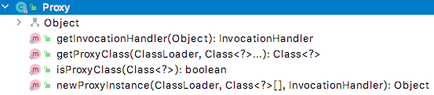

<div style="text-align: center;"><span style="font-size: xxx-large" >从JAVA反射技术到Spring AOP</span></div>

# 前言

当我们使用Spring框架实现我们业务的时候，Spring Aop是一个绕不开的话题。当我们使用Spring的@EnableAspectJAutoProxy，@EnableCaching等注解的时候，底层是由AOP在发挥作用。因此当我们了解了Spring AOP，使用Spring的时候就会更加熟练。

Spring AOP 的底层是动态代理，包括JDK代理和CGLIB代理，其中动态代理，又涉及到反射，因此本文从反射开始讲起。

# 1. JAVA reflect

JAVA是面向对象编程的，因此我们学习和工作的过程中，常常会先定义一个类，然后创建类的对象，通过对象来实现我们的业务逻辑。在这个过程中，我们常常忘记类本身也是一个对象，也有他的方法和属性。

当一个class文件通过类加载器加载到内存中时，都会相应对的创建一个java.lang.Class对象。查看Class类的定义，我们发现只有一个私有的构造器。上面的注释说的很明白，Class的对象只有JVM可以创建。

```java
/*
     * Private constructor. Only the Java Virtual Machine creates Class objects.
     * This constructor is not used and prevents the default constructor being
     * generated.
     */
    private Class(ClassLoader loader) {
        // Initialize final field for classLoader.  The initialization value of non-null
        // prevents future JIT optimizations from assuming this final field is null.
        classLoader = loader;
    }
```

想获取一个类的Class对象，可以有一下三种方式：

1. 使用Class类的forName(String clazzName)方式，会调用native方法forName0(...)。
2. 调用某个类的class属性。例如User.class。
3. 调用某个对象的getClass()方法。该方法是java.lang.Object方法。是一个native方法。

那么Class对象有什么作用呢？从前面可以知道，一个磁盘上的class文件通过jvm的加载成为一个内存里面的Class对象，反过来可以认为，Class对象是class文件在内存中的体现。显而易见，Class对象包含一个类的所有定义，如继承了什么类，实现了哪些接口，拥有的属性、构造函数、方法等。

那Class对象和反射有什么关系呢？

首先看下反射的定义：

> 主要是指程序可以访问，检测和修改它本身状态或行为的一种能力，并能根据自身行为的状态和结果，调整或修改应用所描述行为的状态和相关的语义。

对于JAVA程序来说，一个类有多个组成部分，例如：成员变量、方法、构造方法等，反射就是加载类，并解剖出类的各个组成部分，因此就用到了Class对象。

反射机制主要提供以下功能：

①在运行时判断任意一个对象所属的类；
②在运行时构造任意一个类的对象；
③在运行时判断任意一个类所具有的成员变量和方法；
④在运行时调用任意一个对象的方法；
⑤生成动态代理。

##反射机制中常用的类


| 类                              | 说明   |
| --------------------------------- | -------- |
| java.lang.Class                 | 类     |
| java.lang.reflect.Constructor   | 构造器 |
| java.lang.reflect.Field         | 属性   |
| java.lang.reflect.Method        | 方法   |
| java.lang.reflect.Modifier      | 修饰符 |
| java.lang.annotation.Annotation | 注解   |

以上类都在rt.ja包下

其中Constructor和Method在反射过程中处于核心的位置，因此需要看下具体应用。

## Class类中的构造器方法

Class提供了两种方法获取类的构造器，每种方法又有两种重载方式。

具体如下：


| 序号 | 方法                                            | 作用                                        |
| ------ | ------------------------------------------------- | --------------------------------------------- |
| 1    | getConstructor(Class... parameterTypes)         | 根据参数Class获取指定的public修饰的构造函数 |
| 2    | getConstructors()                               | 获取所有public修饰的构造函数                |
| 3    | getDeclaredConstructor(Class... parameterTypes) | 根据参数Class获取指定的构造函数             |
| 4    | getDeclaredConstructors()                       | 根据参数Class获取所有修饰符的构造函数       |

以上方法会返回一个或者多个java.lang.reflect.Constructor实例，代表了某个构造函数的定义。
Constructor实例的一个常用方式是，创建目标类的实例。
举例如下：

```java
public class 使用Constractor对象创建实例 {
    public static void main(String[] args) throws NoSuchMethodException, InvocationTargetException, InstantiationException, IllegalAccessException {
        Class<ClassA> classAClass = ClassA.class;
        Constructor<ClassA> constructor = classAClass.getConstructor(String.class);
        ClassA classA = constructor.newInstance("使用Constructor获取实例");
        classA.printName();
        //输出： 名称为：使用Constructor获取实例
    }
}

class ClassA {
    private String msg;
    public ClassA(String msg) {
        this.msg = msg;
    }
    public void printName(){
        System.out.println("消息："+msg);
    }
}
```

## Class类中的method方法


| 序号 | 方法                                                           | 作用                                                         |
| ------ | ---------------------------------------------------------------- | -------------------------------------------------------------- |
| 1    | Method getMethod(String name, Class... parameterTypes)         | 查找public修饰符的指定方法，包含父类和接口                   |
| 2    | Method[] getMethods()                                          | 获取所有的public修饰的方法，包含父类和接口                   |
| 3    | Method getDeclaredMethod(String name, Class... parameterTypes) | 查找指定的方法，包含接口，但是不包含父类                     |
| 4    | Method[] getDeclaredMethods()                                  | 获取任意修饰符的的方法，包含接口的方法，但是不包含父类的方法 |

java.lang.reflect.Method 常用于对某个对象的方法进行增强的情况。具体用法如下：

```java
public class 使用Method对象 {
  
    public static void main(String[] args) throws NoSuchMethodException, InvocationTargetException, IllegalAccessException {
        Method getMethod = MethodClass.class.getMethod("get", String.class);
        MethodClass methodClass = new MethodClass();
        InvokeClass invokeClass = new InvokeClass(methodClass, getMethod);
        Object result = invokeClass.invoke("调用");
        System.out.println(result);
    }
}

//一个包装类
class InvokeClass{
    private Object object;
    private Method method;
  
    public InvokeClass(Object object, Method method) {
        this.object = object;
        this.method = method;
    }
    public Object invoke(Object ...parms) throws InvocationTargetException, IllegalAccessException {
        Object invoke = method.invoke(object, parms);
        System.out.println("增强。。。。");
        return invoke;
    }
}
class MethodClass{
    public String get(String msg){
        return msg;
    }
}
```

## Class类中获取注解的方法

参考：[AnnotatedElement](https://www.jianshu.com/p/953e26463fbc)

Class实现了AnnotatedElement接口，提供了若干获取类上注解的方法。


| 序号 | 方法                                                                              | 作用                                                                                         |
| ------ | ----------------------------------------------------------------------------------- | ---------------------------------------------------------------------------------------------- |
| 1    | Annotation[] getAnnotations()                                                     | 获取本类和父类可继承的所有注解                                                               |
| 2    | <A extends Annotation> A getAnnotation(Class<A> annotationClass)                  | 根据类型获取注解                                                                             |
| 3    | <A extends Annotation> A[] getAnnotationsByType(Class<A> annotationClass)         | 会检查修饰该方法对象的注解是否为可重复类型注解，如果是则会返回修饰该方法对象的一个或多个注解 |
| 4    | <A extends Annotation> A getDeclaredAnnotation(Class<A> annotationClass)          | 只获取本类的注解，忽略继承来的注解                                                           |
| 5    | <A extends Annotation> A[] getDeclaredAnnotationsByType(Class<A> annotationClass) | 只获取本类的注解，忽略继承来的注解                                                           |
| 6    | boolean isAnnotationPresent(Class<? extends Annotation> annotationClass)          | 判断注解是否存在                                                                             |

需要说明的是，java.lang.annotation.Annotation是所有注解的父接口，就像Obect的角色一样。

Class类中有一个内部类

```java
private static class AnnotationData {
        //包含父类可继承的注解
        final Map<Class<? extends Annotation>, Annotation> annotations;
        //只包含本类的注解
        final Map<Class<? extends Annotation>, Annotation> declaredAnnotations;
}
```

应用举例

```java
public class 获取注解 {

    @Target({ElementType.TYPE,ElementType.METHOD})
    @Retention(RetentionPolicy.RUNTIME)
    private @interface CustomAnnotation {
        String value();
    }

    @CustomAnnotation("测试类注解")
    private static class AnnotationClass {

        @CustomAnnotation("测试方法注解")
        public void test(){
        }
    }

    public static void main(String[] args) {
        Class<AnnotationClass> annotationClassClass = AnnotationClass.class;
        Annotation[] annotations = annotationClassClass.getAnnotations();
        for (Annotation annotation : annotations) {
            if (annotation instanceof CustomAnnotation){
                System.out.println(((CustomAnnotation)annotation).value());
                //输出：  测试类注解
            }
        }

        Method[] methods = annotationClassClass.getMethods();
        for (Method method : methods) {
            Annotation[] methodAnnotations = method.getAnnotations();
            for (Annotation methodAnnotation : methodAnnotations) {
                if (methodAnnotation instanceof CustomAnnotation){
                    System.out.println(((CustomAnnotation)methodAnnotation).value());
                    //输出：  测试方法注解
                }
            }

        }
    }
}

```

## 反射在实际项目中的使用举例

一个经典的用法是从一个类的集合中获取标注了某个注解的方法，并执行。比如遍历Spring的bean容器中所有的bean，对符合条件的实例，进行特殊处理。

简单举例如下：

```java
public class 反射在实际项目中的应用 {

    @Target({ElementType.TYPE,ElementType.METHOD})
    @Retention(RetentionPolicy.RUNTIME)
    private @interface CustomAnnotation {
        String value();
    }

    private static class AnnotationClass {
        @CustomAnnotation("测试方法注解")
        public void test(){
            System.out.println("执行成功。。。。");
        }
    }

    private static class ClassA {
    }

    public static List<Object> objects = new ArrayList();

    static {
        //实例1
        objects.add(new ClassA());
        //实例2
        objects.add(new AnnotationClass());
    }

    public static void main(String[] args) throws InvocationTargetException, IllegalAccessException {
        //从一个类的集合中获取标注了某个注解的方法，并执行。
        for (Object object : objects) {
            Method[] methods = object.getClass().getMethods();
            for (Method method : methods) {
                boolean annotationPresent = method.isAnnotationPresent(CustomAnnotation.class);
                if (annotationPresent){
                    method.invoke(object);
                    //输出： 执行成功。。。。
                }
            }
        }
    }
}
```

# 代理

在java中，代理的本质是在不影响目标类功能的基础上对目标类进行增强。

代理分为静态代理和动态代理。

静态代理: 所谓静态也就是在程序运行前就已经存在代理类的字节码文件，代理类和委托类的关系在运行前就确定了。
动态代理：动态代理类的源码是在程序运行期间由JVM根据反射等机制动态的生成，所以不存在代理类的字节码文件。代理类和委托类的关系是在程序运行时确定。

## 静态代理（static proxy）

静态代理最明显的特征是需要我们写一个代理类。与被代理类共同实现一个接口。

```java
public class StaticProxyTest {
    public static void main(String[] args) {
        Printer proxy = new Proxy(new ColorPrinter());
        proxy.printMsg("消息");
        //结果：
        //打印前增强
        //彩色打印：消息

        Printer proxy2 = new Proxy(new BlackPrinter());
        proxy2.printMsg("消息");
        //结果：
        //打印前增强
        //黑白打印：消息
    }
}

interface Printer{
    void printMsg(String msg);
}

class ColorPrinter implements  Printer{
    @Override
    public void printMsg(String msg) {
        System.out.println("彩色打印："+msg);
    }
}

class BlackPrinter implements  Printer{
    @Override
    public void printMsg(String msg) {
        System.out.println("黑白打印："+msg);
    }
}

class Proxy implements Printer{

    private Printer printer;

    public Proxy(Printer printer) {
        this.printer = printer;
    }

    @Override
    public void printMsg(String msg) {
        System.out.println("打印前增强");
        printer.printMsg(msg);
    }
}
```

## 动态代理（dynamic proxy）

目前常用的动态代理有两种方式，一种是直接使用JDK自带的代理方式，另一种是CGLIB动态代理

### JDK动态代理

JDK代理的核心类为java.lang.reflect.Proxy。其中方法并不是很多。



其中核心方法为：

```java
public static Object newProxyInstance(ClassLoader loader, Class<?>[] interfaces, InvocationHandler h){
    //...
}
```

总共三个参数，第一个参数需要传入被代理类的ClassLoader和实现的接口，可以通过反射方式获取。接下来查看 InvocationHandler。

```java
public interface InvocationHandler {

    /**
     * @param   proxy 生成的代理类
     * @param   method 被代理类接口的方法
     * @param   args 参数数组
     * @return  method 方法的返回值
     */
    public Object invoke(Object proxy, Method method, Object[] args)
        throws Throwable;
}
```

可以看到， InvocationHandler是一个接口，只有一个方法invoke，有被代理类的实例和方法，以及参数。具体需要做什么由实现类决定。

通过以上分析，可以看出JDK代理需要一个被代理类的实例，以及一个InvocationHandler的实现类即可，由Proxy的静态方法可以创建一个代理类。

```java
public class JDK动态代理最简单示例 {
    //定义一个接口
    private interface Printer{
        void printMsg(String msg);
    }
    //定义实现类
    private static class ColorPrinter implements  Printer{
        @Override
        public void printMsg(String msg) {
            System.out.println("彩色打印："+msg);
        }
    }
    //实现InvocationHandler
    private static class PrinterInvocation implements InvocationHandler {
        private Object target;
        public PrinterInvocation(Object target) {
            this.target = target;
        }
        //实现增强的地方
        @Override
        public Object invoke(Object proxy, Method method, Object[] args) throws Throwable {
            System.out.println("代理类，准备执行代理类。。。");
            Object invoke = method.invoke(target, args);
            System.out.println("代理类，执行完毕。。。");
            return invoke;
        }
    }

    public static void main(String[] args) {
        //设置环境变量，将生成的代理类保存成文件
        System.getProperties().put("sun.misc.ProxyGenerator.saveGeneratedFiles", "true");

        ColorPrinter colorPrinter = new ColorPrinter();
        PrinterInvocation printerInvocation = new PrinterInvocation(colorPrinter);
        //生成代理类
        Printer printer =(Printer) Proxy.newProxyInstance(colorPrinter.getClass().getClassLoader(), colorPrinter.getClass().getInterfaces(), printerInvocation);
        printer.printMsg("消息");
    }
}
```

#### JDK反编译类

生成的代理类反编译如下：

```java

final class $Proxy0 extends Proxy implements Printer {
  
    private static Method m1;
    private static Method m3;
    private static Method m2;
    private static Method m0;
    // 提供了一个带参数的狗仔器，将InvocationHandler传入给父类
    public $Proxy0(InvocationHandler var1) throws Throwable{
        super(var1);
    }

    public final boolean equals(Object var1) throws  Throwable{
        try {
            return (Boolean)super.h.invoke(this, m1, new Object[]{var1});
        } catch (RuntimeException | Error var3) {
            throw var3;
        } catch (Throwable var4) {
            throw new UndeclaredThrowableException(var4);
        }
    }

    public final void printMsg(String var1) throws  Throwable{
        try {
            super.h.invoke(this, m3, new Object[]{var1});
        } catch (RuntimeException | Error var3) {
            throw var3;
        } catch (Throwable var4) {
            throw new UndeclaredThrowableException(var4);
        }
    }

    public final String toString() throws  Throwable{
        try {
            return (String)super.h.invoke(this, m2, (Object[])null);
        } catch (RuntimeException | Error var2) {
            throw var2;
        } catch (Throwable var3) {
            throw new UndeclaredThrowableException(var3);
        }
    }

    public final int hashCode() throws  Throwable{
        try {
            return (Integer)super.h.invoke(this, m0, (Object[])null);
        } catch (RuntimeException | Error var2) {
            throw var2;
        } catch (Throwable var3) {
            throw new UndeclaredThrowableException(var3);
        }
    }

    static {
        try {
            m1 = Class.forName("java.lang.Object").getMethod("equals", Class.forName("java.lang.Object"));
            m3 = Class.forName("代理模式.JDK动态代理.JDK动态代理最简单示例$Printer").getMethod("printMsg", Class.forName("java.lang.String"));
            m2 = Class.forName("java.lang.Object").getMethod("toString");
            m0 = Class.forName("java.lang.Object").getMethod("hashCode");
        } catch (NoSuchMethodException var2) {
            throw new NoSuchMethodError(var2.getMessage());
        } catch (ClassNotFoundException var3) {
            throw new NoClassDefFoundError(var3.getMessage());
        }
    }
}
```

可以看到，代理类继承了Proxy类，在实例化的时候把 InvocationHandler 赋予父类实例。另外定义了一定数量的Method变量，在static的代码块初始化了Object类和接口Printer的所有方法。
另外代理类实现了Printer接口的所有方法，每个方法，实际是去调用了InvocationHandler实例的invoke方法，这样就实现了代理的功能。

#### Proxy 类如何生成代理类

查看 Proxy 代码，很容易找到代理类是由ProxyClassFactory类具体生成的。
最重要的代码是

```java
byte[] proxyClassFile = ProxyGenerator.generateProxyClass(proxyName, interfaces, accessFlags);
```

参考 [java动态代理ProxyGenerator](https://www.cnblogs.com/Joynic/p/13741473.html) 手动写一个demo

```java
public class ProxyGeneratorTest {

    private static interface TestInf{
        void run();
    }

    public static void main(String[] args) {
        //全限定类名
        String className = "com.sun.$Proxy";

        int accessFlags = Modifier.PUBLIC | Modifier.FINAL;
        //接口
        Class<?>[] cls = new Class<?>[]{TestInf.class};

        byte[] bytes = ProxyGenerator.generateProxyClass(className, cls, accessFlags);

        System.out.println("byteLen: " + bytes.length);
        //生成的字节码地址
        String first = System.getProperty("user.dir") + "/$Proxy.class";
        System.out.println(first);
        Path path = Paths.get(first);
        try {
            Files.createFile(path);
            OutputStream outputStream = Files.newOutputStream(path, StandardOpenOption.WRITE);
            outputStream.write(bytes);
            outputStream.close();
        } catch (IOException e) {
            e.printStackTrace();
        }
    }
}
```

输出的类反编译

```java
//
// Source code recreated from a .class file by IntelliJ IDEA
// (powered by FernFlower decompiler)
//

package com.sun;

import java.lang.reflect.InvocationHandler;
import java.lang.reflect.Method;
import java.lang.reflect.Proxy;
import java.lang.reflect.UndeclaredThrowableException;
import 代理模式.JDK动态代理.ProxyGeneratorTest.TestInf;

public class $Proxy extends Proxy implements TestInf {
    private static Method m1;
    private static Method m3;
    private static Method m2;
    private static Method m0;

    public $Proxy(InvocationHandler var1) throws  {
        super(var1);
    }

    public final boolean equals(Object var1) throws  {
        try {
            return (Boolean)super.h.invoke(this, m1, new Object[]{var1});
        } catch (RuntimeException | Error var3) {
            throw var3;
        } catch (Throwable var4) {
            throw new UndeclaredThrowableException(var4);
        }
    }

    public final void run() throws  {
        try {
            super.h.invoke(this, m3, (Object[])null);
        } catch (RuntimeException | Error var2) {
            throw var2;
        } catch (Throwable var3) {
            throw new UndeclaredThrowableException(var3);
        }
    }

    public final String toString() throws  {
        try {
            return (String)super.h.invoke(this, m2, (Object[])null);
        } catch (RuntimeException | Error var2) {
            throw var2;
        } catch (Throwable var3) {
            throw new UndeclaredThrowableException(var3);
        }
    }

    public final int hashCode() throws  {
        try {
            return (Integer)super.h.invoke(this, m0, (Object[])null);
        } catch (RuntimeException | Error var2) {
            throw var2;
        } catch (Throwable var3) {
            throw new UndeclaredThrowableException(var3);
        }
    }

    static {
        try {
            m1 = Class.forName("java.lang.Object").getMethod("equals", Class.forName("java.lang.Object"));
            m3 = Class.forName("代理模式.JDK动态代理.ProxyGeneratorTest$TestInf").getMethod("run");
            m2 = Class.forName("java.lang.Object").getMethod("toString");
            m0 = Class.forName("java.lang.Object").getMethod("hashCode");
        } catch (NoSuchMethodException var2) {
            throw new NoSuchMethodError(var2.getMessage());
        } catch (ClassNotFoundException var3) {
            throw new NoClassDefFoundError(var3.getMessage());
        }
    }
}

```

#### ProxyGenerator

[源码](https://github.com/JetBrains/jdk8u_jdk/blob/master/src/share/classes/sun/misc/ProxyGenerator.java)
具体代码就不展示了。可以参考
[JDK动态代理之ProxyGenerator生成代理类的字节码文件解析](https://blog.csdn.net/qq_43259865/article/details/113944901)

### Cglib动态代理。

Cglib动态代理的基本原理和JDK的相似。

需要引入一个cglib包

```xml
<dependencies>
    <dependency>
        <groupId>cglib</groupId>
        <artifactId>cglib</artifactId>
        <version>3.3.0</version>
    </dependency>
</dependencies>
```

核心入口类为 Enhancer  简单用法如下

```java
public class CglibProxyTest {

    private static class CglibService {
        public void update(){
            System.out.println("原方法-更新");
        }
        public Object find(){
            System.out.println("原方法-查找");
            return new Object();
        }
    }

    //需要实现一个MethodInterceptor
    private static class CglibServiceInterceptor implements MethodInterceptor {

        public Object target;

        public CglibServiceInterceptor(Object target) {
            this.target = target;
        }

        @Override
        public Object intercept(Object o, Method method, Object[] objects, MethodProxy methodProxy) throws Throwable {
            System.out.println("执行代理方法--前 方法为"+method.getName());
            Object invoke = method.invoke(target, objects);
            System.out.println("执行代理方法--后 ");
            return invoke;
        }
    }

    public static void main(String[] args) {
        CglibService cglibService = new CglibService();
        //需要
        CglibServiceInterceptor cglibServiceInterceptor = new CglibServiceInterceptor(cglibService);

        Enhancer enhancer = new Enhancer();
        enhancer.setSuperclass(cglibService.getClass());
        enhancer.setCallback(cglibServiceInterceptor);
        CglibService proxyInstance = (CglibService) enhancer.create();

        proxyInstance.update();
    }
}
```

#### Cglib生成的代理类反编译

```java
import java.lang.reflect.Method;
import net.sf.cglib.core.ReflectUtils;
import net.sf.cglib.core.Signature;
import net.sf.cglib.proxy.Callback;
import net.sf.cglib.proxy.Factory;
import net.sf.cglib.proxy.MethodInterceptor;
import net.sf.cglib.proxy.MethodProxy;
import 代理模式.Cglib代理.CglibProxyTest.CglibService;

//代理类继承了被代理类
public class CglibProxyTest$CglibService$$EnhancerByCGLIB$$2caa56a extends CglibService implements Factory {
    //是否已经绑定拦截器，如果已经绑定，就设为true
    private boolean CGLIB$BOUND;
    public static Object CGLIB$FACTORY_DATA;
    //线程变量，用于存储拦截器
    private static final ThreadLocal CGLIB$THREAD_CALLBACKS;
    private static final Callback[] CGLIB$STATIC_CALLBACKS;
    //拦截器，在传入的callback数组中的第一个
    private MethodInterceptor CGLIB$CALLBACK_0;
    private static Object CGLIB$CALLBACK_FILTER;
    private static final Method CGLIB$update$0$Method;
    private static final MethodProxy CGLIB$update$0$Proxy;
    //空数组，用于无参的方法
    private static final Object[] CGLIB$emptyArgs;
    private static final Method CGLIB$find$1$Method;
    private static final MethodProxy CGLIB$find$1$Proxy;
    private static final Method CGLIB$equals$2$Method;
    private static final MethodProxy CGLIB$equals$2$Proxy;
    private static final Method CGLIB$toString$3$Method;
    private static final MethodProxy CGLIB$toString$3$Proxy;
    private static final Method CGLIB$hashCode$4$Method;
    private static final MethodProxy CGLIB$hashCode$4$Proxy;
    private static final Method CGLIB$clone$5$Method;
    private static final MethodProxy CGLIB$clone$5$Proxy;
    //静态方法，在静态代码块中被执行
    static void CGLIB$STATICHOOK1() {
        CGLIB$THREAD_CALLBACKS = new ThreadLocal();
        CGLIB$emptyArgs = new Object[0];
        //代理的Class
        Class var0 = Class.forName("代理模式.Cglib代理.CglibProxyTest$CglibService$$EnhancerByCGLIB$$2caa56a");
        Class var1;//在下一样中赋值（var1 = Class.forName("java.lang.Object")).getDeclaredMethods()）；
        Method[] var10000 = ReflectUtils.findMethods(new String[]{"equals", "(Ljava/lang/Object;)Z", "toString", "()Ljava/lang/String;", "hashCode", "()I", "clone", "()Ljava/lang/Object;"}, (var1 = Class.forName("java.lang.Object")).getDeclaredMethods());
        CGLIB$equals$2$Method = var10000[0];
        // 使用MethodProxy来创建一个方法调用的代理类，避免通过反射来调用。这个方法，可以使用代理类来调用，最终映射为被代理的调用
        CGLIB$equals$2$Proxy = MethodProxy.create(var1, var0, "(Ljava/lang/Object;)Z", "equals", "CGLIB$equals$2");
        CGLIB$toString$3$Method = var10000[1];
        CGLIB$toString$3$Proxy = MethodProxy.create(var1, var0, "()Ljava/lang/String;", "toString", "CGLIB$toString$3");
        CGLIB$hashCode$4$Method = var10000[2];
        CGLIB$hashCode$4$Proxy = MethodProxy.create(var1, var0, "()I", "hashCode", "CGLIB$hashCode$4");
        CGLIB$clone$5$Method = var10000[3];
        CGLIB$clone$5$Proxy = MethodProxy.create(var1, var0, "()Ljava/lang/Object;", "clone", "CGLIB$clone$5");
        //注意，这里var10000 和var1重新赋值了
        var10000 = ReflectUtils.findMethods(new String[]{"update", "()V", "find", "()Ljava/lang/Object;"}, (var1 = Class.forName("代理模式.Cglib代理.CglibProxyTest$CglibService")).getDeclaredMethods());
        CGLIB$update$0$Method = var10000[0];
        //生成了一个方法的代理，传入了代理类的Class,被代理类的Class, 代理类的方法名，被代理类的方法名
        CGLIB$update$0$Proxy = MethodProxy.create(var1, var0, "()V", "update", "CGLIB$update$0");
        CGLIB$find$1$Method = var10000[1];
        CGLIB$find$1$Proxy = MethodProxy.create(var1, var0, "()Ljava/lang/Object;", "find", "CGLIB$find$1");
    }
    //代理类直接调用父类的方法，
    final void CGLIB$update$0() {
        super.update();
    }

    public final void update() {
        MethodInterceptor var10000 = this.CGLIB$CALLBACK_0;
        if (var10000 == null) {
            CGLIB$BIND_CALLBACKS(this);
            var10000 = this.CGLIB$CALLBACK_0;
        }

        if (var10000 != null) {
            //拦截器中，需要传入被查询的方法
            var10000.intercept(this, CGLIB$update$0$Method, CGLIB$emptyArgs, CGLIB$update$0$Proxy);
        } else {
            //假如没有拦截器，则直接调用父类的方法。
            super.update();
        }
    }

    final Object CGLIB$find$1() {
        return super.find();
    }

    public final Object find() {
        MethodInterceptor var10000 = this.CGLIB$CALLBACK_0;
        if (var10000 == null) {
            CGLIB$BIND_CALLBACKS(this);
            var10000 = this.CGLIB$CALLBACK_0;
        }

        return var10000 != null ? var10000.intercept(this, CGLIB$find$1$Method, CGLIB$emptyArgs, CGLIB$find$1$Proxy) : super.find();
    }

    final boolean CGLIB$equals$2(Object var1) {
        return super.equals(var1);
    }

    public final boolean equals(Object var1) {
        MethodInterceptor var10000 = this.CGLIB$CALLBACK_0;
        if (var10000 == null) {
            CGLIB$BIND_CALLBACKS(this);
            var10000 = this.CGLIB$CALLBACK_0;
        }

        if (var10000 != null) {
            Object var2 = var10000.intercept(this, CGLIB$equals$2$Method, new Object[]{var1}, CGLIB$equals$2$Proxy);
            return var2 == null ? false : (Boolean)var2;
        } else {
            return super.equals(var1);
        }
    }

    final String CGLIB$toString$3() {
        return super.toString();
    }

    public final String toString() {
        MethodInterceptor var10000 = this.CGLIB$CALLBACK_0;
        if (var10000 == null) {
            CGLIB$BIND_CALLBACKS(this);
            var10000 = this.CGLIB$CALLBACK_0;
        }

        return var10000 != null ? (String)var10000.intercept(this, CGLIB$toString$3$Method, CGLIB$emptyArgs, CGLIB$toString$3$Proxy) : super.toString();
    }

    final int CGLIB$hashCode$4() {
        return super.hashCode();
    }

    public final int hashCode() {
        MethodInterceptor var10000 = this.CGLIB$CALLBACK_0;
        if (var10000 == null) {
            CGLIB$BIND_CALLBACKS(this);
            var10000 = this.CGLIB$CALLBACK_0;
        }

        if (var10000 != null) {
            Object var1 = var10000.intercept(this, CGLIB$hashCode$4$Method, CGLIB$emptyArgs, CGLIB$hashCode$4$Proxy);
            return var1 == null ? 0 : ((Number)var1).intValue();
        } else {
            return super.hashCode();
        }
    }

    final Object CGLIB$clone$5() throws CloneNotSupportedException {
        return super.clone();
    }

    protected final Object clone() throws CloneNotSupportedException {
        MethodInterceptor var10000 = this.CGLIB$CALLBACK_0;
        if (var10000 == null) {
            CGLIB$BIND_CALLBACKS(this);
            var10000 = this.CGLIB$CALLBACK_0;
        }

        return var10000 != null ? var10000.intercept(this, CGLIB$clone$5$Method, CGLIB$emptyArgs, CGLIB$clone$5$Proxy) : super.clone();
    }
    //获取被代理的方法
    public static MethodProxy CGLIB$findMethodProxy(Signature var0) {
        //toString 已经被重写
        String var10000 = var0.toString();
        switch(var10000.hashCode()) {
        case -1949253108:
            if (var10000.equals("update()V")) {
                return CGLIB$update$0$Proxy;
            }
            break;
        case -508378822:
            if (var10000.equals("clone()Ljava/lang/Object;")) {
                return CGLIB$clone$5$Proxy;
            }
            break;
        case 288953238:
            if (var10000.equals("find()Ljava/lang/Object;")) {
                return CGLIB$find$1$Proxy;
            }
            break;
        case 1826985398:
            if (var10000.equals("equals(Ljava/lang/Object;)Z")) {
                return CGLIB$equals$2$Proxy;
            }
            break;
        case 1913648695:
            if (var10000.equals("toString()Ljava/lang/String;")) {
                return CGLIB$toString$3$Proxy;
            }
            break;
        case 1984935277:
            if (var10000.equals("hashCode()I")) {
                return CGLIB$hashCode$4$Proxy;
            }
        }

        return null;
    }
    // 构造方法，一般不直接使用这个，而是使用new instance,先给线程变量赋值
    public CglibProxyTest$CglibService$$EnhancerByCGLIB$$2caa56a() {
        //无参构造方法，从线程变量获取拦截器并且绑定到当前类中
        CGLIB$BIND_CALLBACKS(this);
    }

    public static void CGLIB$SET_THREAD_CALLBACKS(Callback[] var0) {
        CGLIB$THREAD_CALLBACKS.set(var0);
    }

    public static void CGLIB$SET_STATIC_CALLBACKS(Callback[] var0) {
        CGLIB$STATIC_CALLBACKS = var0;
    }

    private static final void CGLIB$BIND_CALLBACKS(Object var0) {
        CglibProxyTest$CglibService$$EnhancerByCGLIB$$2caa56a var1 = (CglibProxyTest$CglibService$$EnhancerByCGLIB$$2caa56a)var0;
        if (!var1.CGLIB$BOUND) { //如果已经处理过， 就不再处理
            var1.CGLIB$BOUND = true;
            Object var10000 = CGLIB$THREAD_CALLBACKS.get();
            //从当前线程中获取callbacks
            if (var10000 == null) {
                var10000 = CGLIB$STATIC_CALLBACKS;
                if (var10000 == null) {
                    return;
                }
            }
            //给类变量赋值。CGLIB$CALLBACK_0为第一个callback 对类型进行强转。如果有filter,这里会有多个MethodInterceptor，对应不同的下标
            var1.CGLIB$CALLBACK_0 = (MethodInterceptor)((Callback[])var10000)[0];
        }

    }

    public Object newInstance(Callback[] var1) {
        CGLIB$SET_THREAD_CALLBACKS(var1);
        CglibProxyTest$CglibService$$EnhancerByCGLIB$$2caa56a var10000 = new CglibProxyTest$CglibService$$EnhancerByCGLIB$$2caa56a();
        //清空线程变量
        CGLIB$SET_THREAD_CALLBACKS((Callback[])null);
        return var10000;
    }

    public Object newInstance(Callback var1) {
        CGLIB$SET_THREAD_CALLBACKS(new Callback[]{var1});
        CglibProxyTest$CglibService$$EnhancerByCGLIB$$2caa56a var10000 = new CglibProxyTest$CglibService$$EnhancerByCGLIB$$2caa56a();
        CGLIB$SET_THREAD_CALLBACKS((Callback[])null);
        return var10000;
    }

    public Object newInstance(Class[] var1, Object[] var2, Callback[] var3) {
        CGLIB$SET_THREAD_CALLBACKS(var3);
        CglibProxyTest$CglibService$$EnhancerByCGLIB$$2caa56a var10000 = new CglibProxyTest$CglibService$$EnhancerByCGLIB$$2caa56a;
        switch(var1.length) {
        case 0:
            var10000.<init>();
            CGLIB$SET_THREAD_CALLBACKS((Callback[])null);
            return var10000;
        default:
            throw new IllegalArgumentException("Constructor not found");
        }
    }

    public Callback getCallback(int var1) {
        CGLIB$BIND_CALLBACKS(this);
        MethodInterceptor var10000;
        switch(var1) {
        case 0:
            var10000 = this.CGLIB$CALLBACK_0;
            break;
        default:
            var10000 = null;
        }

        return var10000;
    }

    public void setCallback(int var1, Callback var2) {
        switch(var1) {
        case 0:
            this.CGLIB$CALLBACK_0 = (MethodInterceptor)var2;
        default:
        }
    }

    public Callback[] getCallbacks() {
        CGLIB$BIND_CALLBACKS(this);
        return new Callback[]{this.CGLIB$CALLBACK_0};
    }

    public void setCallbacks(Callback[] var1) {
        this.CGLIB$CALLBACK_0 = (MethodInterceptor)var1[0];
    }

    static {
        CGLIB$STATICHOOK1();
    }
}
```

可以看到，代理类继承了CglibService类，重写了父类的方法，在调用父类的方法时，具体由MethodInterceptor的实现类去完成。

另外，相比较JDK代理，CGLIB拦截器中方法中多了一个参数 MethodProxy。前面我们知道，在JDK代理的拦截器中，如果需要调用实例，只能使反射的方式。而在CGLIB中，MethodProxy提供给了被代理实例和代理实例直接调用方法的方式。

其原理也挺简单的，使用ASM再动态生成一个包装类，根据签名对目标类的方法进行了编号。在目标类实例想调用指定的方法的时候，只要传入编号和参数即可。伪代码如下：

```java
public class FastClassDemo {
    //根据方法的签名，获取相对应的所以
    public int getIndex(String signature) {
        switch (signature.hashCode()) {
            case 3078479:
                //方法1
                return 1;
            case 3108270:
                //方法1
                return 2;
        }
        return -1;
    }
    //根据传入的方法索引，调用指定的方法。
	public Object invoke(int index, Object o, Object[] ol) {
		Target t = (Target) o;
		switch (index) {
		case 1:
            //方法1 有返回值
			return t.f();
		case 2:
            //方法2 没有返回值
			t.g();
			return null;
		}
		return null;
	}
  
}
```

以上用户，跟proxy的用法基本一致，
但是cglib还有更多的用法，比如说可以接收更多的过滤器，对应不同的方法，可以使用不同的过滤器来执行业务逻辑。

```java
public class Enhancer各种方法探索 {

    interface Animal {
         Object eat();
    }

    static class Duck {
        public Object find(){
            System.out.println("原方法-查找");
            return new Object();
        }
    }

    static class CglibServiceInterceptor implements MethodInterceptor {

        public Object target;

        public CglibServiceInterceptor(Object target) {
            this.target = target;
        }

        @Override
        public Object intercept(Object o, Method method, Object[] objects, MethodProxy methodProxy) throws Throwable {
            String name = method.getName();
            System.out.println("CglibServiceInterceptor 执行代理方法--前 方法为"+ name);
            Object invoke = methodProxy.invoke(target, objects);
            System.out.println("CglibServiceInterceptor 执行代理方法--后 ");
            return invoke;
        }
    }

    static class CglibServiceInterceptor2 implements MethodInterceptor {
        @Override
        public Object intercept(Object o, Method method, Object[] objects, MethodProxy methodProxy) throws Throwable {
            String name = method.getName();
            System.out.println("CglibServiceInterceptor2 执行代理方法--前 方法为"+ name);
            Object invoke = null;
            System.out.println("CglibServiceInterceptor2 执行接口的方法");

            System.out.println("CglibServiceInterceptor2 执行代理方法--后 ");
            return invoke;
        }
    }


    public static class 添加过滤器 {
        public static void main(String[] args) {
            System.setProperty(DebuggingClassWriter.DEBUG_LOCATION_PROPERTY,"./");
            CallbackFilter filter = new CallbackFilter() {
                //返回过滤数组的下标
                @Override
                public int accept(Method method) {
                    if (method.getName().equals("eat")){
                        return 1;
                    }
                    return 0;
                }
            };

            Duck duck = new Duck();
            //验证属性
            Enhancer各种方法探索.CglibServiceInterceptor cglibServiceInterceptor = new Enhancer各种方法探索.CglibServiceInterceptor(duck);
            Enhancer各种方法探索.CglibServiceInterceptor2 cglibServiceInterceptor2 = new Enhancer各种方法探索.CglibServiceInterceptor2();

            Enhancer enhancer = new Enhancer();
            enhancer.setSuperclass(Duck.class);
            //提供两个callbacks
            enhancer.setCallbacks(new Callback[]{cglibServiceInterceptor, cglibServiceInterceptor2});
            //添加代理方法过滤器
            enhancer.setCallbackFilter(filter);
            //添加接口
            enhancer.setInterfaces(new Class[]{Animal.class});
            //使用接口的方法
            Animal proxyInstance = (Animal) enhancer.create();
            proxyInstance.eat();
            //父类方法
            Duck d = (Duck) proxyInstance;
            d.find();
        }
    }
}


```

生成的代理类：

```java

import java.lang.reflect.Method;
import net.sf.cglib.core.ReflectUtils;
import net.sf.cglib.core.Signature;
import net.sf.cglib.proxy.Callback;
import net.sf.cglib.proxy.Factory;
import net.sf.cglib.proxy.MethodInterceptor;
import net.sf.cglib.proxy.MethodProxy;
import 代理模式.Cglib代理.Enhancer各种方法探索.Animal;
import 代理模式.Cglib代理.Enhancer各种方法探索.Duck;

public class Enhancer各种方法探索$Duck$$EnhancerByCGLIB$$9ee760ad extends Duck implements Animal, Factory {
    private boolean CGLIB$BOUND;
    public static Object CGLIB$FACTORY_DATA;
    private static final ThreadLocal CGLIB$THREAD_CALLBACKS;
    private static final Callback[] CGLIB$STATIC_CALLBACKS;
    private MethodInterceptor CGLIB$CALLBACK_0;
    private MethodInterceptor CGLIB$CALLBACK_1;
    private static Object CGLIB$CALLBACK_FILTER;
    private static final Method CGLIB$find$0$Method;
    private static final MethodProxy CGLIB$find$0$Proxy;
    private static final Object[] CGLIB$emptyArgs;
    private static final Method CGLIB$equals$1$Method;
    private static final MethodProxy CGLIB$equals$1$Proxy;
    private static final Method CGLIB$toString$2$Method;
    private static final MethodProxy CGLIB$toString$2$Proxy;
    private static final Method CGLIB$hashCode$3$Method;
    private static final MethodProxy CGLIB$hashCode$3$Proxy;
    private static final Method CGLIB$clone$4$Method;
    private static final MethodProxy CGLIB$clone$4$Proxy;
    private static final Method CGLIB$eat$5$Method;
    private static final MethodProxy CGLIB$eat$5$Proxy;

    static void CGLIB$STATICHOOK1() {
        CGLIB$THREAD_CALLBACKS = new ThreadLocal();
        CGLIB$emptyArgs = new Object[0];
        Class var0 = Class.forName("代理模式.Cglib代理.Enhancer各种方法探索$Duck$$EnhancerByCGLIB$$9ee760ad");
        Class var1;
        CGLIB$find$0$Method = ReflectUtils.findMethods(new String[]{"find", "()Ljava/lang/Object;"}, (var1 = Class.forName("代理模式.Cglib代理.Enhancer各种方法探索$Duck")).getDeclaredMethods())[0];
        CGLIB$find$0$Proxy = MethodProxy.create(var1, var0, "()Ljava/lang/Object;", "find", "CGLIB$find$0");
        Method[] var10000 = ReflectUtils.findMethods(new String[]{"equals", "(Ljava/lang/Object;)Z", "toString", "()Ljava/lang/String;", "hashCode", "()I", "clone", "()Ljava/lang/Object;"}, (var1 = Class.forName("java.lang.Object")).getDeclaredMethods());
        CGLIB$equals$1$Method = var10000[0];
        CGLIB$equals$1$Proxy = MethodProxy.create(var1, var0, "(Ljava/lang/Object;)Z", "equals", "CGLIB$equals$1");
        CGLIB$toString$2$Method = var10000[1];
        CGLIB$toString$2$Proxy = MethodProxy.create(var1, var0, "()Ljava/lang/String;", "toString", "CGLIB$toString$2");
        CGLIB$hashCode$3$Method = var10000[2];
        CGLIB$hashCode$3$Proxy = MethodProxy.create(var1, var0, "()I", "hashCode", "CGLIB$hashCode$3");
        CGLIB$clone$4$Method = var10000[3];
        CGLIB$clone$4$Proxy = MethodProxy.create(var1, var0, "()Ljava/lang/Object;", "clone", "CGLIB$clone$4");
        CGLIB$eat$5$Method = ReflectUtils.findMethods(new String[]{"eat", "()Ljava/lang/Object;"}, (var1 = Class.forName("代理模式.Cglib代理.Enhancer各种方法探索$Animal")).getDeclaredMethods())[0];
        CGLIB$eat$5$Proxy = MethodProxy.create(var1, var0, "()Ljava/lang/Object;", "eat", "CGLIB$eat$5");
    }

    final Object CGLIB$find$0() {
        return super.find();
    }
    public final Object find() {
        //默认情况下，使用的是第一个拦截器
        MethodInterceptor var10000 = this.CGLIB$CALLBACK_0;
        if (var10000 == null) {
            CGLIB$BIND_CALLBACKS(this);
            var10000 = this.CGLIB$CALLBACK_0;
        }

        return var10000 != null ? var10000.intercept(this, CGLIB$find$0$Method, CGLIB$emptyArgs, CGLIB$find$0$Proxy) : super.find();
    }

    final boolean CGLIB$equals$1(Object var1) {
        return super.equals(var1);
    }

    public final boolean equals(Object var1) {
        MethodInterceptor var10000 = this.CGLIB$CALLBACK_0;
        if (var10000 == null) {
            CGLIB$BIND_CALLBACKS(this);
            var10000 = this.CGLIB$CALLBACK_0;
        }

        if (var10000 != null) {
            Object var2 = var10000.intercept(this, CGLIB$equals$1$Method, new Object[]{var1}, CGLIB$equals$1$Proxy);
            return var2 == null ? false : (Boolean)var2;
        } else {
            return super.equals(var1);
        }
    }

    final String CGLIB$toString$2() {
        return super.toString();
    }

    public final String toString() {
        MethodInterceptor var10000 = this.CGLIB$CALLBACK_0;
        if (var10000 == null) {
            CGLIB$BIND_CALLBACKS(this);
            var10000 = this.CGLIB$CALLBACK_0;
        }

        return var10000 != null ? (String)var10000.intercept(this, CGLIB$toString$2$Method, CGLIB$emptyArgs, CGLIB$toString$2$Proxy) : super.toString();
    }

    final int CGLIB$hashCode$3() {
        return super.hashCode();
    }

    public final int hashCode() {
        MethodInterceptor var10000 = this.CGLIB$CALLBACK_0;
        if (var10000 == null) {
            CGLIB$BIND_CALLBACKS(this);
            var10000 = this.CGLIB$CALLBACK_0;
        }

        if (var10000 != null) {
            Object var1 = var10000.intercept(this, CGLIB$hashCode$3$Method, CGLIB$emptyArgs, CGLIB$hashCode$3$Proxy);
            return var1 == null ? 0 : ((Number)var1).intValue();
        } else {
            return super.hashCode();
        }
    }

    final Object CGLIB$clone$4() throws CloneNotSupportedException {
        return super.clone();
    }

    protected final Object clone() throws CloneNotSupportedException {
        MethodInterceptor var10000 = this.CGLIB$CALLBACK_0;
        if (var10000 == null) {
            CGLIB$BIND_CALLBACKS(this);
            var10000 = this.CGLIB$CALLBACK_0;
        }

        return var10000 != null ? var10000.intercept(this, CGLIB$clone$4$Method, CGLIB$emptyArgs, CGLIB$clone$4$Proxy) : super.clone();
    }

    final Object CGLIB$eat$5() {
        return super.eat();
    }

    public final Object eat() {
        // 这里使用的是第二个拦截器
        MethodInterceptor var10000 = this.CGLIB$CALLBACK_1;
        if (var10000 == null) {
            CGLIB$BIND_CALLBACKS(this);
            var10000 = this.CGLIB$CALLBACK_1;
        }

        return var10000 != null ? var10000.intercept(this, CGLIB$eat$5$Method, CGLIB$emptyArgs, CGLIB$eat$5$Proxy) : super.eat();
    }

    public static MethodProxy CGLIB$findMethodProxy(Signature var0) {
        String var10000 = var0.toString();
        switch(var10000.hashCode()) {
        case -508378822:
            if (var10000.equals("clone()Ljava/lang/Object;")) {
                return CGLIB$clone$4$Proxy;
            }
            break;
        case 288953238:
            if (var10000.equals("find()Ljava/lang/Object;")) {
                return CGLIB$find$0$Proxy;
            }
            break;
        case 1826985398:
            if (var10000.equals("equals(Ljava/lang/Object;)Z")) {
                return CGLIB$equals$1$Proxy;
            }
            break;
        case 1913648695:
            if (var10000.equals("toString()Ljava/lang/String;")) {
                return CGLIB$toString$2$Proxy;
            }
            break;
        case 1956159413:
            if (var10000.equals("eat()Ljava/lang/Object;")) {
                return CGLIB$eat$5$Proxy;
            }
            break;
        case 1984935277:
            if (var10000.equals("hashCode()I")) {
                return CGLIB$hashCode$3$Proxy;
            }
        }

        return null;
    }

    public Enhancer各种方法探索$Duck$$EnhancerByCGLIB$$9ee760ad() {
        CGLIB$BIND_CALLBACKS(this);
    }

    public static void CGLIB$SET_THREAD_CALLBACKS(Callback[] var0) {
        CGLIB$THREAD_CALLBACKS.set(var0);
    }

    public static void CGLIB$SET_STATIC_CALLBACKS(Callback[] var0) {
        CGLIB$STATIC_CALLBACKS = var0;
    }

    private static final void CGLIB$BIND_CALLBACKS(Object var0) {
        Enhancer各种方法探索$Duck$$EnhancerByCGLIB$$9ee760ad var1 = (Enhancer各种方法探索$Duck$$EnhancerByCGLIB$$9ee760ad)var0;
        if (!var1.CGLIB$BOUND) {
            var1.CGLIB$BOUND = true;
            Object var10000 = CGLIB$THREAD_CALLBACKS.get();
            if (var10000 == null) {
                var10000 = CGLIB$STATIC_CALLBACKS;
                if (var10000 == null) {
                    return;
                }
            }

            Callback[] var10001 = (Callback[])var10000;
            //初始化了两个拦截器
            var1.CGLIB$CALLBACK_1 = (MethodInterceptor)((Callback[])var10000)[1];
            var1.CGLIB$CALLBACK_0 = (MethodInterceptor)var10001[0];
        }

    }

    public Object newInstance(Callback[] var1) {
        CGLIB$SET_THREAD_CALLBACKS(var1);
        Enhancer各种方法探索$Duck$$EnhancerByCGLIB$$9ee760ad var10000 = new Enhancer各种方法探索$Duck$$EnhancerByCGLIB$$9ee760ad();
        CGLIB$SET_THREAD_CALLBACKS((Callback[])null);
        return var10000;
    }

    public Object newInstance(Callback var1) {
        throw new IllegalStateException("More than one callback object required");
    }

    public Object newInstance(Class[] var1, Object[] var2, Callback[] var3) {
        CGLIB$SET_THREAD_CALLBACKS(var3);
        Enhancer各种方法探索$Duck$$EnhancerByCGLIB$$9ee760ad var10000 = new Enhancer各种方法探索$Duck$$EnhancerByCGLIB$$9ee760ad;
        switch(var1.length) {
        case 0:
            var10000.<init>();
            CGLIB$SET_THREAD_CALLBACKS((Callback[])null);
            return var10000;
        default:
            throw new IllegalArgumentException("Constructor not found");
        }
    }

    public Callback getCallback(int var1) {
        CGLIB$BIND_CALLBACKS(this);
        MethodInterceptor var10000;
        switch(var1) {
        case 0:
            var10000 = this.CGLIB$CALLBACK_0;
            break;
        case 1:
            var10000 = this.CGLIB$CALLBACK_1;
            break;
        default:
            var10000 = null;
        }

        return var10000;
    }

    public void setCallback(int var1, Callback var2) {
        switch(var1) {
        case 0:
            this.CGLIB$CALLBACK_0 = (MethodInterceptor)var2;
            break;
        case 1:
            this.CGLIB$CALLBACK_1 = (MethodInterceptor)var2;
        }

    }

    public Callback[] getCallbacks() {
        CGLIB$BIND_CALLBACKS(this);
        return new Callback[]{this.CGLIB$CALLBACK_0, this.CGLIB$CALLBACK_1};
    }

    public void setCallbacks(Callback[] var1) {
        this.CGLIB$CALLBACK_0 = (MethodInterceptor)var1[0];
        this.CGLIB$CALLBACK_1 = (MethodInterceptor)var1[1];
    }

    static {
        CGLIB$STATICHOOK1();
    }
}


```

另外，需要注意的是，代理类还实现了Factory接口。提供了以下一系列的方法。主要用于快速生成一个相同的代理类的实例。需要传入Callback。

```java
public interface Factory {
    /**
     * Creates new instance of the same type, using the no-arg constructor.
     * The class of this object must have been created using a single Callback type.
     * If multiple callbacks are required an exception will be thrown.
     * @param callback the new interceptor to use
     * @return new instance of the same type
     */   
    Object newInstance(Callback callback);
  
    /**
     * Creates new instance of the same type, using the no-arg constructor.
     * @param callbacks the new callbacks(s) to use
     * @return new instance of the same type
     */   
    Object newInstance(Callback[] callbacks);

    /**
     * Creates a new instance of the same type, using the constructor
     * matching the given signature.
     * @param types the constructor argument types
     * @param args the constructor arguments
     * @param callbacks the new interceptor(s) to use
     * @return new instance of the same type
     */
    Object newInstance(Class[] types, Object[] args, Callback[] callbacks);

    /**
     * Return the <code>Callback</code> implementation at the specified index.
     * @param index the callback index
     * @return the callback implementation
     */
    Callback getCallback(int index);

    /**
     * Set the callback for this object for the given type.
     * @param index the callback index to replace
     * @param callback the new callback
     */
    void setCallback(int index, Callback callback);

    /**
     * Replace all of the callbacks for this object at once.
     * @param callbacks the new callbacks(s) to use
     */
    void setCallbacks(Callback[] callbacks);

    /**
     * Get the current set of callbacks for ths object.
     * @return a new array instance
     */   
    Callback[] getCallbacks();
}
```

假如我们是先拿到了一个代理类的Class，可以如下进行实例化

```java
public static class 传入的回调是类而不是实例 {
    public static void main(String[] args) throws InstantiationException, IllegalAccessException, NoSuchMethodException, InvocationTargetException {
        System.setProperty(DebuggingClassWriter.DEBUG_LOCATION_PROPERTY,"./");
        CallbackFilter filter = new CallbackFilter() {
            //返回过滤数组的下标
            @Override
            public int accept(Method method) {
                if (method.getName().equals("eat")){
                    return 1;
                }
                return 0;
            }
        };

        Duck duck = new Duck();
        //验证属性
        Enhancer各种方法探索.CglibServiceInterceptor cglibServiceInterceptor = new Enhancer各种方法探索.CglibServiceInterceptor(duck);
        Enhancer各种方法探索.CglibServiceInterceptor2 cglibServiceInterceptor2 = new Enhancer各种方法探索.CglibServiceInterceptor2();

        Enhancer enhancer = new Enhancer();
        enhancer.setSuperclass(Duck.class);
        //提供两个callbacks
        enhancer.setCallbackTypes(new Class[]{CglibServiceInterceptor.class, CglibServiceInterceptor2.class});
        //添加代理方法过滤器
        enhancer.setCallbackFilter(filter);
        //添加接口
        enhancer.setInterfaces(new Class[]{Animal.class});
        //使用接口的方法
        Class aClass = enhancer.createClass();
        Object o1 = aClass.newInstance();
        Factory factory = (Factory) o1;
        Object o = factory.newInstance(new Callback[]{cglibServiceInterceptor, cglibServiceInterceptor2});
        Animal proxyInstance = (Animal) o;
        proxyInstance.eat();
        //父类方法
        Duck d = (Duck) proxyInstance;
        d.find();
        // 从而可以知道，如果只需要生成代理类，还不需要实例，可以使用setCallbackTypes代替setCallbacks，当需要实例化的时候，才传入具体的拦截器。
        // 而且 本身GCLIB的代理类实现了Factory，可以用来生成具体的实例。
    }
}
```

#### MethodProxy 类

```java
package net.sf.cglib.proxy;

import java.lang.reflect.InvocationTargetException;
import java.lang.reflect.Method;

import net.sf.cglib.core.AbstractClassGenerator;
import net.sf.cglib.core.CodeGenerationException;
import net.sf.cglib.core.GeneratorStrategy;
import net.sf.cglib.core.NamingPolicy;
import net.sf.cglib.core.Signature;
import net.sf.cglib.reflect.FastClass;

public class MethodProxy {
    //被代理类的方法签名。方法名称+描述
    private Signature sig1;
    //代理类的方法签名。方法名称+描述
    private Signature sig2;
    //创建代理的参数
    private CreateInfo createInfo;
  
    private final Object initLock = new Object();
    //用于存放最终生成的FastClass实例和索引
    private volatile FastClassInfo fastClassInfo;
  
    /**
     * 
     * C1对应name1,用于构建被代理类的fastClass。最用被 invoke()方法使用。
     * c2对应name2,用于构建代理类的fastClass。最终被 invokeSuper()方法使用。
     * 
     */
    public static MethodProxy create(Class c1, Class c2, String desc, String name1, String name2) {
        //封装了参数，但是此时还没有初始化
        MethodProxy proxy = new MethodProxy();
        proxy.sig1 = new Signature(name1, desc);
        proxy.sig2 = new Signature(name2, desc);
        proxy.createInfo = new CreateInfo(c1, c2);
        return proxy;
    }

    /**
     * 初始化FastClass，
     */
    private void init()
    {
   
        if (fastClassInfo == null)
        {
            synchronized (initLock)
            {
                if (fastClassInfo == null)
                {
                    CreateInfo ci = createInfo;

                    FastClassInfo fci = new FastClassInfo();
                    //被代理类的Class，给原始被代理类实例调用
                    fci.f1 = helper(ci, ci.c1);
                    //处理代理类的Class，给原始代理类实例调用
                    fci.f2 = helper(ci, ci.c2);
                    //拿到了被代理类的索引  sig1：update()V
                    fci.i1 = fci.f1.getIndex(sig1);
                    //已经拿到了代理类的索引 sig2： CGLIB$update$0()V
                    fci.i2 = fci.f2.getIndex(sig2);
                    fastClassInfo = fci;
                    createInfo = null;
                }
            }
        }
    }

    private static class FastClassInfo
    {
        FastClass f1;
        FastClass f2;
        int i1;
        int i2;
    }
    //该类用于组织参数
    private static class CreateInfo
    {
        //被代理类的Class
        Class c1;
        // 代理类的Class
        Class c2;
        NamingPolicy namingPolicy;
        GeneratorStrategy strategy;
        boolean attemptLoad;
  
        public CreateInfo(Class c1, Class c2)
        {
            this.c1 = c1;
            this.c2 = c2;
            AbstractClassGenerator fromEnhancer = AbstractClassGenerator.getCurrent();
            if (fromEnhancer != null) {
                namingPolicy = fromEnhancer.getNamingPolicy();
                strategy = fromEnhancer.getStrategy();
                attemptLoad = fromEnhancer.getAttemptLoad();
            }
        }
    }

    //动态生成FastClass子类
    private static FastClass helper(CreateInfo ci, Class type) {
        FastClass.Generator g = new FastClass.Generator();
        g.setType(type);
        g.setClassLoader(ci.c2.getClassLoader());
        g.setNamingPolicy(ci.namingPolicy);
        g.setStrategy(ci.strategy);
        g.setAttemptLoad(ci.attemptLoad);
        return g.create();
    }

    /**
     * Invoke the original method, on a different object of the same type.
     * @param obj 被代理类的实例，
     * @param args 参数
     */
    public Object invoke(Object obj, Object[] args) throws Throwable {
        try {
            init();
            FastClassInfo fci = fastClassInfo;
            //调用的是fastClass的Invoke方法，跟调原生方法是一样的。把索引传进去，直接调用指定的方法
            return fci.f1.invoke(fci.i1, obj, args);
        } catch (InvocationTargetException e) {
            throw e.getTargetException();
        } catch (IllegalArgumentException e) {
            if (fastClassInfo.i1 < 0)
                throw new IllegalArgumentException("Protected method: " + sig1);
            throw e;
        }
    }

    /**
     * 调用父类的方法
     * @param obj 代理类，必须是 MethodInterceptor 函数中的第一个参数。
     * @param args 方法参数
     */
    public Object invokeSuper(Object obj, Object[] args) throws Throwable {
        try {
            init();
            FastClassInfo fci = fastClassInfo;
            return fci.f2.invoke(fci.i2, obj, args);
        } catch (InvocationTargetException e) {
            throw e.getTargetException();
        }
    }
}
```

#### FastClass类

里面有Generator，专门用来动态生成 FastClass 子类。具体源码就不看了

#### 动态生成的FastClass类的子类

继承了抽象类FastClass，针对不同的类生成不同的FastClass子类。

```java
//
// Source code recreated from a .class file by IntelliJ IDEA
// (powered by FernFlower decompiler)
//

package 代理模式.Cglib代理;

import java.lang.reflect.InvocationTargetException;
import net.sf.cglib.core.Signature;
import net.sf.cglib.reflect.FastClass;
import 代理模式.Cglib代理.CglibProxyTest.CglibService;

public class CglibProxyTest$CglibService$$FastClassByCGLIB$$7f8d7b12 extends FastClass {
    public CglibProxyTest$CglibService$$FastClassByCGLIB$$7f8d7b12(Class var1) {
        super(var1);
    }
    //根据方法签名，值，获取方法的索引
    public int getIndex(Signature var1) {
        String var10000 = var1.toString();
        switch(var10000.hashCode()) {
        case -1949253108:
            if (var10000.equals("update()V")) {
                return 0;
            }
            break;
        case 288953238:
            if (var10000.equals("find()Ljava/lang/Object;")) {
                return 1;
            }
            break;
        case 1385557709:
            if (var10000.equals("setA(I)V")) {
                return 2;
            }
            break;
        case 1826985398:
            if (var10000.equals("equals(Ljava/lang/Object;)Z")) {
                return 3;
            }
            break;
        case 1913648695:
            if (var10000.equals("toString()Ljava/lang/String;")) {
                return 4;
            }
            break;
        case 1984935277:
            if (var10000.equals("hashCode()I")) {
                return 5;
            }
        }

        return -1;
    }
   
    //根据传入的方法索引和对象，调用对应的方法
    public Object invoke(int var1, Object var2, Object[] var3) throws InvocationTargetException {
        CglibService var10000 = (CglibService)var2;
        int var10001 = var1;
        try {
            switch(var10001) {
            case 0:
                var10000.update();
                return null;
            case 1:
                return var10000.find();
            case 2:
                var10000.setA(((Number)var3[0]).intValue());
                return null;
            case 3:
                return new Boolean(var10000.equals(var3[0]));
            case 4:
                return var10000.toString();
            case 5:
                return new Integer(var10000.hashCode());
            }
        } catch (Throwable var4) {
            throw new InvocationTargetException(var4);
        }

        throw new IllegalArgumentException("Cannot find matching method/constructor");
    }
}

```

#### 方法签名Signature

包括方法名，参数列表和返回值。

```java
package net.sf.cglib.core;

import org.objectweb.asm.Type;

public class Signature {
    private String name;
    //ASM方法描述
    private String desc;

    public Signature(String name, String desc) {
        // TODO: better error checking
        if (name.indexOf('(') >= 0) {
            throw new IllegalArgumentException("Name '" + name + "' is invalid");
        }
        this.name = name;
        this.desc = desc;
    }
    public Signature(String name, Type returnType, Type[] argumentTypes) {
        this(name, Type.getMethodDescriptor(returnType, argumentTypes));
    }
    //方法签名，对一个类来说具有唯一性
    public String toString() {
        return name + desc;
    }
}
```

#### 如何生成CGLIG代理

##### CallbackInfo里面定义了多种callback策略

### 两种动态代理的简单对比


|                  | JDK                                                                                 | cglib                                                                                      |
| ------------------ | ------------------------------------------------------------------------------------- | -------------------------------------------------------------------------------------------- |
| 入口类           | java.lang.reflect.Proxy                                                             | net.sf.cglib.proxy.Enhancer                                                                |
| 增强类           | java.lang.reflect.InvocationHandler                                                 | net.sf.cglib.proxy.MethodInterceptor                                                       |
| 是否需要实现接口 | 是                                                                                  | 否                                                                                         |
| 原理             | 利用反射机制生成一个实现代理接口的匿名类，在调用具体方法前调用InvokeHandler来处理。 | 动态代理是利用asm开源包，对代理对象类的class文件加载进来，通过修改其字节码生成子类来处理。 |
