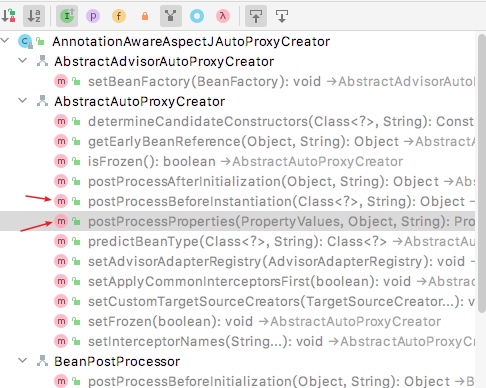

# Spring Aop 2

##Spring Aop初始化流程

接下来看下Spring 如何让启动Aop。

Spring Aop 是独立的模块，并不是容器的默认像，需要@EnableAspectJAutoProxy注解才能够发挥作用。首先看注解

```java
@Target(ElementType.TYPE)
@Retention(RetentionPolicy.RUNTIME)
@Documented
@Import(AspectJAutoProxyRegistrar.class)
public @interface EnableAspectJAutoProxy {
    //当为true时使用cglib方式代理
	boolean proxyTargetClass() default false;
    //为了解决一些由于代理引发的切面失效问题，Spring AOP在Spring 4.3.1后引入了AopContext类来将代理类的引用存储在ThreadLocal中，通过AopContext可以快速获取当前类的代理类.默认为不支持，如果声明为true，即可使用AopContext获取代理类. 注意，AopContext用完会重置。只能在增强的Interceptor中使用。
	boolean exposeProxy() default false;
}
```

核心为@Import(AspectJAutoProxyRegistrar.class)。查看源码，属于Spring-context内的类。只做了一件事情，生成 AnnotationAwareAspectJAutoProxyCreator 类的RootBeanDefinition。bean名称为"org.springframework.aop.config.internalAutoProxyCreator"，添加到容器的BeanDefinitionRegistry。

```java
class AspectJAutoProxyRegistrar implements ImportBeanDefinitionRegistrar {


	@Override
	public void registerBeanDefinitions(
			AnnotationMetadata importingClassMetadata, BeanDefinitionRegistry registry) {
        
		AopConfigUtils.registerAspectJAnnotationAutoProxyCreatorIfNecessary(registry);
        //如果存在注解并且有相应的值，就修改BeanDefinitionRegistry。
		AnnotationAttributes enableAspectJAutoProxy = AnnotationConfigUtils.attributesFor(importingClassMetadata, EnableAspectJAutoProxy.class);
		if (enableAspectJAutoProxy != null) {
			if (enableAspectJAutoProxy.getBoolean("proxyTargetClass")) {
				AopConfigUtils.forceAutoProxyCreatorToUseClassProxying(registry);
			}
			if (enableAspectJAutoProxy.getBoolean("exposeProxy")) {
				AopConfigUtils.forceAutoProxyCreatorToExposeProxy(registry);
			}
		}
	}

}

```


来启动配置，具体类为AopConfigUtils。

```java
public abstract class AopConfigUtils {

	//自动代理bean名
	public static final String AUTO_PROXY_CREATOR_BEAN_NAME = "org.springframework.aop.config.internalAutoProxyCreator";

    @Nullable
    public static BeanDefinition registerAspectJAnnotationAutoProxyCreatorIfNecessary(BeanDefinitionRegistry registry) {
        return registerAspectJAnnotationAutoProxyCreatorIfNecessary(registry, null);
    }
    //将 AnnotationAwareAspectJAutoProxyCreator 注册到BeanDefinitionRegistry。
    @Nullable
    public static BeanDefinition registerAspectJAnnotationAutoProxyCreatorIfNecessary(BeanDefinitionRegistry registry, @Nullable Object source) {
        //固定了AnnotationAwareAspectJAutoProxyCreator类。
        return registerOrEscalateApcAsRequired(AnnotationAwareAspectJAutoProxyCreator.class, registry, source);
    }
    @Nullable
    private static BeanDefinition registerOrEscalateApcAsRequired(Class<?> cls, BeanDefinitionRegistry registry, @Nullable Object source) {
        //生成bean定义
        RootBeanDefinition beanDefinition = new RootBeanDefinition(cls);
        beanDefinition.setSource(source);
        beanDefinition.getPropertyValues().add("order", Ordered.HIGHEST_PRECEDENCE);
        beanDefinition.setRole(BeanDefinition.ROLE_INFRASTRUCTURE);
        registry.registerBeanDefinition(AUTO_PROXY_CREATOR_BEAN_NAME, beanDefinition);
        return beanDefinition;
    }
    //设置属性
    public static void forceAutoProxyCreatorToUseClassProxying(BeanDefinitionRegistry registry) {
        if (registry.containsBeanDefinition(AUTO_PROXY_CREATOR_BEAN_NAME)) {
            BeanDefinition definition = registry.getBeanDefinition(AUTO_PROXY_CREATOR_BEAN_NAME);
            definition.getPropertyValues().add("proxyTargetClass", Boolean.TRUE);
        }
    }
    //设置属性
    public static void forceAutoProxyCreatorToExposeProxy(BeanDefinitionRegistry registry) {
        if (registry.containsBeanDefinition(AUTO_PROXY_CREATOR_BEAN_NAME)) {
            BeanDefinition definition = registry.getBeanDefinition(AUTO_PROXY_CREATOR_BEAN_NAME);
            definition.getPropertyValues().add("exposeProxy", Boolean.TRUE);
        }
    }

	//忽略

}
```

AnnotationAwareAspectJAutoProxyCreator 名字含义为: 基于注解的AspectJ自动代理构造器，查看继承关系，还是比较复杂的。

从继承关系图可以看到AnnotationAwareAspectJAutoProxyCreator实现了 BeanPostProcessor。依据经验核心代码应该是在BeanPostProcessor的两个实现类。
通过idea的类的结构图可以看到，在抽象类 AbstractAutoProxyCreator 中有实现了两个抽象方法


首先看AnnotationAwareAspectJAutoProxyCreator的父类

```java
public abstract class AbstractAutoProxyCreator extends ProxyProcessorSupport implements SmartInstantiationAwareBeanPostProcessor, BeanFactoryAware {
    
    //此时bean已经实例化，但是没有调用Spring property population，即没有进行依赖注入
    @Override
    public Object postProcessAfterInitialization(@Nullable Object bean, String beanName) {
        if (bean != null) {
            Object cacheKey = getCacheKey(bean.getClass(), beanName);
            if (this.earlyProxyReferences.remove(cacheKey) != bean) {
                return wrapIfNecessary(bean, beanName, cacheKey);
            }
        }
        return bean;
    }
    //总共做了两步，1、寻找拦截器，2、根据拦截器创建代理。
    protected Object wrapIfNecessary(Object bean, String beanName, Object cacheKey) {
        //如果有advice,就是创建一个代理。
        //看到specificInterceptors，就比较熟悉了， 无论JDK还是CGLIB，都需要一个拦截器
        Object[] specificInterceptors = getAdvicesAndAdvisorsForBean(bean.getClass(), beanName, null);
        if (specificInterceptors != DO_NOT_PROXY) {
            this.advisedBeans.put(cacheKey, Boolean.TRUE);
            Object proxy = createProxy(bean.getClass(), beanName, specificInterceptors, new SingletonTargetSource(bean));
            this.proxyTypes.put(cacheKey, proxy.getClass());
            return proxy;
        }
        return bean;
    }

    protected Object createProxy(Class<?> beanClass, @Nullable String beanName,
                                 @Nullable Object[] specificInterceptors, TargetSource targetSource) {

        if (this.beanFactory instanceof ConfigurableListableBeanFactory) {
            AutoProxyUtils.exposeTargetClass((ConfigurableListableBeanFactory) this.beanFactory, beanName, beanClass);
        }
        //创建一个代理工厂
        ProxyFactory proxyFactory = new ProxyFactory();
        proxyFactory.copyFrom(this);

        if (proxyFactory.isProxyTargetClass()) {
            // Explicit handling of JDK proxy targets (for introduction advice scenarios)
            if (Proxy.isProxyClass(beanClass)) {
                // Must allow for introductions; can't just set interfaces to the proxy's interfaces only.
                for (Class<?> ifc : beanClass.getInterfaces()) {
                    proxyFactory.addInterface(ifc);
                }
            }
        }
        else {
            // No proxyTargetClass flag enforced, let's apply our default checks...
            if (shouldProxyTargetClass(beanClass, beanName)) {
                proxyFactory.setProxyTargetClass(true);
            }
            else {
                evaluateProxyInterfaces(beanClass, proxyFactory);
            }
        }
        //查找相对应的通知 Advisor
        Advisor[] advisors = buildAdvisors(beanName, specificInterceptors);
        proxyFactory.addAdvisors(advisors);
        proxyFactory.setTargetSource(targetSource);
        customizeProxyFactory(proxyFactory);

        proxyFactory.setFrozen(this.freezeProxy);
        if (advisorsPreFiltered()) {
            proxyFactory.setPreFiltered(true);
        }

        // Use original ClassLoader if bean class not locally loaded in overriding class loader
        ClassLoader classLoader = getProxyClassLoader();
        if (classLoader instanceof SmartClassLoader && classLoader != beanClass.getClassLoader()) {
            classLoader = ((SmartClassLoader) classLoader).getOriginalClassLoader();
        }
        //前面准备完成，创建代理
        return proxyFactory.getProxy(classLoader);
    }
    //需要子类去实现
    @Nullable
    protected abstract Object[] getAdvicesAndAdvisorsForBean(Class<?> beanClass, String beanName,
                                                             @Nullable TargetSource customTargetSource) throws BeansException;
}
```

首先看一下如何查找拦截器

具体实现在子类AbstractAdvisorAutoProxyCreator

```java
public abstract class AbstractAdvisorAutoProxyCreator extends AbstractAutoProxyCreator {

    //用来查找advisor
    @Nullable
    private BeanFactoryAdvisorRetrievalHelper advisorRetrievalHelper;
    
    @Override
    public void setBeanFactory(BeanFactory beanFactory) {
        super.setBeanFactory(beanFactory);
        if (!(beanFactory instanceof ConfigurableListableBeanFactory)) {
            throw new IllegalArgumentException("AdvisorAutoProxyCreator requires a ConfigurableListableBeanFactory: " + beanFactory);
        }
        initBeanFactory((ConfigurableListableBeanFactory) beanFactory);
    }

    protected void initBeanFactory(ConfigurableListableBeanFactory beanFactory) {
        //初始化advisorRetrievalHelper
        this.advisorRetrievalHelper = new BeanFactoryAdvisorRetrievalHelperAdapter(beanFactory);
    }

	@Override
	@Nullable
	protected Object[] getAdvicesAndAdvisorsForBean(Class<?> beanClass, String beanName, @Nullable TargetSource targetSource) {

		List<Advisor> advisors = findEligibleAdvisors(beanClass, beanName);
		if (advisors.isEmpty()) {
			return DO_NOT_PROXY;
		}
		return advisors.toArray();
	}

    protected List<Advisor> findEligibleAdvisors(Class<?> beanClass, String beanName) {
        //查找候选的Advisor
        List<Advisor> candidateAdvisors = findCandidateAdvisors();
        //根据规则获取可用的Advisor
        List<Advisor> eligibleAdvisors = findAdvisorsThatCanApply(candidateAdvisors, beanClass, beanName);
        
        extendAdvisors(eligibleAdvisors);
        if (!eligibleAdvisors.isEmpty()) {
            eligibleAdvisors = sortAdvisors(eligibleAdvisors);
        }
        return eligibleAdvisors;
    }

    protected List<Advisor> findCandidateAdvisors() {
        Assert.state(this.advisorRetrievalHelper != null, "No BeanFactoryAdvisorRetrievalHelper available");
        return this.advisorRetrievalHelper.findAdvisorBeans();
    }

    protected List<Advisor> findAdvisorsThatCanApply(
            List<Advisor> candidateAdvisors, Class<?> beanClass, String beanName) {

        ProxyCreationContext.setCurrentProxiedBeanName(beanName);
        try {
            return AopUtils.findAdvisorsThatCanApply(candidateAdvisors, beanClass);
        }
        finally {
            ProxyCreationContext.setCurrentProxiedBeanName(null);
        }
    }
}
```


查找候选的advisor
```java
public class BeanFactoryAdvisorRetrievalHelper {

	private static final Log logger = LogFactory.getLog(BeanFactoryAdvisorRetrievalHelper.class);

	private final ConfigurableListableBeanFactory beanFactory;

	@Nullable
	private volatile String[] cachedAdvisorBeanNames;


	/**
	 * Create a new BeanFactoryAdvisorRetrievalHelper for the given BeanFactory.
	 * @param beanFactory the ListableBeanFactory to scan
	 */
	public BeanFactoryAdvisorRetrievalHelper(ConfigurableListableBeanFactory beanFactory) {
		Assert.notNull(beanFactory, "ListableBeanFactory must not be null");
		this.beanFactory = beanFactory;
	}


	/**
	 * Find all eligible Advisor beans in the current bean factory,
	 * ignoring FactoryBeans and excluding beans that are currently in creation.
	 * @return the list of {@link org.springframework.aop.Advisor} beans
	 * @see #isEligibleBean
	 */
	public List<Advisor> findAdvisorBeans() {
		// Determine list of advisor bean names, if not cached already.
		String[] advisorNames = this.cachedAdvisorBeanNames;
		if (advisorNames == null) {
			// Do not initialize FactoryBeans here: We need to leave all regular beans
			// uninitialized to let the auto-proxy creator apply to them!
			advisorNames = BeanFactoryUtils.beanNamesForTypeIncludingAncestors(
					this.beanFactory, Advisor.class, true, false);
			this.cachedAdvisorBeanNames = advisorNames;
		}
		if (advisorNames.length == 0) {
			return new ArrayList<>();
		}

		List<Advisor> advisors = new ArrayList<>();
		for (String name : advisorNames) {
			if (isEligibleBean(name)) {
				if (this.beanFactory.isCurrentlyInCreation(name)) {
					if (logger.isTraceEnabled()) {
						logger.trace("Skipping currently created advisor '" + name + "'");
					}
				}
				else {
					try {
						advisors.add(this.beanFactory.getBean(name, Advisor.class));
					}
					catch (BeanCreationException ex) {
						Throwable rootCause = ex.getMostSpecificCause();
						if (rootCause instanceof BeanCurrentlyInCreationException) {
							BeanCreationException bce = (BeanCreationException) rootCause;
							String bceBeanName = bce.getBeanName();
							if (bceBeanName != null && this.beanFactory.isCurrentlyInCreation(bceBeanName)) {
								if (logger.isTraceEnabled()) {
									logger.trace("Skipping advisor '" + name +
											"' with dependency on currently created bean: " + ex.getMessage());
								}
								// Ignore: indicates a reference back to the bean we're trying to advise.
								// We want to find advisors other than the currently created bean itself.
								continue;
							}
						}
						throw ex;
					}
				}
			}
		}
		return advisors;
	}
}
```

org.springframework.aop.aspectj.annotation.BeanFactoryAspectJAdvisorsBuilder.buildAspectJAdvisors获取容器中所有的
核心的两句
MetadataAwareAspectInstanceFactory factory =
new BeanFactoryAspectInstanceFactory(this.beanFactory, beanName);
List<Advisor classAdvisors = this.advisorFactory.getAdvisors(factory);

```java
public class ReflectiveAspectJAdvisorFactory extends AbstractAspectJAdvisorFactory implements Serializable {
    @Override
    public List<Advisor> getAdvisors(MetadataAwareAspectInstanceFactory aspectInstanceFactory) {
        Class<?> aspectClass = aspectInstanceFactory.getAspectMetadata().getAspectClass();
        String aspectName = aspectInstanceFactory.getAspectMetadata().getAspectName();
        validate(aspectClass);

        // We need to wrap the MetadataAwareAspectInstanceFactory with a decorator
        // so that it will only instantiate once.
        MetadataAwareAspectInstanceFactory lazySingletonAspectInstanceFactory =
                new LazySingletonAspectInstanceFactoryDecorator(aspectInstanceFactory);

        List<Advisor> advisors = new ArrayList<>();
        for (Method method : getAdvisorMethods(aspectClass)) {
            // Prior to Spring Framework 5.2.7, advisors.size() was supplied as the declarationOrderInAspect
            // to getAdvisor(...) to represent the "current position" in the declared methods list.
            // However, since Java 7 the "current position" is not valid since the JDK no longer
            // returns declared methods in the order in which they are declared in the source code.
            // Thus, we now hard code the declarationOrderInAspect to 0 for all advice methods
            // discovered via reflection in order to support reliable advice ordering across JVM launches.
            // Specifically, a value of 0 aligns with the default value used in
            // AspectJPrecedenceComparator.getAspectDeclarationOrder(Advisor).
            Advisor advisor = getAdvisor(method, lazySingletonAspectInstanceFactory, 0, aspectName);
            if (advisor != null) {
                advisors.add(advisor);
            }
        }

        // If it's a per target aspect, emit the dummy instantiating aspect.
        if (!advisors.isEmpty() && lazySingletonAspectInstanceFactory.getAspectMetadata().isLazilyInstantiated()) {
            Advisor instantiationAdvisor = new SyntheticInstantiationAdvisor(lazySingletonAspectInstanceFactory);
            advisors.add(0, instantiationAdvisor);
        }

        // Find introduction fields.
        for (Field field : aspectClass.getDeclaredFields()) {
            Advisor advisor = getDeclareParentsAdvisor(field);
            if (advisor != null) {
                advisors.add(advisor);
            }
        }

        return advisors;
    }

    @Override
    @Nullable
    public Advisor getAdvisor(Method candidateAdviceMethod, MetadataAwareAspectInstanceFactory aspectInstanceFactory,
                              int declarationOrderInAspect, String aspectName) {

        validate(aspectInstanceFactory.getAspectMetadata().getAspectClass());

        AspectJExpressionPointcut expressionPointcut = getPointcut(
                candidateAdviceMethod, aspectInstanceFactory.getAspectMetadata().getAspectClass());
        if (expressionPointcut == null) {
            return null;
        }

        return new InstantiationModelAwarePointcutAdvisorImpl(expressionPointcut, candidateAdviceMethod,
                this, aspectInstanceFactory, declarationOrderInAspect, aspectName);
    }
}
```

可以看到为InstantiationModelAwarePointcutAdvisorImpl。

具体为 org.springframework.aop.aspectj.annotation.ReflectiveAspectJAdvisorFactory.getAdvisors

可以看到，最终是交给ProxyFactory去实现的。

## @EnableAspectJAutoProxy

## DefaultAopProxyFactory

ProxyFactory调用了父类的ProxyCreatorSupport的AopProxyFactory实例来创建代理。AopProxyFactory 实现类为DefaultAopProxyFactory。查看源码，AopProxyFactory继承了AopProxyFactory，本身只有一个方法createAopProxy。


```java
public class DefaultAopProxyFactory implements AopProxyFactory, Serializable {

	private static final long serialVersionUID = 7930414337282325166L;


	@Override
	public AopProxy createAopProxy(AdvisedSupport config) throws AopConfigException {
		if (!NativeDetector.inNativeImage() &&
				(config.isOptimize() || config.isProxyTargetClass() || hasNoUserSuppliedProxyInterfaces(config))) {
			Class<?> targetClass = config.getTargetClass();
			if (targetClass == null) {
				throw new AopConfigException("TargetSource cannot determine target class: " +
						"Either an interface or a target is required for proxy creation.");
			}
            //如果目标类是一个PROXY或者是一个接口，就仍然使用JDK方式进行代理
			if (targetClass.isInterface() || Proxy.isProxyClass(targetClass)) {
				return new JdkDynamicAopProxy(config);
			}
			return new ObjenesisCglibAopProxy(config);
		}
		else {
			return new JdkDynamicAopProxy(config);
		}
	}

	/**
	 * Determine whether the supplied {@link AdvisedSupport} has only the
	 * {@link org.springframework.aop.SpringProxy} interface specified
	 * (or no proxy interfaces specified at all).
	 */
	private boolean hasNoUserSuppliedProxyInterfaces(AdvisedSupport config) {
		Class<?>[] ifcs = config.getProxiedInterfaces();
		return (ifcs.length == 0 || (ifcs.length == 1 && SpringProxy.class.isAssignableFrom(ifcs[0])));
	}

}
```

只有一个方法，那就是

AopProxy createAopProxy(AdvisedSupport config)
返回了 AopProxy

```java
public interface AopProxy {

	/**
	 * Create a new proxy object.
	 * <pUses the AopProxy's default class loader (if necessary for proxy creation):
	 * usually, the thread context class loader.
	 * @return the new proxy object (never {@code null})
	 * @see Thread#getContextClassLoader()
	 */
	Object getProxy();

	/**
	 * Create a new proxy object.
	 * <pUses the given class loader (if necessary for proxy creation).
	 * {@code null} will simply be passed down and thus lead to the low-level
	 * proxy facility's default, which is usually different from the default chosen
	 * by the AopProxy implementation's {@link #getProxy()} method.
	 * @param classLoader the class loader to create the proxy with
	 * (or {@code null} for the low-level proxy facility's default)
	 * @return the new proxy object (never {@code null})
	 */
	Object getProxy(@Nullable ClassLoader classLoader);

}
```

查看实现类，可以看到两种具体的实现：ObjenesisCglibAopProxy和JdkDynamicAopProxy


所以Spring-aop最终时由ObjenesisCglibAopProxy和JdkDynamicAopProxy创建代理的，研究清楚了这两个类就能对Spring-Aop的实现有一个深入的了解。

# 参考

1. [java反射机制深入理解剖析](https://www.w3cschool.cn/java/java-reflex.html)
2. [Java:Annotation(注解)--原理到案例](https://www.jianshu.com/p/28edf5352b63)
3. [AnnotatedElement](https://www.jianshu.com/p/953e26463fbc)
4. [动态代理与静态代理区别](https://blog.csdn.net/ikownyou/article/details/53081426?utm_medium=distribute.pc_relevant.none-task-blog-2~default~baidujs_baidulandingword~default-0.pc_relevant_paycolumn_v3&spm=1001.2101.3001.4242.1&utm_relevant_index=3)
5. [Spring AOP——Spring 中面向切面编程 ](https://www.cnblogs.com/joy99/p/10941543.html)
6. [Spring 官方网站关于AOP的文档](https://docs.spring.io/spring-framework/docs/current/reference/html/core.html#aop)
7. [SpringAPI手动创建代理对象——ProxyFactory](https://blog.csdn.net/u012834750/article/details/71773598)
8. [精讲 Spring AOP](https://www.jianshu.com/nb/36701166)
9. [spring——Java Proxy和Cglib两种方式方法嵌套调用时候代理行为分析](https://juejin.cn/post/7038246357752086541)
10. [java动态代理ProxyGenerator](https://www.cnblogs.com/Joynic/p/13741473.html)
