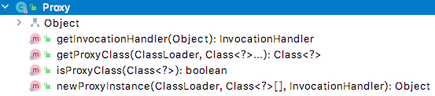

<div style="text-align: center;"><span style="font-size: xxx-large" >从JAVA反射技术到Spring AOP</span></div>

# 前言

当我们使用Spring框架实现我们业务的时候，Spring Aop是一个绕不开的话题。当我们使用Spring的@Transactional，@EnableCaching等注解的时候，底层是由AOP在发挥作用。因此当我们了解了Spring AOP，使用Spring的时候就会更加熟练。

# JAVA reflect

JAVA是面向对象编程的，因此我们学习和工作的过程中，常常会先定义一个类，然后创建类的对象，通过对象来实现我们的业务逻辑。在这个过程中，我们常常忘记类本身也是一个对象，也有他的方法和属性。

当一个class文件通过类加载器加载到内存中时，都会相应对的创建一个java.lang.Class对象。查看Class类的定义，我们发现只有一个私有的构造器。上面的注释说的很明白，Class的对象只有JVM可以创建。

```java
/*
     * Private constructor. Only the Java Virtual Machine creates Class objects.
     * This constructor is not used and prevents the default constructor being
     * generated.
     */
    private Class(ClassLoader loader) {
        // Initialize final field for classLoader.  The initialization value of non-null
        // prevents future JIT optimizations from assuming this final field is null.
        classLoader = loader;
    }
```

想获取一个类的Class对象，可以有一下三种方式：

1. 使用Class类的forName(String clazzName)方式，会调用native方法forName0(...)。
2. 调用某个类的class属性。例如User.class。
3. 调用某个对象的getClass()方法。该方法是java.lang.Object方法。是一个native方法。

那么Class对象有什么作用呢？从前面可以知道，一个class文件通过jvm的加载成为一个Class对象，反过来可以认为，Class对象是class文件在内存中的体现。显而易见，Class对象包含一个类的所有定义，如继承了什么类，实现了哪些接口，拥有的属性、构造函数、方法等。

那Class对象和反射有什么关系呢？

首先看下反射的定义：

> 主要是指程序可以访问，检测和修改它本身状态或行为的一种能力，并能根据自身行为的状态和结果，调整或修改应用所描述行为的状态和相关的语义。

对于JAVA程序来说，一个类有多个组成部分，例如：成员变量、方法、构造方法等，反射就是加载类，并解剖出类的各个组成部分，因此就用到了Class对象。

反射机制主要提供以下功能：

①在运行时判断任意一个对象所属的类；
②在运行时构造任意一个类的对象；
③在运行时判断任意一个类所具有的成员变量和方法；
④在运行时调用任意一个对象的方法；
⑤生成动态代理。

##反射机制中常用的类


| 类                            | 说明   |
| ------------------------------- | -------- |
| java.lang.Class               | 类     |
| java.lang.reflect.Constructor | 构造器 |
| java.lang.reflect.Field       | 属性   |
| java.lang.reflect.Method      | 方法   |
| java.lang.reflect.Modifier    | 修饰符 |

以上类都在rt.ja包下

其中Constructor和Method在反射过程中处于核心的位置，因此需要看下具体应用。

## Class类中的构造器方法

Class提供了两种方法获取类的构造器，每种方法又有两种重载方式。

具体如下：


| 序号 | 方法                                            | 作用                                        |
| ------ | ------------------------------------------------- | --------------------------------------------- |
| 1    | getConstructor(Class... parameterTypes)         | 根据参数Class获取指定的public修饰的构造函数 |
| 2    | getConstructors()                               | 获取所有public修饰的构造函数                |
| 3    | getDeclaredConstructor(Class... parameterTypes) | 根据参数Class获取指定的构造函数             |
| 4    | getDeclaredConstructors()                       | 根据参数Class获取所有修饰符的构造函数       |

以上方法会返回一个或者多个java.lang.reflect.Constructor实例，代表了某个构造函数的定义。
Constructor实例的一个常用方式是，创建目标类的实例。
举例如下：

```java
public class 使用Constractor对象创建实例 {
    public static void main(String[] args) throws NoSuchMethodException, InvocationTargetException, InstantiationException, IllegalAccessException {
        Class<ClassA> classAClass = ClassA.class;
        Constructor<ClassA> constructor = classAClass.getConstructor(String.class);
        ClassA classA = constructor.newInstance("使用Constructor获取实例");
        classA.printName();
        //输出： 名称为：使用Constructor获取实例
    }
}

class ClassA {
    private String msg;
    public ClassA(String msg) {
        this.msg = msg;
    }
    public void printName(){
        System.out.println("消息："+msg);
    }
}
```

## Class类中的method方法


| 序号 | 方法                                                           | 作用                                                         |
| ------ | ---------------------------------------------------------------- | -------------------------------------------------------------- |
| 1    | Method getMethod(String name, Class... parameterTypes)         | 查找public修饰符的指定方法，包含父类和接口                   |
| 2    | Method[] getMethods()                                          | 获取所有的public修饰的方法，包含父类和接口                   |
| 3    | Method getDeclaredMethod(String name, Class... parameterTypes) | 查找指定的方法，包含接口，但是不包含父类                     |
| 4    | Method[] getDeclaredMethods()                                  | 获取任意修饰符的的方法，包含接口的方法，但是不包含父类的方法 |

java.lang.reflect.Method 常用于对某个对象的方法进行增强的情况。具体用法如下：

```java
public class 使用Method对象 {
  
    public static void main(String[] args) throws NoSuchMethodException, InvocationTargetException, IllegalAccessException {
        Method getMethod = MethodClass.class.getMethod("get", String.class);
        MethodClass methodClass = new MethodClass();
        InvokeClass invokeClass = new InvokeClass(methodClass, getMethod);
        Object result = invokeClass.invoke("调用");
        System.out.println(result);
    }
}

//一个包装类
class InvokeClass{
    private Object object;
    private Method method;
  
    public InvokeClass(Object object, Method method) {
        this.object = object;
        this.method = method;
    }
    public Object invoke(Object ...parms) throws InvocationTargetException, IllegalAccessException {
        Object invoke = method.invoke(object, parms);
        System.out.println("增强。。。。");
        return invoke;
    }
}
class MethodClass{
    public String get(String msg){
        return msg;
    }
}
```

[java反射机制深入理解剖析](https://www.w3cschool.cn/java/java-reflex.html)

#代理
代理分为静态代理和动态代理。

静态代理: 由程序员创建或工具生成代理类的源码，再编译代理类。所谓静态也就是在程序运行前就已经存在代理类的字节码文件，代理类和委托类的关系在运行前就确定了。
动态代理：动态代理类的源码是在程序运行期间由JVM根据反射等机制动态的生成，所以不存在代理类的字节码文件。代理类和委托类的关系是在程序运行时确定。

## 静态代理static proxy

静态代理最明显的特征是需要我们写一个代理类。与被代理类共同实现一个接口。

```java
public class StaticProxyTest {
    public static void main(String[] args) {
        Printer proxy = new Proxy(new ColorPrinter());
        proxy.printMsg("消息");
        //结果：
        //打印前增强
        //彩色打印：消息

        Printer proxy2 = new Proxy(new BlackPrinter());
        proxy2.printMsg("消息");
        //结果：
        //打印前增强
        //黑白打印：消息
    }
}

interface Printer{
    void printMsg(String msg);
}

class ColorPrinter implements  Printer{
    @Override
    public void printMsg(String msg) {
        System.out.println("彩色打印："+msg);
    }
}

class BlackPrinter implements  Printer{
    @Override
    public void printMsg(String msg) {
        System.out.println("黑白打印："+msg);
    }
}

class Proxy implements Printer{

    private Printer printer;

    public Proxy(Printer printer) {
        this.printer = printer;
    }

    @Override
    public void printMsg(String msg) {
        System.out.println("打印前增强");
        printer.printMsg(msg);
    }
}
```

## 动态代理（dynamic proxy）

目前常用的动态代理有两种方式，一种是直接使用JDK自带的代理方式

### JDK动态代理

JDK代理的核心类为java.lang.reflect.Proxy。其中方法并不是很多。


其中核心方法为：

```java
public static Object newProxyInstance(ClassLoader loader,
                                          Class<?>[] interfaces,
                                          InvocationHandler h){
    //...
}
```

总共三个参数，第一个参数需要传入被代理类的ClassLoader和实现的接口，可以通过反射方式获取。接下来查看 InvocationHandler。

```java
public interface InvocationHandler {

    /**
     * @param   proxy 生成的代理类
     * @param   method 被代理类接口的方法
     * @param   args 参数数组
     * @return  method 方法的返回值
     */
    public Object invoke(Object proxy, Method method, Object[] args)
        throws Throwable;
}
```

可以看到， InvocationHandler是一个接口，只有一个方法invoke，有被代理类的实例和方法，以及参数。具体需要做什么由实现类决定。

通过以上分析，可以看出JDK代理需要一个被代理类的实例，以及一个InvocationHandler的实现类即可，由Proxy的静态方法可以创建一个代理类。

```java
public class JDK动态代理最简单示例 {
    //定义一个接口
    private interface Printer{
        void printMsg(String msg);
    }
    //定义实现类
    private static class ColorPrinter implements  Printer{
        @Override
        public void printMsg(String msg) {
            System.out.println("彩色打印："+msg);
        }
    }
    //实现InvocationHandler
    private static class PrinterInvocation implements InvocationHandler {

        private Object target;

        public PrinterInvocation(Object target) {
            this.target = target;
        }
  
        //实现增强的地方
        @Override
        public Object invoke(Object proxy, Method method, Object[] args) throws Throwable {
            System.out.println("代理类，准备执行代理类。。。");
            Object invoke = method.invoke(target, args);
            System.out.println("代理类，执行完毕。。。");
            return invoke;
        }
    }

    public static void main(String[] args) {
        //设置环境变量，将生成的代理类保存成文件
        System.getProperties().put("sun.misc.ProxyGenerator.saveGeneratedFiles", "true");

        ColorPrinter colorPrinter = new ColorPrinter();
        PrinterInvocation printerInvocation = new PrinterInvocation(colorPrinter);
        //生成代理类
        Printer printer =(Printer) Proxy.newProxyInstance(colorPrinter.getClass().getClassLoader(), colorPrinter.getClass().getInterfaces(), printerInvocation);
        printer.printMsg("消息");
    }
}
```

生成的代理类反编译如下：

```java
final class $Proxy0 extends Proxy implements Printer {
    private static Method m1;
    private static Method m3;
    private static Method m2;
    private static Method m0;

    public $Proxy0(InvocationHandler var1) throws Throwable{
        super(var1);
    }

    public final boolean equals(Object var1) throws  Throwable{
        try {
            return (Boolean)super.h.invoke(this, m1, new Object[]{var1});
        } catch (RuntimeException | Error var3) {
            throw var3;
        } catch (Throwable var4) {
            throw new UndeclaredThrowableException(var4);
        }
    }

    public final void printMsg(String var1) throws  Throwable{
        try {
            super.h.invoke(this, m3, new Object[]{var1});
        } catch (RuntimeException | Error var3) {
            throw var3;
        } catch (Throwable var4) {
            throw new UndeclaredThrowableException(var4);
        }
    }

    public final String toString() throws  Throwable{
        try {
            return (String)super.h.invoke(this, m2, (Object[])null);
        } catch (RuntimeException | Error var2) {
            throw var2;
        } catch (Throwable var3) {
            throw new UndeclaredThrowableException(var3);
        }
    }

    public final int hashCode() throws  Throwable{
        try {
            return (Integer)super.h.invoke(this, m0, (Object[])null);
        } catch (RuntimeException | Error var2) {
            throw var2;
        } catch (Throwable var3) {
            throw new UndeclaredThrowableException(var3);
        }
    }

    static {
        try {
            m1 = Class.forName("java.lang.Object").getMethod("equals", Class.forName("java.lang.Object"));
            m3 = Class.forName("代理模式.JDK动态代理.JDK动态代理最简单示例$Printer").getMethod("printMsg", Class.forName("java.lang.String"));
            m2 = Class.forName("java.lang.Object").getMethod("toString");
            m0 = Class.forName("java.lang.Object").getMethod("hashCode");
        } catch (NoSuchMethodException var2) {
            throw new NoSuchMethodError(var2.getMessage());
        } catch (ClassNotFoundException var3) {
            throw new NoClassDefFoundError(var3.getMessage());
        }
    }
}
```

可以看到，代理类继承了Proxy类，在实例化的时候把 InvocationHandler 赋予父类实例。另外定义了一定数量的Method变量，初始化再static的代码块，里面初始化了Object类和接口Printer的所有方法。
另外代理类实现了Printer接口的所有方法，每个方法，实际是去调用了InvocationHandler实例的invoke方法，这样就实现了代理的功能。

### Cglib动态代理。

Cglib动态代理的基本原理和JDK的相似。

需要引入一个cglib包

```xml
<dependencies>
    <dependency>
        <groupId>cglib</groupId>
        <artifactId>cglib</artifactId>
        <version>3.3.0</version>
    </dependency>
</dependencies>
```

核心入口类为 Enhancer

```java
public class CglibProxyTest {

    private static class CglibService {
        public void update(){
            System.out.println("原方法-更新");
        }
        public Object find(){
            System.out.println("原方法-查找");
            return new Object();
        }
    }

    //需要实现一个MethodInterceptor
    private static class CglibServiceInterceptor implements MethodInterceptor {

        public Object target;

        public CglibServiceInterceptor(Object target) {
            this.target = target;
        }

        @Override
        public Object intercept(Object o, Method method, Object[] objects, MethodProxy methodProxy) throws Throwable {
            System.out.println("执行代理方法--前 方法为"+method.getName());
            Object invoke = method.invoke(target, objects);
            System.out.println("执行代理方法--后 ");
            return invoke;
        }
    }

    public static void main(String[] args) {
        CglibService cglibService = new CglibService();
        //需要
        CglibServiceInterceptor cglibServiceInterceptor = new CglibServiceInterceptor(cglibService);

        Enhancer enhancer = new Enhancer();
        enhancer.setSuperclass(cglibService.getClass());
        enhancer.setCallback(cglibServiceInterceptor);
        CglibService proxyInstance = (CglibService) enhancer.create();

        proxyInstance.update();
    }
}
```

生成的代理类如下：

```java
import java.lang.reflect.Method;
import net.sf.cglib.core.ReflectUtils;
import net.sf.cglib.core.Signature;
import net.sf.cglib.proxy.Callback;
import net.sf.cglib.proxy.Factory;
import net.sf.cglib.proxy.MethodInterceptor;
import net.sf.cglib.proxy.MethodProxy;
import 代理模式.Cglib代理.CglibProxyTest.CglibService;

public class CglibProxyTest$CglibService$$EnhancerByCGLIB$$2caa56a extends CglibService implements Factory {
    private boolean CGLIB$BOUND;
    public static Object CGLIB$FACTORY_DATA;
    private static final ThreadLocal CGLIB$THREAD_CALLBACKS;
    private static final Callback[] CGLIB$STATIC_CALLBACKS;
    private MethodInterceptor CGLIB$CALLBACK_0;
    private static Object CGLIB$CALLBACK_FILTER;
    private static final Method CGLIB$update$0$Method;
    private static final MethodProxy CGLIB$update$0$Proxy;
    private static final Object[] CGLIB$emptyArgs;
    private static final Method CGLIB$find$1$Method;
    private static final MethodProxy CGLIB$find$1$Proxy;
    private static final Method CGLIB$equals$2$Method;
    private static final MethodProxy CGLIB$equals$2$Proxy;
    private static final Method CGLIB$toString$3$Method;
    private static final MethodProxy CGLIB$toString$3$Proxy;
    private static final Method CGLIB$hashCode$4$Method;
    private static final MethodProxy CGLIB$hashCode$4$Proxy;
    private static final Method CGLIB$clone$5$Method;
    private static final MethodProxy CGLIB$clone$5$Proxy;

    static void CGLIB$STATICHOOK1() {
        CGLIB$THREAD_CALLBACKS = new ThreadLocal();
        CGLIB$emptyArgs = new Object[0];
        Class var0 = Class.forName("代理模式.Cglib代理.CglibProxyTest$CglibService$$EnhancerByCGLIB$$2caa56a");
        Class var1;
        Method[] var10000 = ReflectUtils.findMethods(new String[]{"equals", "(Ljava/lang/Object;)Z", "toString", "()Ljava/lang/String;", "hashCode", "()I", "clone", "()Ljava/lang/Object;"}, (var1 = Class.forName("java.lang.Object")).getDeclaredMethods());
        CGLIB$equals$2$Method = var10000[0];
        CGLIB$equals$2$Proxy = MethodProxy.create(var1, var0, "(Ljava/lang/Object;)Z", "equals", "CGLIB$equals$2");
        CGLIB$toString$3$Method = var10000[1];
        CGLIB$toString$3$Proxy = MethodProxy.create(var1, var0, "()Ljava/lang/String;", "toString", "CGLIB$toString$3");
        CGLIB$hashCode$4$Method = var10000[2];
        CGLIB$hashCode$4$Proxy = MethodProxy.create(var1, var0, "()I", "hashCode", "CGLIB$hashCode$4");
        CGLIB$clone$5$Method = var10000[3];
        CGLIB$clone$5$Proxy = MethodProxy.create(var1, var0, "()Ljava/lang/Object;", "clone", "CGLIB$clone$5");
        var10000 = ReflectUtils.findMethods(new String[]{"update", "()V", "find", "()Ljava/lang/Object;"}, (var1 = Class.forName("代理模式.Cglib代理.CglibProxyTest$CglibService")).getDeclaredMethods());
        CGLIB$update$0$Method = var10000[0];
        CGLIB$update$0$Proxy = MethodProxy.create(var1, var0, "()V", "update", "CGLIB$update$0");
        CGLIB$find$1$Method = var10000[1];
        CGLIB$find$1$Proxy = MethodProxy.create(var1, var0, "()Ljava/lang/Object;", "find", "CGLIB$find$1");
    }

    final void CGLIB$update$0() {
        super.update();
    }

    public final void update() {
        MethodInterceptor var10000 = this.CGLIB$CALLBACK_0;
        if (var10000 == null) {
            CGLIB$BIND_CALLBACKS(this);
            var10000 = this.CGLIB$CALLBACK_0;
        }

        if (var10000 != null) {
            var10000.intercept(this, CGLIB$update$0$Method, CGLIB$emptyArgs, CGLIB$update$0$Proxy);
        } else {
            super.update();
        }
    }

    final Object CGLIB$find$1() {
        return super.find();
    }

    public final Object find() {
        MethodInterceptor var10000 = this.CGLIB$CALLBACK_0;
        if (var10000 == null) {
            CGLIB$BIND_CALLBACKS(this);
            var10000 = this.CGLIB$CALLBACK_0;
        }

        return var10000 != null ? var10000.intercept(this, CGLIB$find$1$Method, CGLIB$emptyArgs, CGLIB$find$1$Proxy) : super.find();
    }

    final boolean CGLIB$equals$2(Object var1) {
        return super.equals(var1);
    }

    public final boolean equals(Object var1) {
        MethodInterceptor var10000 = this.CGLIB$CALLBACK_0;
        if (var10000 == null) {
            CGLIB$BIND_CALLBACKS(this);
            var10000 = this.CGLIB$CALLBACK_0;
        }

        if (var10000 != null) {
            Object var2 = var10000.intercept(this, CGLIB$equals$2$Method, new Object[]{var1}, CGLIB$equals$2$Proxy);
            return var2 == null ? false : (Boolean)var2;
        } else {
            return super.equals(var1);
        }
    }

    final String CGLIB$toString$3() {
        return super.toString();
    }

    public final String toString() {
        MethodInterceptor var10000 = this.CGLIB$CALLBACK_0;
        if (var10000 == null) {
            CGLIB$BIND_CALLBACKS(this);
            var10000 = this.CGLIB$CALLBACK_0;
        }

        return var10000 != null ? (String)var10000.intercept(this, CGLIB$toString$3$Method, CGLIB$emptyArgs, CGLIB$toString$3$Proxy) : super.toString();
    }

    final int CGLIB$hashCode$4() {
        return super.hashCode();
    }

    public final int hashCode() {
        MethodInterceptor var10000 = this.CGLIB$CALLBACK_0;
        if (var10000 == null) {
            CGLIB$BIND_CALLBACKS(this);
            var10000 = this.CGLIB$CALLBACK_0;
        }

        if (var10000 != null) {
            Object var1 = var10000.intercept(this, CGLIB$hashCode$4$Method, CGLIB$emptyArgs, CGLIB$hashCode$4$Proxy);
            return var1 == null ? 0 : ((Number)var1).intValue();
        } else {
            return super.hashCode();
        }
    }

    final Object CGLIB$clone$5() throws CloneNotSupportedException {
        return super.clone();
    }

    protected final Object clone() throws CloneNotSupportedException {
        MethodInterceptor var10000 = this.CGLIB$CALLBACK_0;
        if (var10000 == null) {
            CGLIB$BIND_CALLBACKS(this);
            var10000 = this.CGLIB$CALLBACK_0;
        }

        return var10000 != null ? var10000.intercept(this, CGLIB$clone$5$Method, CGLIB$emptyArgs, CGLIB$clone$5$Proxy) : super.clone();
    }

    public static MethodProxy CGLIB$findMethodProxy(Signature var0) {
        String var10000 = var0.toString();
        switch(var10000.hashCode()) {
        case -1949253108:
            if (var10000.equals("update()V")) {
                return CGLIB$update$0$Proxy;
            }
            break;
        case -508378822:
            if (var10000.equals("clone()Ljava/lang/Object;")) {
                return CGLIB$clone$5$Proxy;
            }
            break;
        case 288953238:
            if (var10000.equals("find()Ljava/lang/Object;")) {
                return CGLIB$find$1$Proxy;
            }
            break;
        case 1826985398:
            if (var10000.equals("equals(Ljava/lang/Object;)Z")) {
                return CGLIB$equals$2$Proxy;
            }
            break;
        case 1913648695:
            if (var10000.equals("toString()Ljava/lang/String;")) {
                return CGLIB$toString$3$Proxy;
            }
            break;
        case 1984935277:
            if (var10000.equals("hashCode()I")) {
                return CGLIB$hashCode$4$Proxy;
            }
        }

        return null;
    }

    public CglibProxyTest$CglibService$$EnhancerByCGLIB$$2caa56a() {
        CGLIB$BIND_CALLBACKS(this);
    }

    public static void CGLIB$SET_THREAD_CALLBACKS(Callback[] var0) {
        CGLIB$THREAD_CALLBACKS.set(var0);
    }

    public static void CGLIB$SET_STATIC_CALLBACKS(Callback[] var0) {
        CGLIB$STATIC_CALLBACKS = var0;
    }

    private static final void CGLIB$BIND_CALLBACKS(Object var0) {
        CglibProxyTest$CglibService$$EnhancerByCGLIB$$2caa56a var1 = (CglibProxyTest$CglibService$$EnhancerByCGLIB$$2caa56a)var0;
        if (!var1.CGLIB$BOUND) {
            var1.CGLIB$BOUND = true;
            Object var10000 = CGLIB$THREAD_CALLBACKS.get();
            if (var10000 == null) {
                var10000 = CGLIB$STATIC_CALLBACKS;
                if (var10000 == null) {
                    return;
                }
            }

            var1.CGLIB$CALLBACK_0 = (MethodInterceptor)((Callback[])var10000)[0];
        }

    }

    public Object newInstance(Callback[] var1) {
        CGLIB$SET_THREAD_CALLBACKS(var1);
        CglibProxyTest$CglibService$$EnhancerByCGLIB$$2caa56a var10000 = new CglibProxyTest$CglibService$$EnhancerByCGLIB$$2caa56a();
        CGLIB$SET_THREAD_CALLBACKS((Callback[])null);
        return var10000;
    }

    public Object newInstance(Callback var1) {
        CGLIB$SET_THREAD_CALLBACKS(new Callback[]{var1});
        CglibProxyTest$CglibService$$EnhancerByCGLIB$$2caa56a var10000 = new CglibProxyTest$CglibService$$EnhancerByCGLIB$$2caa56a();
        CGLIB$SET_THREAD_CALLBACKS((Callback[])null);
        return var10000;
    }

    public Object newInstance(Class[] var1, Object[] var2, Callback[] var3) {
        CGLIB$SET_THREAD_CALLBACKS(var3);
        CglibProxyTest$CglibService$$EnhancerByCGLIB$$2caa56a var10000 = new CglibProxyTest$CglibService$$EnhancerByCGLIB$$2caa56a;
        switch(var1.length) {
        case 0:
            var10000.<init>();
            CGLIB$SET_THREAD_CALLBACKS((Callback[])null);
            return var10000;
        default:
            throw new IllegalArgumentException("Constructor not found");
        }
    }

    public Callback getCallback(int var1) {
        CGLIB$BIND_CALLBACKS(this);
        MethodInterceptor var10000;
        switch(var1) {
        case 0:
            var10000 = this.CGLIB$CALLBACK_0;
            break;
        default:
            var10000 = null;
        }

        return var10000;
    }

    public void setCallback(int var1, Callback var2) {
        switch(var1) {
        case 0:
            this.CGLIB$CALLBACK_0 = (MethodInterceptor)var2;
        default:
        }
    }

    public Callback[] getCallbacks() {
        CGLIB$BIND_CALLBACKS(this);
        return new Callback[]{this.CGLIB$CALLBACK_0};
    }

    public void setCallbacks(Callback[] var1) {
        this.CGLIB$CALLBACK_0 = (MethodInterceptor)var1[0];
    }

    static {
        CGLIB$STATICHOOK1();
    }
}
```

可以看到，代理类继承了CglibService类，重写了父类的方法，在调用父类的方法时，具体由MethodInterceptor的实现类去完成。

### 两种动态代理的简单对比


|                  | JDK                                                                                 | cglib                                                                                      |
| ------------------ | ------------------------------------------------------------------------------------- | -------------------------------------------------------------------------------------------- |
| 入口类           | java.lang.reflect.Proxy                                                             | net.sf.cglib.proxy.Enhancer                                                                |
| 增强类           | java.lang.reflect.InvocationHandler                                                 | net.sf.cglib.proxy.MethodInterceptor                                                       |
| 是否需要实现接口 | 是                                                                                  | 否                                                                                         |
| 原理             | 利用反射机制生成一个实现代理接口的匿名类，在调用具体方法前调用InvokeHandler来处理。 | 动态代理是利用asm开源包，对代理对象类的class文件加载进来，通过修改其字节码生成子类来处理。 |
