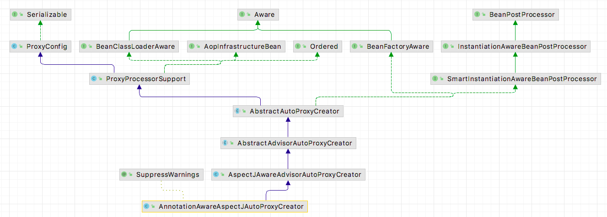

# Spring Aop

[Spring 官方网站关于AOP的文档](https://docs.spring.io/spring-framework/docs/current/reference/html/core.html#aop) 对spring 使用方法有比较详尽的介绍。

## AOP 术语

AOP 领域中的特性术语：

- 通知（Advice）: AOP 框架中的增强处理。通知描述了切面何时执行以及如何执行增强处理。
- 连接点（join point）: 连接点表示应用执行过程中能够插入切面的一个点，这个点可以是方法的调用、异常的抛出。在 Spring AOP 中，连接点总是方法的调用。
- 切点（PointCut）: 可以插入增强处理的连接点。
- 切面（Aspect）: 切面是通知和切点的结合。
- 引入（Introduction）：引入允许我们向现有的类添加新的方法或者属性。
- 织入（Weaving）: 将增强处理添加到目标对象中，并创建一个被增强的对象，这个过程就是织入。

## 简单的例子

新建一个maven工程，引入以下两个依赖。

```xml
<dependency>
    <groupId>org.springframework</groupId>
    <artifactId>spring-context</artifactId>
    <version>5.3.15</version>
</dependency>
<dependency>
    <groupId>org.springframework</groupId>
    <artifactId>spring-aspects</artifactId>
    <version>5.3.12</version>
</dependency>
```

例子如下：

```java
public class Application {
  
    //声明被代理对象
    @Component
    static class Duck{
        public void run(){
            System.out.println("小鸭快跑");
        }
    }
  
    @Aspect
    @Component
    @EnableAspectJAutoProxy
    static class Intercepter{

        @Before("execution(* com.mjy.spring.aop.Application..*.*(..))")
        public void before(){
            System.out.println("Aspect: 预备。。。");
        }
    }

    public static void main(String[] args) {
        AnnotationConfigApplicationContext annotationConfigApplicationContext = new AnnotationConfigApplicationContext(Duck.class, Intercepter.class);
        Duck bean = annotationConfigApplicationContext.getBean(Duck.class);
        bean.run();
    }
    //输出AspAspect: 
    //Aspect: 预备。。
    //小鸭快跑
}
```

## ProxyFactory

要想深入了解Spring Aop的运作原理，必须先理解ProxyFactory。ProxyFactory 属于spring-aop里面的类。


我们也可以通过 ProxyFactory 来手动创建代理。首先看一个

```java
public class Application {
    static class Duck{
        public void run(){
            System.out.println("小鸭快跑");
        }
    }
    public static void main(String[] args) {
        Duck duck = new Duck();
        //传入一个即将被代理的类
        MethodBeforeAdvice methodBeforeAdvice = new MethodBeforeAdvice() {
            @Override
            public void before(Method method, Object[] args, Object target) throws Throwable {
                System.out.println("前置通知");
            }
        };

        AfterReturningAdvice afterReturningAdvice = new AfterReturningAdvice() {
            @Override
            public void afterReturning(Object returnValue, Method method, Object[] args, Object target) throws Throwable {
                System.out.println("后置通知");
            }
        };

        MethodInterceptor methodInterceptor = new MethodInterceptor() {
            @Override
            public Object invoke(MethodInvocation invocation) throws Throwable {
                System.out.println("环绕通知前 ");
                Object proceed = invocation.proceed();
                System.out.println("环绕通知后 ");
                return proceed;
            }
        };

        ProxyFactory proxyFactory = new ProxyFactory(duck);
        proxyFactory.addAdvice(methodBeforeAdvice);
        proxyFactory.addAdvice(methodInterceptor);
        //addAdvice(Advice advice) 底层是封装成为一个Advisor的，因此也可以使用addAdvisor(Advisor advisor)方法
        proxyFactory.addAdvisor(new DefaultPointcutAdvisor(afterReturningAdvice));
        Duck proxyDuck = (Duck) proxyFactory.getProxy();
        proxyDuck.run();
        //输出：
        //前置通知
        //环绕通知前
        //小鸭快跑
        //后置通知
        //环绕通知后
    }
}
```

从以上可知， ProxyFactory需要传入一个被代理类，以及多个advice。

生成的Cglib代理类：

```java
import com.mjy.spring.aop.ProxyFactoryTest.CglibApplication.Duck;
import java.lang.reflect.Method;
import org.aopalliance.aop.Advice;
import org.springframework.aop.Advisor;
import org.springframework.aop.SpringProxy;
import org.springframework.aop.TargetClassAware;
import org.springframework.aop.TargetSource;
import org.springframework.aop.framework.Advised;
import org.springframework.aop.framework.AopConfigException;
import org.springframework.cglib.core.ReflectUtils;
import org.springframework.cglib.core.Signature;
import org.springframework.cglib.proxy.Callback;
import org.springframework.cglib.proxy.Dispatcher;
import org.springframework.cglib.proxy.Factory;
import org.springframework.cglib.proxy.MethodInterceptor;
import org.springframework.cglib.proxy.MethodProxy;
import org.springframework.cglib.proxy.NoOp;

public class CglibApplication$Duck$$EnhancerBySpringCGLIB$$9da35552 extends Duck implements SpringProxy, Advised, Factory {
    private boolean CGLIB$BOUND;
    public static Object CGLIB$FACTORY_DATA;
    private static final ThreadLocal CGLIB$THREAD_CALLBACKS;
    private static final Callback[] CGLIB$STATIC_CALLBACKS;
    private MethodInterceptor CGLIB$CALLBACK_0;
    private MethodInterceptor CGLIB$CALLBACK_1;
    private NoOp CGLIB$CALLBACK_2;
    private Dispatcher CGLIB$CALLBACK_3;
    private Dispatcher CGLIB$CALLBACK_4;
    private MethodInterceptor CGLIB$CALLBACK_5;
    private MethodInterceptor CGLIB$CALLBACK_6;
    private static Object CGLIB$CALLBACK_FILTER;
    private static final Method CGLIB$run$0$Method;
    private static final MethodProxy CGLIB$run$0$Proxy;
    private static final Object[] CGLIB$emptyArgs;
    private static final Method CGLIB$equals$1$Method;
    private static final MethodProxy CGLIB$equals$1$Proxy;
    private static final Method CGLIB$toString$2$Method;
    private static final MethodProxy CGLIB$toString$2$Proxy;
    private static final Method CGLIB$hashCode$3$Method;
    private static final MethodProxy CGLIB$hashCode$3$Proxy;
    private static final Method CGLIB$clone$4$Method;
    private static final MethodProxy CGLIB$clone$4$Proxy;

    static void CGLIB$STATICHOOK1() {
        CGLIB$THREAD_CALLBACKS = new ThreadLocal();
        CGLIB$emptyArgs = new Object[0];
        Class var0 = Class.forName("com.mjy.spring.aop.ProxyFactoryTest.CglibApplication$Duck$$EnhancerBySpringCGLIB$$9da35552");
        Class var1;
        Method[] var10000 = ReflectUtils.findMethods(new String[]{"equals", "(Ljava/lang/Object;)Z", "toString", "()Ljava/lang/String;", "hashCode", "()I", "clone", "()Ljava/lang/Object;"}, (var1 = Class.forName("java.lang.Object")).getDeclaredMethods());
        CGLIB$equals$1$Method = var10000[0];
        CGLIB$equals$1$Proxy = MethodProxy.create(var1, var0, "(Ljava/lang/Object;)Z", "equals", "CGLIB$equals$1");
        CGLIB$toString$2$Method = var10000[1];
        CGLIB$toString$2$Proxy = MethodProxy.create(var1, var0, "()Ljava/lang/String;", "toString", "CGLIB$toString$2");
        CGLIB$hashCode$3$Method = var10000[2];
        CGLIB$hashCode$3$Proxy = MethodProxy.create(var1, var0, "()I", "hashCode", "CGLIB$hashCode$3");
        CGLIB$clone$4$Method = var10000[3];
        CGLIB$clone$4$Proxy = MethodProxy.create(var1, var0, "()Ljava/lang/Object;", "clone", "CGLIB$clone$4");
        CGLIB$run$0$Method = ReflectUtils.findMethods(new String[]{"run", "()V"}, (var1 = Class.forName("com.mjy.spring.aop.ProxyFactoryTest.CglibApplication$Duck")).getDeclaredMethods())[0];
        CGLIB$run$0$Proxy = MethodProxy.create(var1, var0, "()V", "run", "CGLIB$run$0");
    }

    final void CGLIB$run$0() {
        super.run();
    }

    public final void run() {
        MethodInterceptor var10000 = this.CGLIB$CALLBACK_0;
        if (var10000 == null) {
            CGLIB$BIND_CALLBACKS(this);
            var10000 = this.CGLIB$CALLBACK_0;
        }

        if (var10000 != null) {
            var10000.intercept(this, CGLIB$run$0$Method, CGLIB$emptyArgs, CGLIB$run$0$Proxy);
        } else {
            super.run();
        }
    }

    final boolean CGLIB$equals$1(Object var1) {
        return super.equals(var1);
    }

    public final boolean equals(Object var1) {
        MethodInterceptor var10000 = this.CGLIB$CALLBACK_5;
        if (var10000 == null) {
            CGLIB$BIND_CALLBACKS(this);
            var10000 = this.CGLIB$CALLBACK_5;
        }

        if (var10000 != null) {
            Object var2 = var10000.intercept(this, CGLIB$equals$1$Method, new Object[]{var1}, CGLIB$equals$1$Proxy);
            return var2 == null ? false : (Boolean)var2;
        } else {
            return super.equals(var1);
        }
    }

    final String CGLIB$toString$2() {
        return super.toString();
    }

    public final String toString() {
        MethodInterceptor var10000 = this.CGLIB$CALLBACK_0;
        if (var10000 == null) {
            CGLIB$BIND_CALLBACKS(this);
            var10000 = this.CGLIB$CALLBACK_0;
        }

        return var10000 != null ? (String)var10000.intercept(this, CGLIB$toString$2$Method, CGLIB$emptyArgs, CGLIB$toString$2$Proxy) : super.toString();
    }

    final int CGLIB$hashCode$3() {
        return super.hashCode();
    }

    public final int hashCode() {
        MethodInterceptor var10000 = this.CGLIB$CALLBACK_6;
        if (var10000 == null) {
            CGLIB$BIND_CALLBACKS(this);
            var10000 = this.CGLIB$CALLBACK_6;
        }

        if (var10000 != null) {
            Object var1 = var10000.intercept(this, CGLIB$hashCode$3$Method, CGLIB$emptyArgs, CGLIB$hashCode$3$Proxy);
            return var1 == null ? 0 : ((Number)var1).intValue();
        } else {
            return super.hashCode();
        }
    }

    final Object CGLIB$clone$4() throws CloneNotSupportedException {
        return super.clone();
    }

    protected final Object clone() throws CloneNotSupportedException {
        MethodInterceptor var10000 = this.CGLIB$CALLBACK_0;
        if (var10000 == null) {
            CGLIB$BIND_CALLBACKS(this);
            var10000 = this.CGLIB$CALLBACK_0;
        }

        return var10000 != null ? var10000.intercept(this, CGLIB$clone$4$Method, CGLIB$emptyArgs, CGLIB$clone$4$Proxy) : super.clone();
    }

    public static MethodProxy CGLIB$findMethodProxy(Signature var0) {
        String var10000 = var0.toString();
        switch(var10000.hashCode()) {
        case -919875318:
            if (var10000.equals("run()V")) {
                return CGLIB$run$0$Proxy;
            }
            break;
        case -508378822:
            if (var10000.equals("clone()Ljava/lang/Object;")) {
                return CGLIB$clone$4$Proxy;
            }
            break;
        case 1826985398:
            if (var10000.equals("equals(Ljava/lang/Object;)Z")) {
                return CGLIB$equals$1$Proxy;
            }
            break;
        case 1913648695:
            if (var10000.equals("toString()Ljava/lang/String;")) {
                return CGLIB$toString$2$Proxy;
            }
            break;
        case 1984935277:
            if (var10000.equals("hashCode()I")) {
                return CGLIB$hashCode$3$Proxy;
            }
        }

        return null;
    }

    public final int indexOf(Advisor var1) {
        Dispatcher var10000 = this.CGLIB$CALLBACK_4;
        if (var10000 == null) {
            CGLIB$BIND_CALLBACKS(this);
            var10000 = this.CGLIB$CALLBACK_4;
        }

        return ((Advised)var10000.loadObject()).indexOf(var1);
    }

    public final int indexOf(Advice var1) {
        Dispatcher var10000 = this.CGLIB$CALLBACK_4;
        if (var10000 == null) {
            CGLIB$BIND_CALLBACKS(this);
            var10000 = this.CGLIB$CALLBACK_4;
        }

        return ((Advised)var10000.loadObject()).indexOf(var1);
    }

    public final boolean isFrozen() {
        Dispatcher var10000 = this.CGLIB$CALLBACK_4;
        if (var10000 == null) {
            CGLIB$BIND_CALLBACKS(this);
            var10000 = this.CGLIB$CALLBACK_4;
        }

        return ((Advised)var10000.loadObject()).isFrozen();
    }

    public final void addAdvice(Advice var1) throws AopConfigException {
        Dispatcher var10000 = this.CGLIB$CALLBACK_4;
        if (var10000 == null) {
            CGLIB$BIND_CALLBACKS(this);
            var10000 = this.CGLIB$CALLBACK_4;
        }

        ((Advised)var10000.loadObject()).addAdvice(var1);
    }

    public final void addAdvice(int var1, Advice var2) throws AopConfigException {
        Dispatcher var10000 = this.CGLIB$CALLBACK_4;
        if (var10000 == null) {
            CGLIB$BIND_CALLBACKS(this);
            var10000 = this.CGLIB$CALLBACK_4;
        }

        ((Advised)var10000.loadObject()).addAdvice(var1, var2);
    }

    public final void addAdvisor(Advisor var1) throws AopConfigException {
        Dispatcher var10000 = this.CGLIB$CALLBACK_4;
        if (var10000 == null) {
            CGLIB$BIND_CALLBACKS(this);
            var10000 = this.CGLIB$CALLBACK_4;
        }

        ((Advised)var10000.loadObject()).addAdvisor(var1);
    }

    public final void addAdvisor(int var1, Advisor var2) throws AopConfigException {
        Dispatcher var10000 = this.CGLIB$CALLBACK_4;
        if (var10000 == null) {
            CGLIB$BIND_CALLBACKS(this);
            var10000 = this.CGLIB$CALLBACK_4;
        }

        ((Advised)var10000.loadObject()).addAdvisor(var1, var2);
    }

    public final TargetSource getTargetSource() {
        Dispatcher var10000 = this.CGLIB$CALLBACK_4;
        if (var10000 == null) {
            CGLIB$BIND_CALLBACKS(this);
            var10000 = this.CGLIB$CALLBACK_4;
        }

        return ((Advised)var10000.loadObject()).getTargetSource();
    }

    public final void setPreFiltered(boolean var1) {
        Dispatcher var10000 = this.CGLIB$CALLBACK_4;
        if (var10000 == null) {
            CGLIB$BIND_CALLBACKS(this);
            var10000 = this.CGLIB$CALLBACK_4;
        }

        ((Advised)var10000.loadObject()).setPreFiltered(var1);
    }

    public final boolean isPreFiltered() {
        Dispatcher var10000 = this.CGLIB$CALLBACK_4;
        if (var10000 == null) {
            CGLIB$BIND_CALLBACKS(this);
            var10000 = this.CGLIB$CALLBACK_4;
        }

        return ((Advised)var10000.loadObject()).isPreFiltered();
    }

    public final Class[] getProxiedInterfaces() {
        Dispatcher var10000 = this.CGLIB$CALLBACK_4;
        if (var10000 == null) {
            CGLIB$BIND_CALLBACKS(this);
            var10000 = this.CGLIB$CALLBACK_4;
        }

        return ((Advised)var10000.loadObject()).getProxiedInterfaces();
    }

    public final boolean isInterfaceProxied(Class var1) {
        Dispatcher var10000 = this.CGLIB$CALLBACK_4;
        if (var10000 == null) {
            CGLIB$BIND_CALLBACKS(this);
            var10000 = this.CGLIB$CALLBACK_4;
        }

        return ((Advised)var10000.loadObject()).isInterfaceProxied(var1);
    }

    public final Advisor[] getAdvisors() {
        Dispatcher var10000 = this.CGLIB$CALLBACK_4;
        if (var10000 == null) {
            CGLIB$BIND_CALLBACKS(this);
            var10000 = this.CGLIB$CALLBACK_4;
        }

        return ((Advised)var10000.loadObject()).getAdvisors();
    }

    public final int getAdvisorCount() {
        Dispatcher var10000 = this.CGLIB$CALLBACK_4;
        if (var10000 == null) {
            CGLIB$BIND_CALLBACKS(this);
            var10000 = this.CGLIB$CALLBACK_4;
        }

        return ((Advised)var10000.loadObject()).getAdvisorCount();
    }

    public final void setTargetSource(TargetSource var1) {
        Dispatcher var10000 = this.CGLIB$CALLBACK_4;
        if (var10000 == null) {
            CGLIB$BIND_CALLBACKS(this);
            var10000 = this.CGLIB$CALLBACK_4;
        }

        ((Advised)var10000.loadObject()).setTargetSource(var1);
    }

    public final void removeAdvisor(int var1) throws AopConfigException {
        Dispatcher var10000 = this.CGLIB$CALLBACK_4;
        if (var10000 == null) {
            CGLIB$BIND_CALLBACKS(this);
            var10000 = this.CGLIB$CALLBACK_4;
        }

        ((Advised)var10000.loadObject()).removeAdvisor(var1);
    }

    public final boolean removeAdvisor(Advisor var1) {
        Dispatcher var10000 = this.CGLIB$CALLBACK_4;
        if (var10000 == null) {
            CGLIB$BIND_CALLBACKS(this);
            var10000 = this.CGLIB$CALLBACK_4;
        }

        return ((Advised)var10000.loadObject()).removeAdvisor(var1);
    }

    public final void setExposeProxy(boolean var1) {
        Dispatcher var10000 = this.CGLIB$CALLBACK_4;
        if (var10000 == null) {
            CGLIB$BIND_CALLBACKS(this);
            var10000 = this.CGLIB$CALLBACK_4;
        }

        ((Advised)var10000.loadObject()).setExposeProxy(var1);
    }

    public final boolean replaceAdvisor(Advisor var1, Advisor var2) throws AopConfigException {
        Dispatcher var10000 = this.CGLIB$CALLBACK_4;
        if (var10000 == null) {
            CGLIB$BIND_CALLBACKS(this);
            var10000 = this.CGLIB$CALLBACK_4;
        }

        return ((Advised)var10000.loadObject()).replaceAdvisor(var1, var2);
    }

    public final boolean removeAdvice(Advice var1) {
        Dispatcher var10000 = this.CGLIB$CALLBACK_4;
        if (var10000 == null) {
            CGLIB$BIND_CALLBACKS(this);
            var10000 = this.CGLIB$CALLBACK_4;
        }

        return ((Advised)var10000.loadObject()).removeAdvice(var1);
    }

    public final String toProxyConfigString() {
        Dispatcher var10000 = this.CGLIB$CALLBACK_4;
        if (var10000 == null) {
            CGLIB$BIND_CALLBACKS(this);
            var10000 = this.CGLIB$CALLBACK_4;
        }

        return ((Advised)var10000.loadObject()).toProxyConfigString();
    }

    public final boolean isProxyTargetClass() {
        Dispatcher var10000 = this.CGLIB$CALLBACK_4;
        if (var10000 == null) {
            CGLIB$BIND_CALLBACKS(this);
            var10000 = this.CGLIB$CALLBACK_4;
        }

        return ((Advised)var10000.loadObject()).isProxyTargetClass();
    }

    public final boolean isExposeProxy() {
        Dispatcher var10000 = this.CGLIB$CALLBACK_4;
        if (var10000 == null) {
            CGLIB$BIND_CALLBACKS(this);
            var10000 = this.CGLIB$CALLBACK_4;
        }

        return ((Advised)var10000.loadObject()).isExposeProxy();
    }

    public final Class getTargetClass() {
        Dispatcher var10000 = this.CGLIB$CALLBACK_4;
        if (var10000 == null) {
            CGLIB$BIND_CALLBACKS(this);
            var10000 = this.CGLIB$CALLBACK_4;
        }

        return ((TargetClassAware)var10000.loadObject()).getTargetClass();
    }

    public CglibApplication$Duck$$EnhancerBySpringCGLIB$$9da35552() {
        CGLIB$BIND_CALLBACKS(this);
    }

    public static void CGLIB$SET_THREAD_CALLBACKS(Callback[] var0) {
        CGLIB$THREAD_CALLBACKS.set(var0);
    }

    public static void CGLIB$SET_STATIC_CALLBACKS(Callback[] var0) {
        CGLIB$STATIC_CALLBACKS = var0;
    }

    private static final void CGLIB$BIND_CALLBACKS(Object var0) {
        CglibApplication$Duck$$EnhancerBySpringCGLIB$$9da35552 var1 = (CglibApplication$Duck$$EnhancerBySpringCGLIB$$9da35552)var0;
        if (!var1.CGLIB$BOUND) {
            var1.CGLIB$BOUND = true;
            Object var10000 = CGLIB$THREAD_CALLBACKS.get();
            if (var10000 == null) {
                var10000 = CGLIB$STATIC_CALLBACKS;
                if (var10000 == null) {
                    return;
                }
            }

            Callback[] var10001 = (Callback[])var10000;
            var1.CGLIB$CALLBACK_6 = (MethodInterceptor)((Callback[])var10000)[6];
            var1.CGLIB$CALLBACK_5 = (MethodInterceptor)var10001[5];
            var1.CGLIB$CALLBACK_4 = (Dispatcher)var10001[4];
            var1.CGLIB$CALLBACK_3 = (Dispatcher)var10001[3];
            var1.CGLIB$CALLBACK_2 = (NoOp)var10001[2];
            var1.CGLIB$CALLBACK_1 = (MethodInterceptor)var10001[1];
            var1.CGLIB$CALLBACK_0 = (MethodInterceptor)var10001[0];
        }

    }

    public Object newInstance(Callback[] var1) {
        CGLIB$SET_THREAD_CALLBACKS(var1);
        CglibApplication$Duck$$EnhancerBySpringCGLIB$$9da35552 var10000 = new CglibApplication$Duck$$EnhancerBySpringCGLIB$$9da35552();
        CGLIB$SET_THREAD_CALLBACKS((Callback[])null);
        return var10000;
    }

    public Object newInstance(Callback var1) {
        throw new IllegalStateException("More than one callback object required");
    }

    public Object newInstance(Class[] var1, Object[] var2, Callback[] var3) {
        CGLIB$SET_THREAD_CALLBACKS(var3);
        CglibApplication$Duck$$EnhancerBySpringCGLIB$$9da35552 var10000 = new CglibApplication$Duck$$EnhancerBySpringCGLIB$$9da35552;
        switch(var1.length) {
        case 0:
            var10000.<init>();
            CGLIB$SET_THREAD_CALLBACKS((Callback[])null);
            return var10000;
        default:
            throw new IllegalArgumentException("Constructor not found");
        }
    }

    public Callback getCallback(int var1) {
        CGLIB$BIND_CALLBACKS(this);
        Object var10000;
        switch(var1) {
        case 0:
            var10000 = this.CGLIB$CALLBACK_0;
            break;
        case 1:
            var10000 = this.CGLIB$CALLBACK_1;
            break;
        case 2:
            var10000 = this.CGLIB$CALLBACK_2;
            break;
        case 3:
            var10000 = this.CGLIB$CALLBACK_3;
            break;
        case 4:
            var10000 = this.CGLIB$CALLBACK_4;
            break;
        case 5:
            var10000 = this.CGLIB$CALLBACK_5;
            break;
        case 6:
            var10000 = this.CGLIB$CALLBACK_6;
            break;
        default:
            var10000 = null;
        }

        return (Callback)var10000;
    }

    public void setCallback(int var1, Callback var2) {
        switch(var1) {
        case 0:
            this.CGLIB$CALLBACK_0 = (MethodInterceptor)var2;
            break;
        case 1:
            this.CGLIB$CALLBACK_1 = (MethodInterceptor)var2;
            break;
        case 2:
            this.CGLIB$CALLBACK_2 = (NoOp)var2;
            break;
        case 3:
            this.CGLIB$CALLBACK_3 = (Dispatcher)var2;
            break;
        case 4:
            this.CGLIB$CALLBACK_4 = (Dispatcher)var2;
            break;
        case 5:
            this.CGLIB$CALLBACK_5 = (MethodInterceptor)var2;
            break;
        case 6:
            this.CGLIB$CALLBACK_6 = (MethodInterceptor)var2;
        }

    }

    public Callback[] getCallbacks() {
        CGLIB$BIND_CALLBACKS(this);
        return new Callback[]{this.CGLIB$CALLBACK_0, this.CGLIB$CALLBACK_1, this.CGLIB$CALLBACK_2, this.CGLIB$CALLBACK_3, this.CGLIB$CALLBACK_4, this.CGLIB$CALLBACK_5, this.CGLIB$CALLBACK_6};
    }

    public void setCallbacks(Callback[] var1) {
        this.CGLIB$CALLBACK_0 = (MethodInterceptor)var1[0];
        this.CGLIB$CALLBACK_1 = (MethodInterceptor)var1[1];
        this.CGLIB$CALLBACK_2 = (NoOp)var1[2];
        this.CGLIB$CALLBACK_3 = (Dispatcher)var1[3];
        this.CGLIB$CALLBACK_4 = (Dispatcher)var1[4];
        this.CGLIB$CALLBACK_5 = (MethodInterceptor)var1[5];
        this.CGLIB$CALLBACK_6 = (MethodInterceptor)var1[6];
    }

    static {
        CGLIB$STATICHOOK1();
    }
}
```

想要生成JDK代理，可以如以下例子。

```java
public class JDKApplication {
    interface Run{
        void run();
    }
    static class Duck implements Run{
        @Override
        public void run(){
            System.out.println("小鸭快跑");
        }
    }

    static class MethodInterceptorC implements MethodInterceptor {
        @Override
        public Object invoke(MethodInvocation invocation) throws Throwable {
            System.out.println("环绕通知前 ");
            Object proceed = invocation.proceed();
            System.out.println("环绕通知后 ");
            return proceed;
        }
    };

    public static void main(String[] args) {
        Duck duck = new Duck();
        //传入一个即将被代理的类
        MethodBeforeAdvice methodBeforeAdvice = new MethodBeforeAdvice() {
            @Override
            public void before(Method method, Object[] args, Object target) throws Throwable {
                System.out.println("前置通知");
            }
        };

        AfterReturningAdvice afterReturningAdvice = new AfterReturningAdvice() {
            @Override
            public void afterReturning(Object returnValue, Method method, Object[] args, Object target) throws Throwable {
                System.out.println("后置通知");
            }
        };

        ProxyFactory proxyFactory = new ProxyFactory(duck);
        proxyFactory.addAdvice(methodBeforeAdvice);
        proxyFactory.addAdvice(new MethodInterceptorC());
        //addAdvice(Advice advice) 底层是封装成为一个Advisor的，因此也可以使用addAdvisor(Advisor advisor)方法
        proxyFactory.addAdvisor(new DefaultPointcutAdvisor(afterReturningAdvice));
        Run proxyDuck = (Run) proxyFactory.getProxy();
        proxyDuck.run();
        //输出：
        //前置通知
        //环绕通知前
        //小鸭快跑
        //后置通知
        //环绕通知后
    }
}
```

生成的代码如下：

```java
import JDKApplication.Run;
import java.lang.reflect.InvocationHandler;
import java.lang.reflect.Method;
import java.lang.reflect.Proxy;
import java.lang.reflect.UndeclaredThrowableException;
import org.aopalliance.aop.Advice;
import org.springframework.aop.Advisor;
import org.springframework.aop.SpringProxy;
import org.springframework.aop.TargetSource;
import org.springframework.aop.framework.Advised;
import org.springframework.aop.framework.AopConfigException;
import org.springframework.core.DecoratingProxy;

final class $Proxy0 extends Proxy implements Run, SpringProxy, Advised, DecoratingProxy {
    private static Method m1;
    private static Method m12;
    private static Method m26;
    private static Method m25;
    private static Method m21;
    private static Method m16;
    private static Method m4;
    private static Method m13;
    private static Method m10;
    private static Method m9;
    private static Method m0;
    private static Method m17;
    private static Method m23;
    private static Method m8;
    private static Method m19;
    private static Method m7;
    private static Method m2;
    private static Method m27;
    private static Method m11;
    private static Method m28;
    private static Method m20;
    private static Method m5;
    private static Method m6;
    private static Method m22;
    private static Method m14;
    private static Method m3;
    private static Method m24;
    private static Method m18;
    private static Method m15;

    public $Proxy0(InvocationHandler var1) throws  {
        super(var1);
    }

    public final boolean equals(Object var1) throws  {
        try {
            return (Boolean)super.h.invoke(this, m1, new Object[]{var1});
        } catch (RuntimeException | Error var3) {
            throw var3;
        } catch (Throwable var4) {
            throw new UndeclaredThrowableException(var4);
        }
    }

    public final void addAdvisor(Advisor var1) throws AopConfigException {
        try {
            super.h.invoke(this, m12, new Object[]{var1});
        } catch (RuntimeException | Error var3) {
            throw var3;
        } catch (Throwable var4) {
            throw new UndeclaredThrowableException(var4);
        }
    }

    public final boolean isExposeProxy() throws  {
        try {
            return (Boolean)super.h.invoke(this, m26, (Object[])null);
        } catch (RuntimeException | Error var2) {
            throw var2;
        } catch (Throwable var3) {
            throw new UndeclaredThrowableException(var3);
        }
    }

    public final boolean isProxyTargetClass() throws  {
        try {
            return (Boolean)super.h.invoke(this, m25, (Object[])null);
        } catch (RuntimeException | Error var2) {
            throw var2;
        } catch (Throwable var3) {
            throw new UndeclaredThrowableException(var3);
        }
    }

    public final void removeAdvisor(int var1) throws AopConfigException {
        try {
            super.h.invoke(this, m21, new Object[]{var1});
        } catch (RuntimeException | Error var3) {
            throw var3;
        } catch (Throwable var4) {
            throw new UndeclaredThrowableException(var4);
        }
    }

    public final Class[] getProxiedInterfaces() throws  {
        try {
            return (Class[])super.h.invoke(this, m16, (Object[])null);
        } catch (RuntimeException | Error var2) {
            throw var2;
        } catch (Throwable var3) {
            throw new UndeclaredThrowableException(var3);
        }
    }

    public final int indexOf(Advisor var1) throws  {
        try {
            return (Integer)super.h.invoke(this, m4, new Object[]{var1});
        } catch (RuntimeException | Error var3) {
            throw var3;
        } catch (Throwable var4) {
            throw new UndeclaredThrowableException(var4);
        }
    }

    public final TargetSource getTargetSource() throws  {
        try {
            return (TargetSource)super.h.invoke(this, m13, (Object[])null);
        } catch (RuntimeException | Error var2) {
            throw var2;
        } catch (Throwable var3) {
            throw new UndeclaredThrowableException(var3);
        }
    }

    public final void addAdvice(int var1, Advice var2) throws AopConfigException {
        try {
            super.h.invoke(this, m10, new Object[]{var1, var2});
        } catch (RuntimeException | Error var4) {
            throw var4;
        } catch (Throwable var5) {
            throw new UndeclaredThrowableException(var5);
        }
    }

    public final void addAdvice(Advice var1) throws AopConfigException {
        try {
            super.h.invoke(this, m9, new Object[]{var1});
        } catch (RuntimeException | Error var3) {
            throw var3;
        } catch (Throwable var4) {
            throw new UndeclaredThrowableException(var4);
        }
    }

    public final int hashCode() throws  {
        try {
            return (Integer)super.h.invoke(this, m0, (Object[])null);
        } catch (RuntimeException | Error var2) {
            throw var2;
        } catch (Throwable var3) {
            throw new UndeclaredThrowableException(var3);
        }
    }

    public final boolean isInterfaceProxied(Class var1) throws  {
        try {
            return (Boolean)super.h.invoke(this, m17, new Object[]{var1});
        } catch (RuntimeException | Error var3) {
            throw var3;
        } catch (Throwable var4) {
            throw new UndeclaredThrowableException(var4);
        }
    }

    public final boolean removeAdvice(Advice var1) throws  {
        try {
            return (Boolean)super.h.invoke(this, m23, new Object[]{var1});
        } catch (RuntimeException | Error var3) {
            throw var3;
        } catch (Throwable var4) {
            throw new UndeclaredThrowableException(var4);
        }
    }

    public final void setExposeProxy(boolean var1) throws  {
        try {
            super.h.invoke(this, m8, new Object[]{var1});
        } catch (RuntimeException | Error var3) {
            throw var3;
        } catch (Throwable var4) {
            throw new UndeclaredThrowableException(var4);
        }
    }

    public final int getAdvisorCount() throws  {
        try {
            return (Integer)super.h.invoke(this, m19, (Object[])null);
        } catch (RuntimeException | Error var2) {
            throw var2;
        } catch (Throwable var3) {
            throw new UndeclaredThrowableException(var3);
        }
    }

    public final void setTargetSource(TargetSource var1) throws  {
        try {
            super.h.invoke(this, m7, new Object[]{var1});
        } catch (RuntimeException | Error var3) {
            throw var3;
        } catch (Throwable var4) {
            throw new UndeclaredThrowableException(var4);
        }
    }

    public final String toString() throws  {
        try {
            return (String)super.h.invoke(this, m2, (Object[])null);
        } catch (RuntimeException | Error var2) {
            throw var2;
        } catch (Throwable var3) {
            throw new UndeclaredThrowableException(var3);
        }
    }

    public final Class getTargetClass() throws  {
        try {
            return (Class)super.h.invoke(this, m27, (Object[])null);
        } catch (RuntimeException | Error var2) {
            throw var2;
        } catch (Throwable var3) {
            throw new UndeclaredThrowableException(var3);
        }
    }

    public final void addAdvisor(int var1, Advisor var2) throws AopConfigException {
        try {
            super.h.invoke(this, m11, new Object[]{var1, var2});
        } catch (RuntimeException | Error var4) {
            throw var4;
        } catch (Throwable var5) {
            throw new UndeclaredThrowableException(var5);
        }
    }

    public final Class getDecoratedClass() throws  {
        try {
            return (Class)super.h.invoke(this, m28, (Object[])null);
        } catch (RuntimeException | Error var2) {
            throw var2;
        } catch (Throwable var3) {
            throw new UndeclaredThrowableException(var3);
        }
    }

    public final boolean removeAdvisor(Advisor var1) throws  {
        try {
            return (Boolean)super.h.invoke(this, m20, new Object[]{var1});
        } catch (RuntimeException | Error var3) {
            throw var3;
        } catch (Throwable var4) {
            throw new UndeclaredThrowableException(var4);
        }
    }

    public final int indexOf(Advice var1) throws  {
        try {
            return (Integer)super.h.invoke(this, m5, new Object[]{var1});
        } catch (RuntimeException | Error var3) {
            throw var3;
        } catch (Throwable var4) {
            throw new UndeclaredThrowableException(var4);
        }
    }

    public final boolean isFrozen() throws  {
        try {
            return (Boolean)super.h.invoke(this, m6, (Object[])null);
        } catch (RuntimeException | Error var2) {
            throw var2;
        } catch (Throwable var3) {
            throw new UndeclaredThrowableException(var3);
        }
    }

    public final boolean replaceAdvisor(Advisor var1, Advisor var2) throws AopConfigException {
        try {
            return (Boolean)super.h.invoke(this, m22, new Object[]{var1, var2});
        } catch (RuntimeException | Error var4) {
            throw var4;
        } catch (Throwable var5) {
            throw new UndeclaredThrowableException(var5);
        }
    }

    public final void setPreFiltered(boolean var1) throws  {
        try {
            super.h.invoke(this, m14, new Object[]{var1});
        } catch (RuntimeException | Error var3) {
            throw var3;
        } catch (Throwable var4) {
            throw new UndeclaredThrowableException(var4);
        }
    }

    public final void run() throws  {
        try {
            super.h.invoke(this, m3, (Object[])null);
        } catch (RuntimeException | Error var2) {
            throw var2;
        } catch (Throwable var3) {
            throw new UndeclaredThrowableException(var3);
        }
    }

    public final String toProxyConfigString() throws  {
        try {
            return (String)super.h.invoke(this, m24, (Object[])null);
        } catch (RuntimeException | Error var2) {
            throw var2;
        } catch (Throwable var3) {
            throw new UndeclaredThrowableException(var3);
        }
    }

    public final Advisor[] getAdvisors() throws  {
        try {
            return (Advisor[])super.h.invoke(this, m18, (Object[])null);
        } catch (RuntimeException | Error var2) {
            throw var2;
        } catch (Throwable var3) {
            throw new UndeclaredThrowableException(var3);
        }
    }

    public final boolean isPreFiltered() throws  {
        try {
            return (Boolean)super.h.invoke(this, m15, (Object[])null);
        } catch (RuntimeException | Error var2) {
            throw var2;
        } catch (Throwable var3) {
            throw new UndeclaredThrowableException(var3);
        }
    }

    static {
        try {
            m1 = Class.forName("java.lang.Object").getMethod("equals", Class.forName("java.lang.Object"));
            m12 = Class.forName("org.springframework.aop.framework.Advised").getMethod("addAdvisor", Class.forName("org.springframework.aop.Advisor"));
            m26 = Class.forName("org.springframework.aop.framework.Advised").getMethod("isExposeProxy");
            m25 = Class.forName("org.springframework.aop.framework.Advised").getMethod("isProxyTargetClass");
            m21 = Class.forName("org.springframework.aop.framework.Advised").getMethod("removeAdvisor", Integer.TYPE);
            m16 = Class.forName("org.springframework.aop.framework.Advised").getMethod("getProxiedInterfaces");
            m4 = Class.forName("org.springframework.aop.framework.Advised").getMethod("indexOf", Class.forName("org.springframework.aop.Advisor"));
            m13 = Class.forName("org.springframework.aop.framework.Advised").getMethod("getTargetSource");
            m10 = Class.forName("org.springframework.aop.framework.Advised").getMethod("addAdvice", Integer.TYPE, Class.forName("org.aopalliance.aop.Advice"));
            m9 = Class.forName("org.springframework.aop.framework.Advised").getMethod("addAdvice", Class.forName("org.aopalliance.aop.Advice"));
            m0 = Class.forName("java.lang.Object").getMethod("hashCode");
            m17 = Class.forName("org.springframework.aop.framework.Advised").getMethod("isInterfaceProxied", Class.forName("java.lang.Class"));
            m23 = Class.forName("org.springframework.aop.framework.Advised").getMethod("removeAdvice", Class.forName("org.aopalliance.aop.Advice"));
            m8 = Class.forName("org.springframework.aop.framework.Advised").getMethod("setExposeProxy", Boolean.TYPE);
            m19 = Class.forName("org.springframework.aop.framework.Advised").getMethod("getAdvisorCount");
            m7 = Class.forName("org.springframework.aop.framework.Advised").getMethod("setTargetSource", Class.forName("org.springframework.aop.TargetSource"));
            m2 = Class.forName("java.lang.Object").getMethod("toString");
            m27 = Class.forName("org.springframework.aop.framework.Advised").getMethod("getTargetClass");
            m11 = Class.forName("org.springframework.aop.framework.Advised").getMethod("addAdvisor", Integer.TYPE, Class.forName("org.springframework.aop.Advisor"));
            m28 = Class.forName("org.springframework.core.DecoratingProxy").getMethod("getDecoratedClass");
            m20 = Class.forName("org.springframework.aop.framework.Advised").getMethod("removeAdvisor", Class.forName("org.springframework.aop.Advisor"));
            m5 = Class.forName("org.springframework.aop.framework.Advised").getMethod("indexOf", Class.forName("org.aopalliance.aop.Advice"));
            m6 = Class.forName("org.springframework.aop.framework.Advised").getMethod("isFrozen");
            m22 = Class.forName("org.springframework.aop.framework.Advised").getMethod("replaceAdvisor", Class.forName("org.springframework.aop.Advisor"), Class.forName("org.springframework.aop.Advisor"));
            m14 = Class.forName("org.springframework.aop.framework.Advised").getMethod("setPreFiltered", Boolean.TYPE);
            m3 = Class.forName("JDKApplication$Run").getMethod("run");
            m24 = Class.forName("org.springframework.aop.framework.Advised").getMethod("toProxyConfigString");
            m18 = Class.forName("org.springframework.aop.framework.Advised").getMethod("getAdvisors");
            m15 = Class.forName("org.springframework.aop.framework.Advised").getMethod("isPreFiltered");
        } catch (NoSuchMethodException var2) {
            throw new NoSuchMethodError(var2.getMessage());
        } catch (ClassNotFoundException var3) {
            throw new NoClassDefFoundError(var3.getMessage());
        }
    }
}
```

### ProxyFactory核心类


| 编号                          | 类                             | 说明                                                            |
| ------------------------------- | -------------------------------- | ----------------------------------------------------------------- |
| ProxyFactory                  | 代理入口                       | 组织参数                                                        |
| DefaultAopProxyFactory        | ProxyFactory的父类             | 真正实现获取代理的类                                            |
| Advice                        | 通知                           | 实现业务代码的类                                                |
| Advisor                       | Advice容器                     | 定义如何去获取Advice                                            |
| CglibAopProxy                 | 基于Cglib的Aop代理             |                                                                 |
| JdkDynamicAopProxy            | 基于JDK的AOP                   |                                                                 |
| DefaultAdvisorChainFactory    | 获取通知链                     | JdkDynamicAopProxy 根据配置匹配对应的Interceptors               |
| DefaultAdvisorAdapterRegistry | 通知适配器                     | JdkDynamicAopProxy 将所有的adviceor适配成为 MethodInterceptor   |
| ReflectiveMethodInvocation    | 真正执行增强代码的地方         | JdkDynamicAopProxy下递归的方式完成所有的MethodInterceptor的调用 |
| DynamicAdvisedInterceptor     | 包装类                         | 将AdvisedSupport包装成为 MethodInterceptor                      |
| CglibMethodInvocation         | ReflectiveMethodInvocation子类 | 递归的方式完成所有的MethodInterceptor的调用                     |

### Advice

从前面可以知道，ProxyFactory具体的增强是由Advice去实现的，我们来看下Advice有什么功能。


Advice是一个接口，本身没有任何方法，全部靠其子接口去实现。

```java
public interface Advice {
}
```

比如：

```java
public interface MethodBeforeAdvice extends BeforeAdvice {

	void before(Method method, Object[] args, @Nullable Object target) throws Throwable;

}
```

```java
public interface MethodInterceptor extends Interceptor {
	@Nullable
	Object invoke(@Nonnull MethodInvocation invocation) throws Throwable;

}
```

可以看到，Advice的子类没有一个统一的规范，因此不能直接给AopProxy使用，需要进行包装。Advisor就是起到这个功能。

### Advisor

Advisor接口的具体实现如下。

```java
public interface Advisor {

	/**
	 * Common placeholder for an empty {@code Advice} to be returned from
	 * {@link #getAdvice()} if no proper advice has been configured (yet).
	 * @since 5.0
	 */
	Advice EMPTY_ADVICE = new Advice() {};


	/**
	 * Return the advice part of this aspect. An advice may be an
	 * interceptor, a before advice, a throws advice, etc.
	 * @return the advice that should apply if the pointcut matches
	 * @see org.aopalliance.intercept.MethodInterceptor
	 * @see BeforeAdvice
	 * @see ThrowsAdvice
	 * @see AfterReturningAdvice
	 */
	Advice getAdvice();


	boolean isPerInstance();

}
```

Advisor 定义了有一个重要的方法: Advice getAdvice(),看注解可知，这个方法的返回可以是一个前置通知，后置通知等。具体的实现如下，可以看到，Advisor的实现还是蛮多的。


### CglibAopProxy

CglibAopProxy 是基于Cglib方式创建代理的，每创建一个代理类前，需要先创建一个CglibAopProxy实例，传入一些配置，主要是AdvisedSupport实例。CglibAopProxy类是默认修饰符的，只能在当前包使用。需要说明的是，Spring-core已经集成了asm和cglib的代码，因此使用spring时不再需要引入cglib的包。

```java
class CglibAopProxy implements AopProxy, Serializable {


	/** AdvisedSupport就是一个配置类 */
	protected final AdvisedSupport advised;

	//构造函数，需要传入一个配置AdvisedSupport对象
	public CglibAopProxy(AdvisedSupport config) throws AopConfigException {
		Assert.notNull(config, "AdvisedSupport must not be null");
		if (config.getAdvisorCount() == 0 && config.getTargetSource() == AdvisedSupport.EMPTY_TARGET_SOURCE) {
			throw new AopConfigException("No advisors and no TargetSource specified");
		}
		this.advised = config;
		this.advisedDispatcher = new AdvisedDispatcher(this.advised);
	}
    //重载方法，获取代理
	@Override
	public Object getProxy() {
		return getProxy(null);
	}

	@Override
	public Object getProxy(@Nullable ClassLoader classLoader) {
		try {
		//被代理类
			Class<?> rootClass = this.advised.getTargetClass();
			Assert.state(rootClass != null, "Target class must be available for creating a CGLIB proxy");

			Class<?> proxySuperClass = rootClass;
			if (rootClass.getName().contains(ClassUtils.CGLIB_CLASS_SEPARATOR)) {
				proxySuperClass = rootClass.getSuperclass();
				Class<?>[] additionalInterfaces = rootClass.getInterfaces();
				for (Class<?> additionalInterface : additionalInterfaces) {
					this.advised.addInterface(additionalInterface);
				}
			}

			// Validate the class, writing log messages as necessary.
			validateClassIfNecessary(proxySuperClass, classLoader);

			// Configure CGLIB Enhancer...
			Enhancer enhancer = createEnhancer();
			if (classLoader != null) {
				enhancer.setClassLoader(classLoader);
				if (classLoader instanceof SmartClassLoader &&
						((SmartClassLoader) classLoader).isClassReloadable(proxySuperClass)) {
					enhancer.setUseCache(false);
				}
			}
			enhancer.setSuperclass(proxySuperClass);
			enhancer.setInterfaces(AopProxyUtils.completeProxiedInterfaces(this.advised));
			enhancer.setNamingPolicy(SpringNamingPolicy.INSTANCE);
			enhancer.setStrategy(new ClassLoaderAwareGeneratorStrategy(classLoader));

			Callback[] callbacks = getCallbacks(rootClass);
			Class<?>[] types = new Class<?>[callbacks.length];
			for (int x = 0; x < types.length; x++) {
				types[x] = callbacks[x].getClass();
			}
			// fixedInterceptorMap only populated at this point, after getCallbacks call above
			enhancer.setCallbackFilter(new ProxyCallbackFilter(
					this.advised.getConfigurationOnlyCopy(), this.fixedInterceptorMap, this.fixedInterceptorOffset));
			enhancer.setCallbackTypes(types);

			// Generate the proxy class and create a proxy instance.
			return createProxyClassAndInstance(enhancer, callbacks);
		}
		catch (CodeGenerationException | IllegalArgumentException ex) {
			throw new AopConfigException("Could not generate CGLIB subclass of " + this.advised.getTargetClass() +
					": Common causes of this problem include using a final class or a non-visible class",
					ex);
		}
		catch (Throwable ex) {
			// TargetSource.getTarget() failed
			throw new AopConfigException("Unexpected AOP exception", ex);
		}
	}

	protected Object createProxyClassAndInstance(Enhancer enhancer, Callback[] callbacks) {
		enhancer.setInterceptDuringConstruction(false);
		enhancer.setCallbacks(callbacks);
		return (this.constructorArgs != null && this.constructorArgTypes != null ?
				enhancer.create(this.constructorArgTypes, this.constructorArgs) :
				enhancer.create());
	}

	/**
	 * Creates the CGLIB {@link Enhancer}. Subclasses may wish to override this to return a custom
	 * {@link Enhancer} implementation.
	 */
	protected Enhancer createEnhancer() {
		return new Enhancer();
	}

	/**
	 * Checks to see whether the supplied {@code Class} has already been validated and
	 * validates it if not.
	 */
	private void validateClassIfNecessary(Class<?> proxySuperClass, @Nullable ClassLoader proxyClassLoader) {
		if (!this.advised.isOptimize() && logger.isInfoEnabled()) {
			synchronized (validatedClasses) {
				if (!validatedClasses.containsKey(proxySuperClass)) {
					doValidateClass(proxySuperClass, proxyClassLoader,
							ClassUtils.getAllInterfacesForClassAsSet(proxySuperClass));
					validatedClasses.put(proxySuperClass, Boolean.TRUE);
				}
			}
		}
	}

	/**
	 * Checks for final methods on the given {@code Class}, as well as package-visible
	 * methods across ClassLoaders, and writes warnings to the log for each one found.
	 */
	private void doValidateClass(Class<?> proxySuperClass, @Nullable ClassLoader proxyClassLoader, Set<Class<?> ifcs) {
		if (proxySuperClass != Object.class) {
			Method[] methods = proxySuperClass.getDeclaredMethods();
			for (Method method : methods) {
				int mod = method.getModifiers();
				if (!Modifier.isStatic(mod) && !Modifier.isPrivate(mod)) {
					if (Modifier.isFinal(mod)) {
						if (logger.isInfoEnabled() && implementsInterface(method, ifcs)) {
							logger.info("Unable to proxy interface-implementing method [" + method + "] because " +
									"it is marked as final: Consider using interface-based JDK proxies instead!");
						}
						if (logger.isDebugEnabled()) {
							logger.debug("Final method [" + method + "] cannot get proxied via CGLIB: " +
									"Calls to this method will NOT be routed to the target instance and " +
									"might lead to NPEs against uninitialized fields in the proxy instance.");
						}
					}
					else if (logger.isDebugEnabled() && !Modifier.isPublic(mod) && !Modifier.isProtected(mod) &&
							proxyClassLoader != null && proxySuperClass.getClassLoader() != proxyClassLoader) {
						logger.debug("Method [" + method + "] is package-visible across different ClassLoaders " +
								"and cannot get proxied via CGLIB: Declare this method as public or protected " +
								"if you need to support invocations through the proxy.");
					}
				}
			}
			doValidateClass(proxySuperClass.getSuperclass(), proxyClassLoader, ifcs);
		}
	}

	private Callback[] getCallbacks(Class<?> rootClass) throws Exception {
		// Parameters used for optimization choices...
		boolean exposeProxy = this.advised.isExposeProxy();
		boolean isFrozen = this.advised.isFrozen();
		boolean isStatic = this.advised.getTargetSource().isStatic();

		// Choose an "aop" interceptor (used for AOP calls).
		Callback aopInterceptor = new DynamicAdvisedInterceptor(this.advised);

		// Choose a "straight to target" interceptor. (used for calls that are
		// unadvised but can return this). May be required to expose the proxy.
		Callback targetInterceptor;
		if (exposeProxy) {
			targetInterceptor = (isStatic ?
					new StaticUnadvisedExposedInterceptor(this.advised.getTargetSource().getTarget()) :
					new DynamicUnadvisedExposedInterceptor(this.advised.getTargetSource()));
		}
		else {
			targetInterceptor = (isStatic ?
					new StaticUnadvisedInterceptor(this.advised.getTargetSource().getTarget()) :
					new DynamicUnadvisedInterceptor(this.advised.getTargetSource()));
		}

		// Choose a "direct to target" dispatcher (used for
		// unadvised calls to static targets that cannot return this).
		Callback targetDispatcher = (isStatic ?
				new StaticDispatcher(this.advised.getTargetSource().getTarget()) : new SerializableNoOp());

		Callback[] mainCallbacks = new Callback[] {
				aopInterceptor,  // for normal advice
				targetInterceptor,  // invoke target without considering advice, if optimized
				new SerializableNoOp(),  // no override for methods mapped to this
				targetDispatcher, this.advisedDispatcher,
				new EqualsInterceptor(this.advised),
				new HashCodeInterceptor(this.advised)
		};

		Callback[] callbacks;

		// If the target is a static one and the advice chain is frozen,
		// then we can make some optimizations by sending the AOP calls
		// direct to the target using the fixed chain for that method.
		if (isStatic && isFrozen) {
			Method[] methods = rootClass.getMethods();
			Callback[] fixedCallbacks = new Callback[methods.length];
			this.fixedInterceptorMap = CollectionUtils.newHashMap(methods.length);

			// TODO: small memory optimization here (can skip creation for methods with no advice)
			for (int x = 0; x < methods.length; x++) {
				Method method = methods[x];
				List<Object chain = this.advised.getInterceptorsAndDynamicInterceptionAdvice(method, rootClass);
				fixedCallbacks[x] = new FixedChainStaticTargetInterceptor(
						chain, this.advised.getTargetSource().getTarget(), this.advised.getTargetClass());
				this.fixedInterceptorMap.put(method, x);
			}

			// Now copy both the callbacks from mainCallbacks
			// and fixedCallbacks into the callbacks array.
			callbacks = new Callback[mainCallbacks.length + fixedCallbacks.length];
			System.arraycopy(mainCallbacks, 0, callbacks, 0, mainCallbacks.length);
			System.arraycopy(fixedCallbacks, 0, callbacks, mainCallbacks.length, fixedCallbacks.length);
			this.fixedInterceptorOffset = mainCallbacks.length;
		}
		else {
			callbacks = mainCallbacks;
		}
		return callbacks;
	}


	@Override
	public boolean equals(@Nullable Object other) {
		return (this == other || (other instanceof CglibAopProxy &&
				AopProxyUtils.equalsInProxy(this.advised, ((CglibAopProxy) other).advised)));
	}

	@Override
	public int hashCode() {
		return CglibAopProxy.class.hashCode() * 13 + this.advised.getTargetSource().hashCode();
	}


	/**
	 * Check whether the given method is declared on any of the given interfaces.
	 */
	private static boolean implementsInterface(Method method, Set<Class<?> ifcs) {
		for (Class<?> ifc : ifcs) {
			if (ClassUtils.hasMethod(ifc, method)) {
				return true;
			}
		}
		return false;
	}

	/**
	 * Process a return value. Wraps a return of {@code this} if necessary to be the
	 * {@code proxy} and also verifies that {@code null} is not returned as a primitive.
	 */
	@Nullable
	private static Object processReturnType(
			Object proxy, @Nullable Object target, Method method, @Nullable Object returnValue) {

		// Massage return value if necessary
		if (returnValue != null && returnValue == target &&
				!RawTargetAccess.class.isAssignableFrom(method.getDeclaringClass())) {
			// Special case: it returned "this". Note that we can't help
			// if the target sets a reference to itself in another returned object.
			returnValue = proxy;
		}
		Class<?> returnType = method.getReturnType();
		if (returnValue == null && returnType != Void.TYPE && returnType.isPrimitive()) {
			throw new AopInvocationException(
					"Null return value from advice does not match primitive return type for: " + method);
		}
		return returnValue;
	}


	/**
	 * Serializable replacement for CGLIB's NoOp interface.
	 * Public to allow use elsewhere in the framework.
	 */
	public static class SerializableNoOp implements NoOp, Serializable {
	}


	/**
	 * Method interceptor used for static targets with no advice chain. The call
	 * is passed directly back to the target. Used when the proxy needs to be
	 * exposed and it can't be determined that the method won't return
	 * {@code this}.
	 */
	private static class StaticUnadvisedInterceptor implements MethodInterceptor, Serializable {

		@Nullable
		private final Object target;

		public StaticUnadvisedInterceptor(@Nullable Object target) {
			this.target = target;
		}

		@Override
		@Nullable
		public Object intercept(Object proxy, Method method, Object[] args, MethodProxy methodProxy) throws Throwable {
			Object retVal = methodProxy.invoke(this.target, args);
			return processReturnType(proxy, this.target, method, retVal);
		}
	}


	/**
	 * Method interceptor used for static targets with no advice chain, when the
	 * proxy is to be exposed.
	 */
	private static class StaticUnadvisedExposedInterceptor implements MethodInterceptor, Serializable {

		@Nullable
		private final Object target;

		public StaticUnadvisedExposedInterceptor(@Nullable Object target) {
			this.target = target;
		}

		@Override
		@Nullable
		public Object intercept(Object proxy, Method method, Object[] args, MethodProxy methodProxy) throws Throwable {
			Object oldProxy = null;
			try {
				oldProxy = AopContext.setCurrentProxy(proxy);
				Object retVal = methodProxy.invoke(this.target, args);
				return processReturnType(proxy, this.target, method, retVal);
			}
			finally {
				AopContext.setCurrentProxy(oldProxy);
			}
		}
	}


	/**
	 * Interceptor used to invoke a dynamic target without creating a method
	 * invocation or evaluating an advice chain. (We know there was no advice
	 * for this method.)
	 */
	private static class DynamicUnadvisedInterceptor implements MethodInterceptor, Serializable {

		private final TargetSource targetSource;

		public DynamicUnadvisedInterceptor(TargetSource targetSource) {
			this.targetSource = targetSource;
		}

		@Override
		@Nullable
		public Object intercept(Object proxy, Method method, Object[] args, MethodProxy methodProxy) throws Throwable {
			Object target = this.targetSource.getTarget();
			try {
				Object retVal = methodProxy.invoke(target, args);
				return processReturnType(proxy, target, method, retVal);
			}
			finally {
				if (target != null) {
					this.targetSource.releaseTarget(target);
				}
			}
		}
	}


	/**
	 * Interceptor for unadvised dynamic targets when the proxy needs exposing.
	 */
	private static class DynamicUnadvisedExposedInterceptor implements MethodInterceptor, Serializable {

		private final TargetSource targetSource;

		public DynamicUnadvisedExposedInterceptor(TargetSource targetSource) {
			this.targetSource = targetSource;
		}

		@Override
		@Nullable
		public Object intercept(Object proxy, Method method, Object[] args, MethodProxy methodProxy) throws Throwable {
			Object oldProxy = null;
			Object target = this.targetSource.getTarget();
			try {
				oldProxy = AopContext.setCurrentProxy(proxy);
				Object retVal = methodProxy.invoke(target, args);
				return processReturnType(proxy, target, method, retVal);
			}
			finally {
				AopContext.setCurrentProxy(oldProxy);
				if (target != null) {
					this.targetSource.releaseTarget(target);
				}
			}
		}
	}


	/**
	 * Dispatcher for a static target. Dispatcher is much faster than
	 * interceptor. This will be used whenever it can be determined that a
	 * method definitely does not return "this"
	 */
	private static class StaticDispatcher implements Dispatcher, Serializable {

		@Nullable
		private final Object target;

		public StaticDispatcher(@Nullable Object target) {
			this.target = target;
		}

		@Override
		@Nullable
		public Object loadObject() {
			return this.target;
		}
	}


	/**
	 * Dispatcher for any methods declared on the Advised class.
	 */
	private static class AdvisedDispatcher implements Dispatcher, Serializable {

		private final AdvisedSupport advised;

		public AdvisedDispatcher(AdvisedSupport advised) {
			this.advised = advised;
		}

		@Override
		public Object loadObject() {
			return this.advised;
		}
	}


	/**
	 * Dispatcher for the {@code equals} method.
	 * Ensures that the method call is always handled by this class.
	 */
	private static class EqualsInterceptor implements MethodInterceptor, Serializable {

		private final AdvisedSupport advised;

		public EqualsInterceptor(AdvisedSupport advised) {
			this.advised = advised;
		}

		@Override
		public Object intercept(Object proxy, Method method, Object[] args, MethodProxy methodProxy) {
			Object other = args[0];
			if (proxy == other) {
				return true;
			}
			if (other instanceof Factory) {
				Callback callback = ((Factory) other).getCallback(INVOKE_EQUALS);
				if (!(callback instanceof EqualsInterceptor)) {
					return false;
				}
				AdvisedSupport otherAdvised = ((EqualsInterceptor) callback).advised;
				return AopProxyUtils.equalsInProxy(this.advised, otherAdvised);
			}
			else {
				return false;
			}
		}
	}


	/**
	 * Dispatcher for the {@code hashCode} method.
	 * Ensures that the method call is always handled by this class.
	 */
	private static class HashCodeInterceptor implements MethodInterceptor, Serializable {

		private final AdvisedSupport advised;

		public HashCodeInterceptor(AdvisedSupport advised) {
			this.advised = advised;
		}

		@Override
		public Object intercept(Object proxy, Method method, Object[] args, MethodProxy methodProxy) {
			return CglibAopProxy.class.hashCode() * 13 + this.advised.getTargetSource().hashCode();
		}
	}


	/**
	 * Interceptor used specifically for advised methods on a frozen, static proxy.
	 */
	private static class FixedChainStaticTargetInterceptor implements MethodInterceptor, Serializable {

		private final List<Object adviceChain;

		@Nullable
		private final Object target;

		@Nullable
		private final Class<?> targetClass;

		public FixedChainStaticTargetInterceptor(
				List<Object adviceChain, @Nullable Object target, @Nullable Class<?> targetClass) {

			this.adviceChain = adviceChain;
			this.target = target;
			this.targetClass = targetClass;
		}

		@Override
		@Nullable
		public Object intercept(Object proxy, Method method, Object[] args, MethodProxy methodProxy) throws Throwable {
			MethodInvocation invocation = new CglibMethodInvocation(
					proxy, this.target, method, args, this.targetClass, this.adviceChain, methodProxy);
			// If we get here, we need to create a MethodInvocation.
			Object retVal = invocation.proceed();
			retVal = processReturnType(proxy, this.target, method, retVal);
			return retVal;
		}
	}


	/**
	 * General purpose AOP callback. Used when the target is dynamic or when the
	 * proxy is not frozen.
	 */
	private static class DynamicAdvisedInterceptor implements MethodInterceptor, Serializable {

		private final AdvisedSupport advised;

		public DynamicAdvisedInterceptor(AdvisedSupport advised) {
			this.advised = advised;
		}

		@Override
		@Nullable
		public Object intercept(Object proxy, Method method, Object[] args, MethodProxy methodProxy) throws Throwable {
			Object oldProxy = null;
			boolean setProxyContext = false;
			Object target = null;
			TargetSource targetSource = this.advised.getTargetSource();
			try {
				if (this.advised.exposeProxy) {
					// Make invocation available if necessary.
					oldProxy = AopContext.setCurrentProxy(proxy);
					setProxyContext = true;
				}
				// Get as late as possible to minimize the time we "own" the target, in case it comes from a pool...
				target = targetSource.getTarget();
				Class<?> targetClass = (target != null ? target.getClass() : null);
				List<Object chain = this.advised.getInterceptorsAndDynamicInterceptionAdvice(method, targetClass);
				Object retVal;
				// Check whether we only have one InvokerInterceptor: that is,
				// no real advice, but just reflective invocation of the target.
				if (chain.isEmpty() && CglibMethodInvocation.isMethodProxyCompatible(method)) {
					// We can skip creating a MethodInvocation: just invoke the target directly.
					// Note that the final invoker must be an InvokerInterceptor, so we know
					// it does nothing but a reflective operation on the target, and no hot
					// swapping or fancy proxying.
					Object[] argsToUse = AopProxyUtils.adaptArgumentsIfNecessary(method, args);
					try {
						retVal = methodProxy.invoke(target, argsToUse);
					}
					catch (CodeGenerationException ex) {
						CglibMethodInvocation.logFastClassGenerationFailure(method);
						retVal = AopUtils.invokeJoinpointUsingReflection(target, method, argsToUse);
					}
				}
				else {
					// We need to create a method invocation...
					retVal = new CglibMethodInvocation(proxy, target, method, args, targetClass, chain, methodProxy).proceed();
				}
				retVal = processReturnType(proxy, target, method, retVal);
				return retVal;
			}
			finally {
				if (target != null && !targetSource.isStatic()) {
					targetSource.releaseTarget(target);
				}
				if (setProxyContext) {
					// Restore old proxy.
					AopContext.setCurrentProxy(oldProxy);
				}
			}
		}

		@Override
		public boolean equals(@Nullable Object other) {
			return (this == other ||
					(other instanceof DynamicAdvisedInterceptor &&
							this.advised.equals(((DynamicAdvisedInterceptor) other).advised)));
		}

		/**
		 * CGLIB uses this to drive proxy creation.
		 */
		@Override
		public int hashCode() {
			return this.advised.hashCode();
		}
	}


	/**
	 * Implementation of AOP Alliance MethodInvocation used by this AOP proxy.
	 */
	private static class CglibMethodInvocation extends ReflectiveMethodInvocation {

		@Nullable
		private final MethodProxy methodProxy;

		public CglibMethodInvocation(Object proxy, @Nullable Object target, Method method,
				Object[] arguments, @Nullable Class<?> targetClass,
				List<Object interceptorsAndDynamicMethodMatchers, MethodProxy methodProxy) {

			super(proxy, target, method, arguments, targetClass, interceptorsAndDynamicMethodMatchers);

			// Only use method proxy for public methods not derived from java.lang.Object
			this.methodProxy = (isMethodProxyCompatible(method) ? methodProxy : null);
		}

		@Override
		@Nullable
		public Object proceed() throws Throwable {
			try {
				return super.proceed();
			}
			catch (RuntimeException ex) {
				throw ex;
			}
			catch (Exception ex) {
				if (ReflectionUtils.declaresException(getMethod(), ex.getClass()) ||
						KotlinDetector.isKotlinType(getMethod().getDeclaringClass())) {
					// Propagate original exception if declared on the target method
					// (with callers expecting it). Always propagate it for Kotlin code
					// since checked exceptions do not have to be explicitly declared there.
					throw ex;
				}
				else {
					// Checked exception thrown in the interceptor but not declared on the
					// target method signature - apply an UndeclaredThrowableException,
					// aligned with standard JDK dynamic proxy behavior.
					throw new UndeclaredThrowableException(ex);
				}
			}
		}

		/**
		 * Gives a marginal performance improvement versus using reflection to
		 * invoke the target when invoking public methods.
		 */
		@Override
		protected Object invokeJoinpoint() throws Throwable {
			if (this.methodProxy != null) {
				try {
					return this.methodProxy.invoke(this.target, this.arguments);
				}
				catch (CodeGenerationException ex) {
					logFastClassGenerationFailure(this.method);
				}
			}
			return super.invokeJoinpoint();
		}

		static boolean isMethodProxyCompatible(Method method) {
			return (Modifier.isPublic(method.getModifiers()) &&
					method.getDeclaringClass() != Object.class && !AopUtils.isEqualsMethod(method) &&
					!AopUtils.isHashCodeMethod(method) && !AopUtils.isToStringMethod(method));
		}

		static void logFastClassGenerationFailure(Method method) {
			if (logger.isDebugEnabled()) {
				logger.debug("Failed to generate CGLIB fast class for method: " + method);
			}
		}
	}


	/**
	 * CallbackFilter to assign Callbacks to methods.
	 */
	private static class ProxyCallbackFilter implements CallbackFilter {

		private final AdvisedSupport advised;

		private final Map<Method, Integer fixedInterceptorMap;

		private final int fixedInterceptorOffset;

		public ProxyCallbackFilter(
				AdvisedSupport advised, Map<Method, Integer fixedInterceptorMap, int fixedInterceptorOffset) {

			this.advised = advised;
			this.fixedInterceptorMap = fixedInterceptorMap;
			this.fixedInterceptorOffset = fixedInterceptorOffset;
		}

		/**
		 * Implementation of CallbackFilter.accept() to return the index of the
		 * callback we need.
		 * <pThe callbacks for each proxy are built up of a set of fixed callbacks
		 * for general use and then a set of callbacks that are specific to a method
		 * for use on static targets with a fixed advice chain.
		 * <pThe callback used is determined thus:
		 * <dl
		 * <dtFor exposed proxies</dt
		 * <ddExposing the proxy requires code to execute before and after the
		 * method/chain invocation. This means we must use
		 * DynamicAdvisedInterceptor, since all other interceptors can avoid the
		 * need for a try/catch block</dd
		 * <dtFor Object.finalize():</dt
		 * <ddNo override for this method is used.</dd
		 * <dtFor equals():</dt
		 * <ddThe EqualsInterceptor is used to redirect equals() calls to a
		 * special handler to this proxy.</dd
		 * <dtFor methods on the Advised class:</dt
		 * <ddthe AdvisedDispatcher is used to dispatch the call directly to
		 * the target</dd
		 * <dtFor advised methods:</dt
		 * <ddIf the target is static and the advice chain is frozen then a
		 * FixedChainStaticTargetInterceptor specific to the method is used to
		 * invoke the advice chain. Otherwise a DynamicAdvisedInterceptor is
		 * used.</dd
		 * <dtFor non-advised methods:</dt
		 * <ddWhere it can be determined that the method will not return {@code this}
		 * or when {@code ProxyFactory.getExposeProxy()} returns {@code false},
		 * then a Dispatcher is used. For static targets, the StaticDispatcher is used;
		 * and for dynamic targets, a DynamicUnadvisedInterceptor is used.
		 * If it possible for the method to return {@code this} then a
		 * StaticUnadvisedInterceptor is used for static targets - the
		 * DynamicUnadvisedInterceptor already considers this.</dd
		 * </dl
		 */
		@Override
		public int accept(Method method) {
			if (AopUtils.isFinalizeMethod(method)) {
				logger.trace("Found finalize() method - using NO_OVERRIDE");
				return NO_OVERRIDE;
			}
			if (!this.advised.isOpaque() && method.getDeclaringClass().isInterface() &&
					method.getDeclaringClass().isAssignableFrom(Advised.class)) {
				if (logger.isTraceEnabled()) {
					logger.trace("Method is declared on Advised interface: " + method);
				}
				return DISPATCH_ADVISED;
			}
			// We must always proxy equals, to direct calls to this.
			if (AopUtils.isEqualsMethod(method)) {
				if (logger.isTraceEnabled()) {
					logger.trace("Found 'equals' method: " + method);
				}
				return INVOKE_EQUALS;
			}
			// We must always calculate hashCode based on the proxy.
			if (AopUtils.isHashCodeMethod(method)) {
				if (logger.isTraceEnabled()) {
					logger.trace("Found 'hashCode' method: " + method);
				}
				return INVOKE_HASHCODE;
			}
			Class<?> targetClass = this.advised.getTargetClass();
			// Proxy is not yet available, but that shouldn't matter.
			List<?> chain = this.advised.getInterceptorsAndDynamicInterceptionAdvice(method, targetClass);
			boolean haveAdvice = !chain.isEmpty();
			boolean exposeProxy = this.advised.isExposeProxy();
			boolean isStatic = this.advised.getTargetSource().isStatic();
			boolean isFrozen = this.advised.isFrozen();
			if (haveAdvice || !isFrozen) {
				// If exposing the proxy, then AOP_PROXY must be used.
				if (exposeProxy) {
					if (logger.isTraceEnabled()) {
						logger.trace("Must expose proxy on advised method: " + method);
					}
					return AOP_PROXY;
				}
				// Check to see if we have fixed interceptor to serve this method.
				// Else use the AOP_PROXY.
				if (isStatic && isFrozen && this.fixedInterceptorMap.containsKey(method)) {
					if (logger.isTraceEnabled()) {
						logger.trace("Method has advice and optimizations are enabled: " + method);
					}
					// We know that we are optimizing so we can use the FixedStaticChainInterceptors.
					int index = this.fixedInterceptorMap.get(method);
					return (index + this.fixedInterceptorOffset);
				}
				else {
					if (logger.isTraceEnabled()) {
						logger.trace("Unable to apply any optimizations to advised method: " + method);
					}
					return AOP_PROXY;
				}
			}
			else {
				// See if the return type of the method is outside the class hierarchy of the target type.
				// If so we know it never needs to have return type massage and can use a dispatcher.
				// If the proxy is being exposed, then must use the interceptor the correct one is already
				// configured. If the target is not static, then we cannot use a dispatcher because the
				// target needs to be explicitly released after the invocation.
				if (exposeProxy || !isStatic) {
					return INVOKE_TARGET;
				}
				Class<?> returnType = method.getReturnType();
				if (targetClass != null && returnType.isAssignableFrom(targetClass)) {
					if (logger.isTraceEnabled()) {
						logger.trace("Method return type is assignable from target type and " +
								"may therefore return 'this' - using INVOKE_TARGET: " + method);
					}
					return INVOKE_TARGET;
				}
				else {
					if (logger.isTraceEnabled()) {
						logger.trace("Method return type ensures 'this' cannot be returned - " +
								"using DISPATCH_TARGET: " + method);
					}
					return DISPATCH_TARGET;
				}
			}
		}

		@Override
		public boolean equals(@Nullable Object other) {
			if (this == other) {
				return true;
			}
			if (!(other instanceof ProxyCallbackFilter)) {
				return false;
			}
			ProxyCallbackFilter otherCallbackFilter = (ProxyCallbackFilter) other;
			AdvisedSupport otherAdvised = otherCallbackFilter.advised;
			if (this.advised.isFrozen() != otherAdvised.isFrozen()) {
				return false;
			}
			if (this.advised.isExposeProxy() != otherAdvised.isExposeProxy()) {
				return false;
			}
			if (this.advised.getTargetSource().isStatic() != otherAdvised.getTargetSource().isStatic()) {
				return false;
			}
			if (!AopProxyUtils.equalsProxiedInterfaces(this.advised, otherAdvised)) {
				return false;
			}
			// Advice instance identity is unimportant to the proxy class:
			// All that matters is type and ordering.
			if (this.advised.getAdvisorCount() != otherAdvised.getAdvisorCount()) {
				return false;
			}
			Advisor[] thisAdvisors = this.advised.getAdvisors();
			Advisor[] thatAdvisors = otherAdvised.getAdvisors();
			for (int i = 0; i < thisAdvisors.length; i++) {
				Advisor thisAdvisor = thisAdvisors[i];
				Advisor thatAdvisor = thatAdvisors[i];
				if (!equalsAdviceClasses(thisAdvisor, thatAdvisor)) {
					return false;
				}
				if (!equalsPointcuts(thisAdvisor, thatAdvisor)) {
					return false;
				}
			}
			return true;
		}

		private static boolean equalsAdviceClasses(Advisor a, Advisor b) {
			return (a.getAdvice().getClass() == b.getAdvice().getClass());
		}

		private static boolean equalsPointcuts(Advisor a, Advisor b) {
			// If only one of the advisor (but not both) is PointcutAdvisor, then it is a mismatch.
			// Takes care of the situations where an IntroductionAdvisor is used (see SPR-3959).
			return (!(a instanceof PointcutAdvisor) ||
					(b instanceof PointcutAdvisor &&
							ObjectUtils.nullSafeEquals(((PointcutAdvisor) a).getPointcut(), ((PointcutAdvisor) b).getPointcut())));
		}

		@Override
		public int hashCode() {
			int hashCode = 0;
			Advisor[] advisors = this.advised.getAdvisors();
			for (Advisor advisor : advisors) {
				Advice advice = advisor.getAdvice();
				hashCode = 13 * hashCode + advice.getClass().hashCode();
			}
			hashCode = 13 * hashCode + (this.advised.isFrozen() ? 1 : 0);
			hashCode = 13 * hashCode + (this.advised.isExposeProxy() ? 1 : 0);
			hashCode = 13 * hashCode + (this.advised.isOptimize() ? 1 : 0);
			hashCode = 13 * hashCode + (this.advised.isOpaque() ? 1 : 0);
			return hashCode;
		}
	}

}
```

### JdkDynamicAopProxy

JdkDynamicAopProxy是基于JDK实现的代理，在类有接口的时候，会选择使用该模式。查看继承关系。


可知JdkDynamicAopProxy本身也实现了InvocationHandler。因此重点看是如何实现InvocationHandler功能的。

```
final class JdkDynamicAopProxy implements AopProxy, InvocationHandler, Serializable {


	/** Config used to configure this proxy. */

	private final AdvisedSupport advised;

	private final Class<?>[] proxiedInterfaces;

	/**
	 * Is the {@link #equals} method defined on the proxied interfaces?
	 */
	private boolean equalsDefined;

	/**
	 * Is the {@link #hashCode} method defined on the proxied interfaces?
	 */
	private boolean hashCodeDefined;


	/**
	 * Construct a new JdkDynamicAopProxy for the given AOP configuration.
	 * @param config the AOP configuration as AdvisedSupport object
	 * @throws AopConfigException if the config is invalid. We try to throw an informative
	 * exception in this case, rather than let a mysterious failure happen later.
	 */
	public JdkDynamicAopProxy(AdvisedSupport config) throws AopConfigException {
		Assert.notNull(config, "AdvisedSupport must not be null");
		if (config.getAdvisorCount() == 0 && config.getTargetSource() == AdvisedSupport.EMPTY_TARGET_SOURCE) {
			throw new AopConfigException("No advisors and no TargetSource specified");
		}
		this.advised = config;
		this.proxiedInterfaces = AopProxyUtils.completeProxiedInterfaces(this.advised, true);
		findDefinedEqualsAndHashCodeMethods(this.proxiedInterfaces);
	}


	@Override
	public Object getProxy() {
		return getProxy(ClassUtils.getDefaultClassLoader());
	}

	@Override
	public Object getProxy(@Nullable ClassLoader classLoader) {
		if (logger.isTraceEnabled()) {
			logger.trace("Creating JDK dynamic proxy: " + this.advised.getTargetSource());
		}
		return Proxy.newProxyInstance(classLoader, this.proxiedInterfaces, this);
	}

	/**
	 * Finds any {@link #equals} or {@link #hashCode} method that may be defined
	 * on the supplied set of interfaces.
	 * @param proxiedInterfaces the interfaces to introspect
	 */
	private void findDefinedEqualsAndHashCodeMethods(Class<?>[] proxiedInterfaces) {
		for (Class<?> proxiedInterface : proxiedInterfaces) {
			Method[] methods = proxiedInterface.getDeclaredMethods();
			for (Method method : methods) {
				if (AopUtils.isEqualsMethod(method)) {
					this.equalsDefined = true;
				}
				if (AopUtils.isHashCodeMethod(method)) {
					this.hashCodeDefined = true;
				}
				if (this.equalsDefined && this.hashCodeDefined) {
					return;
				}
			}
		}
	}


	/**
	 * Implementation of {@code InvocationHandler.invoke}.
	 * <p>Callers will see exactly the exception thrown by the target,
	 * unless a hook method throws an exception.
	 */
	@Override
	@Nullable
	public Object invoke(Object proxy, Method method, Object[] args) throws Throwable {
		Object oldProxy = null;
		boolean setProxyContext = false;

		TargetSource targetSource = this.advised.targetSource;
		Object target = null;

		try {
			if (!this.equalsDefined && AopUtils.isEqualsMethod(method)) {
				// The target does not implement the equals(Object) method itself.
				return equals(args[0]);
			}
			else if (!this.hashCodeDefined && AopUtils.isHashCodeMethod(method)) {
				// The target does not implement the hashCode() method itself.
				return hashCode();
			}
			else if (method.getDeclaringClass() == DecoratingProxy.class) {
				// There is only getDecoratedClass() declared -> dispatch to proxy config.
				return AopProxyUtils.ultimateTargetClass(this.advised);
			}
			else if (!this.advised.opaque && method.getDeclaringClass().isInterface() &&
					method.getDeclaringClass().isAssignableFrom(Advised.class)) {
				// Service invocations on ProxyConfig with the proxy config...
				return AopUtils.invokeJoinpointUsingReflection(this.advised, method, args);
			}

			Object retVal;

			if (this.advised.exposeProxy) {
				// Make invocation available if necessary.
				oldProxy = AopContext.setCurrentProxy(proxy);
				setProxyContext = true;
			}

			// Get as late as possible to minimize the time we "own" the target,
			// in case it comes from a pool.
			target = targetSource.getTarget();
			Class<?> targetClass = (target != null ? target.getClass() : null);

			// Get the interception chain for this method. 根据方法和类，查找合适的拦截器，具体查看DefaultAdvisorChainFactory类。实际会返回MethodInterceptor数组
			List<Object> chain = this.advised.getInterceptorsAndDynamicInterceptionAdvice(method, targetClass);

			// Check whether we have any advice. If we don't, we can fallback on direct
			// reflective invocation of the target, and avoid creating a MethodInvocation.
			if (chain.isEmpty()) {
				// We can skip creating a MethodInvocation: just invoke the target directly
				// Note that the final invoker must be an InvokerInterceptor so we know it does
				// nothing but a reflective operation on the target, and no hot swapping or fancy proxying.
				Object[] argsToUse = AopProxyUtils.adaptArgumentsIfNecessary(method, args);
				retVal = AopUtils.invokeJoinpointUsingReflection(target, method, argsToUse);
			}
			else {
				// We need to create a method invocation...
				MethodInvocation invocation =
						new ReflectiveMethodInvocation(proxy, target, method, args, targetClass, chain);
				// Proceed to the joinpoint through the interceptor chain.
				retVal = invocation.proceed();
			}

			// Massage return value if necessary.
			Class<?> returnType = method.getReturnType();
			if (retVal != null && retVal == target &&
					returnType != Object.class && returnType.isInstance(proxy) &&
					!RawTargetAccess.class.isAssignableFrom(method.getDeclaringClass())) {
				// Special case: it returned "this" and the return type of the method
				// is type-compatible. Note that we can't help if the target sets
				// a reference to itself in another returned object.
				retVal = proxy;
			}
			else if (retVal == null && returnType != Void.TYPE && returnType.isPrimitive()) {
				throw new AopInvocationException(
						"Null return value from advice does not match primitive return type for: " + method);
			}
			return retVal;
		}
		finally {
			if (target != null && !targetSource.isStatic()) {
				// Must have come from TargetSource.
				targetSource.releaseTarget(target);
			}
			if (setProxyContext) {
				// Restore old proxy.
				AopContext.setCurrentProxy(oldProxy);
			}
		}
	}


	/**
	 * Equality means interfaces, advisors and TargetSource are equal.
	 * <p>The compared object may be a JdkDynamicAopProxy instance itself
	 * or a dynamic proxy wrapping a JdkDynamicAopProxy instance.
	 */
	@Override
	public boolean equals(@Nullable Object other) {
		if (other == this) {
			return true;
		}
		if (other == null) {
			return false;
		}

		JdkDynamicAopProxy otherProxy;
		if (other instanceof JdkDynamicAopProxy) {
			otherProxy = (JdkDynamicAopProxy) other;
		}
		else if (Proxy.isProxyClass(other.getClass())) {
			InvocationHandler ih = Proxy.getInvocationHandler(other);
			if (!(ih instanceof JdkDynamicAopProxy)) {
				return false;
			}
			otherProxy = (JdkDynamicAopProxy) ih;
		}
		else {
			// Not a valid comparison...
			return false;
		}

		// If we get here, otherProxy is the other AopProxy.
		return AopProxyUtils.equalsInProxy(this.advised, otherProxy.advised);
	}

	/**
	 * Proxy uses the hash code of the TargetSource.
	 */
	@Override
	public int hashCode() {
		return JdkDynamicAopProxy.class.hashCode() * 13 + this.advised.getTargetSource().hashCode();
	}

}
```

### DefaultAdvisorAdapterRegistry

将所有的advisor处理成为MethodInterceptor，用于JdkDynamicAopProxy代理。

查看源码，对于JdkDynamicAopProxy，只支持四种方式的实现。分别是

```
MethodBeforeAdvice，AfterReturningAdvice，ThrowsAdvice和MethodInterceptor，其中前三种要包装成为MethodInterceptor。Interceptor
```

```java
public class DefaultAdvisorAdapterRegistry implements AdvisorAdapterRegistry, Serializable {

	private final List<AdvisorAdapter> adapters = new ArrayList<>(3);


	/**
	 * Create a new DefaultAdvisorAdapterRegistry, registering well-known adapters.
	 */
	public DefaultAdvisorAdapterRegistry() {
		registerAdvisorAdapter(new MethodBeforeAdviceAdapter());
		registerAdvisorAdapter(new AfterReturningAdviceAdapter());
		registerAdvisorAdapter(new ThrowsAdviceAdapter());
	}


	@Override
	public Advisor wrap(Object adviceObject) throws UnknownAdviceTypeException {
		if (adviceObject instanceof Advisor) {
			return (Advisor) adviceObject;
		}
		if (!(adviceObject instanceof Advice)) {
			throw new UnknownAdviceTypeException(adviceObject);
		}
		Advice advice = (Advice) adviceObject;
		if (advice instanceof MethodInterceptor) {
			// So well-known it doesn't even need an adapter.
			return new DefaultPointcutAdvisor(advice);
		}
		for (AdvisorAdapter adapter : this.adapters) {
			// Check that it is supported.
			if (adapter.supportsAdvice(advice)) {
				return new DefaultPointcutAdvisor(advice);
			}
		}
		throw new UnknownAdviceTypeException(advice);
	}

	@Override
	public MethodInterceptor[] getInterceptors(Advisor advisor) throws UnknownAdviceTypeException {
		List<MethodInterceptor> interceptors = new ArrayList<>(3);
		Advice advice = advisor.getAdvice();
		if (advice instanceof MethodInterceptor) {
			interceptors.add((MethodInterceptor) advice);
		}
		for (AdvisorAdapter adapter : this.adapters) {
			if (adapter.supportsAdvice(advice)) {
				interceptors.add(adapter.getInterceptor(advisor));
			}
		}
		if (interceptors.isEmpty()) {
			throw new UnknownAdviceTypeException(advisor.getAdvice());
		}
		return interceptors.toArray(new MethodInterceptor[0]);
	}

	@Override
	public void registerAdvisorAdapter(AdvisorAdapter adapter) {
		this.adapters.add(adapter);
	}

}
```

##Spring Aop初始化流程
接下来看下Spring 如何让启动Aop。
从以上代码可以看到，Spring Aop是独立的模块，需要@EnableAspectJAutoProxy注解才能够发挥作用

```java
@Target(ElementType.TYPE)
@Retention(RetentionPolicy.RUNTIME)
@Documented
@Import(AspectJAutoProxyRegistrar.class)
public @interface EnableAspectJAutoProxy {
	boolean proxyTargetClass() default false;
	boolean exposeProxy() default false;
}
```

核心为@Import(AspectJAutoProxyRegistrar.class)。查看源码，属于Spring-context内的类。默认情况下使用

> AopConfigUtils.registerAspectJAnnotationAutoProxyCreatorIfNecessary(registry);

来启动配置，具体类为AopConfigUtils。

```java
public abstract class AopConfigUtils {

	/**
	 * The bean name of the internally managed auto-proxy creator.
	 */
	public static final String AUTO_PROXY_CREATOR_BEAN_NAME =
			"org.springframework.aop.config.internalAutoProxyCreator";

	/**
	 * Stores the auto proxy creator classes in escalation order.
	 */
   private static final List<Class<?>> APC_PRIORITY_LIST = new ArrayList<>(3);

	static {
		// Set up the escalation list...
		APC_PRIORITY_LIST.add(InfrastructureAdvisorAutoProxyCreator.class);
		APC_PRIORITY_LIST.add(AspectJAwareAdvisorAutoProxyCreator.class);
		APC_PRIORITY_LIST.add(AnnotationAwareAspectJAutoProxyCreator.class);
	}

  
    @Nullable
    public static BeanDefinition registerAspectJAnnotationAutoProxyCreatorIfNecessary(BeanDefinitionRegistry registry) {
        return registerAspectJAnnotationAutoProxyCreatorIfNecessary(registry, null);
    }
    //将 AnnotationAwareAspectJAutoProxyCreator 注册到BeanDefinitionRegistry。
    @Nullable
    public static BeanDefinition registerAspectJAnnotationAutoProxyCreatorIfNecessary(
            BeanDefinitionRegistry registry, @Nullable Object source) {

        return registerOrEscalateApcAsRequired(AnnotationAwareAspectJAutoProxyCreator.class, registry, source);
    }
    @Nullable
    private static BeanDefinition registerOrEscalateApcAsRequired(
            Class<?> cls, BeanDefinitionRegistry registry, @Nullable Object source) {

        Assert.notNull(registry, "BeanDefinitionRegistry must not be null");

        if (registry.containsBeanDefinition(AUTO_PROXY_CREATOR_BEAN_NAME)) {
            BeanDefinition apcDefinition = registry.getBeanDefinition(AUTO_PROXY_CREATOR_BEAN_NAME);
            if (!cls.getName().equals(apcDefinition.getBeanClassName())) {
                int currentPriority = findPriorityForClass(apcDefinition.getBeanClassName());
                int requiredPriority = findPriorityForClass(cls);
                if (currentPriority < requiredPriority) {
                    apcDefinition.setBeanClassName(cls.getName());
                }
            }
            return null;
        }

        RootBeanDefinition beanDefinition = new RootBeanDefinition(cls);
        beanDefinition.setSource(source);
        beanDefinition.getPropertyValues().add("order", Ordered.HIGHEST_PRECEDENCE);
        beanDefinition.setRole(BeanDefinition.ROLE_INFRASTRUCTURE);
        registry.registerBeanDefinition(AUTO_PROXY_CREATOR_BEAN_NAME, beanDefinition);
        return beanDefinition;
    }

	//忽略

}
```

从上可以看到，在Spring启动获取bean定义的时候，将 AnnotationAwareAspectJAutoProxyCreator 注入到了BeanDefinitionRegistry。
AnnotationAwareAspectJAutoProxyCreator 名字含义为: 基于注解的AspectJ自动代理构造器，查看继承关系，还是比较复杂的。

从继承关系图可以看到AnnotationAwareAspectJAutoProxyCreator实现了 BeanPostProcessor。依据经验核心代码应该是在BeanPostProcessor的两个实现类。
通过idea的类的结构图可以看到，在抽象类 AbstractAutoProxyCreator 中有实现了两个抽象方法


```java
public abstract class AbstractAutoProxyCreator extends ProxyProcessorSupport
        implements SmartInstantiationAwareBeanPostProcessor, BeanFactoryAware {

    @Override
    public Object postProcessBeforeInstantiation(Class<?> beanClass, String beanName) {
        Object cacheKey = getCacheKey(beanClass, beanName);
        //先检查缓存
        if (!StringUtils.hasLength(beanName) || !this.targetSourcedBeans.contains(beanName)) {
            if (this.advisedBeans.containsKey(cacheKey)) {
                return null;
            }
            if (isInfrastructureClass(beanClass) || shouldSkip(beanClass, beanName)) {
                this.advisedBeans.put(cacheKey, Boolean.FALSE);
                return null;
            }
        }

        // Create proxy here if we have a custom TargetSource.
        // Suppresses unnecessary default instantiation of the target bean:
        // The TargetSource will handle target instances in a custom fashion.
        TargetSource targetSource = getCustomTargetSource(beanClass, beanName);
        if (targetSource != null) {
            if (StringUtils.hasLength(beanName)) {
                this.targetSourcedBeans.add(beanName);
            }
            Object[] specificInterceptors = getAdvicesAndAdvisorsForBean(beanClass, beanName, targetSource);
            Object proxy = createProxy(beanClass, beanName, specificInterceptors, targetSource);
            this.proxyTypes.put(cacheKey, proxy.getClass());
            return proxy;
        }

        return null;
    }

    @Override
    public Object postProcessAfterInitialization(@Nullable Object bean, String beanName) {
        if (bean != null) {
            Object cacheKey = getCacheKey(bean.getClass(), beanName);
            if (this.earlyProxyReferences.remove(cacheKey) != bean) {
                return wrapIfNecessary(bean, beanName, cacheKey);
            }
        }
        return bean;
    }
    //实现代理
    protected Object wrapIfNecessary(Object bean, String beanName, Object cacheKey) {
        if (StringUtils.hasLength(beanName) && this.targetSourcedBeans.contains(beanName)) {
            return bean;
        }
        if (Boolean.FALSE.equals(this.advisedBeans.get(cacheKey))) {
            return bean;
        }
        if (isInfrastructureClass(bean.getClass()) || shouldSkip(bean.getClass(), beanName)) {
            this.advisedBeans.put(cacheKey, Boolean.FALSE);
            return bean;
        }

        // Create proxy if we have advice.
        //如果有advice,就是创建一个代理。
        //看到specificInterceptors，就比较熟悉了， cglib也是需要实现一个interceptors
        Object[] specificInterceptors = getAdvicesAndAdvisorsForBean(bean.getClass(), beanName, null);
        if (specificInterceptors != DO_NOT_PROXY) {
            this.advisedBeans.put(cacheKey, Boolean.TRUE);
            Object proxy = createProxy(
                    bean.getClass(), beanName, specificInterceptors, new SingletonTargetSource(bean));
            this.proxyTypes.put(cacheKey, proxy.getClass());
            return proxy;
        }

        this.advisedBeans.put(cacheKey, Boolean.FALSE);
        return bean;
    }

    protected Object createProxy(Class<?> beanClass, @Nullable String beanName,
                                 @Nullable Object[] specificInterceptors, TargetSource targetSource) {

        if (this.beanFactory instanceof ConfigurableListableBeanFactory) {
            AutoProxyUtils.exposeTargetClass((ConfigurableListableBeanFactory) this.beanFactory, beanName, beanClass);
        }
        //创建一个代理工厂
        ProxyFactory proxyFactory = new ProxyFactory();
        proxyFactory.copyFrom(this);

        if (proxyFactory.isProxyTargetClass()) {
            // Explicit handling of JDK proxy targets (for introduction advice scenarios)
            if (Proxy.isProxyClass(beanClass)) {
                // Must allow for introductions; can't just set interfaces to the proxy's interfaces only.
                for (Class<? ifc : beanClass.getInterfaces()) {
                    proxyFactory.addInterface(ifc);
                }
            }
        }
        else {
            // No proxyTargetClass flag enforced, let's apply our default checks...
            if (shouldProxyTargetClass(beanClass, beanName)) {
                proxyFactory.setProxyTargetClass(true);
            }
            else {
                evaluateProxyInterfaces(beanClass, proxyFactory);
            }
        }
        //查找相对应的通知 Advisor
        Advisor[] advisors = buildAdvisors(beanName, specificInterceptors);
        proxyFactory.addAdvisors(advisors);
        proxyFactory.setTargetSource(targetSource);
        customizeProxyFactory(proxyFactory);

        proxyFactory.setFrozen(this.freezeProxy);
        if (advisorsPreFiltered()) {
            proxyFactory.setPreFiltered(true);
        }

        // Use original ClassLoader if bean class not locally loaded in overriding class loader
        ClassLoader classLoader = getProxyClassLoader();
        if (classLoader instanceof SmartClassLoader && classLoader != beanClass.getClassLoader()) {
            classLoader = ((SmartClassLoader) classLoader).getOriginalClassLoader();
        }
        return proxyFactory.getProxy(classLoader);
    }
}
```

org.springframework.aop.aspectj.annotation.BeanFactoryAspectJAdvisorsBuilder.buildAspectJAdvisors获取容器中所有的
核心的两句
MetadataAwareAspectInstanceFactory factory =
new BeanFactoryAspectInstanceFactory(this.beanFactory, beanName);
List<Advisor classAdvisors = this.advisorFactory.getAdvisors(factory);

```java
public class ReflectiveAspectJAdvisorFactory extends AbstractAspectJAdvisorFactory implements Serializable {
    @Override
    public List<Advisor> getAdvisors(MetadataAwareAspectInstanceFactory aspectInstanceFactory) {
        Class<?> aspectClass = aspectInstanceFactory.getAspectMetadata().getAspectClass();
        String aspectName = aspectInstanceFactory.getAspectMetadata().getAspectName();
        validate(aspectClass);

        // We need to wrap the MetadataAwareAspectInstanceFactory with a decorator
        // so that it will only instantiate once.
        MetadataAwareAspectInstanceFactory lazySingletonAspectInstanceFactory =
                new LazySingletonAspectInstanceFactoryDecorator(aspectInstanceFactory);

        List<Advisor> advisors = new ArrayList<>();
        for (Method method : getAdvisorMethods(aspectClass)) {
            // Prior to Spring Framework 5.2.7, advisors.size() was supplied as the declarationOrderInAspect
            // to getAdvisor(...) to represent the "current position" in the declared methods list.
            // However, since Java 7 the "current position" is not valid since the JDK no longer
            // returns declared methods in the order in which they are declared in the source code.
            // Thus, we now hard code the declarationOrderInAspect to 0 for all advice methods
            // discovered via reflection in order to support reliable advice ordering across JVM launches.
            // Specifically, a value of 0 aligns with the default value used in
            // AspectJPrecedenceComparator.getAspectDeclarationOrder(Advisor).
            Advisor advisor = getAdvisor(method, lazySingletonAspectInstanceFactory, 0, aspectName);
            if (advisor != null) {
                advisors.add(advisor);
            }
        }

        // If it's a per target aspect, emit the dummy instantiating aspect.
        if (!advisors.isEmpty() && lazySingletonAspectInstanceFactory.getAspectMetadata().isLazilyInstantiated()) {
            Advisor instantiationAdvisor = new SyntheticInstantiationAdvisor(lazySingletonAspectInstanceFactory);
            advisors.add(0, instantiationAdvisor);
        }

        // Find introduction fields.
        for (Field field : aspectClass.getDeclaredFields()) {
            Advisor advisor = getDeclareParentsAdvisor(field);
            if (advisor != null) {
                advisors.add(advisor);
            }
        }

        return advisors;
    }

    @Override
    @Nullable
    public Advisor getAdvisor(Method candidateAdviceMethod, MetadataAwareAspectInstanceFactory aspectInstanceFactory,
                              int declarationOrderInAspect, String aspectName) {

        validate(aspectInstanceFactory.getAspectMetadata().getAspectClass());

        AspectJExpressionPointcut expressionPointcut = getPointcut(
                candidateAdviceMethod, aspectInstanceFactory.getAspectMetadata().getAspectClass());
        if (expressionPointcut == null) {
            return null;
        }

        return new InstantiationModelAwarePointcutAdvisorImpl(expressionPointcut, candidateAdviceMethod,
                this, aspectInstanceFactory, declarationOrderInAspect, aspectName);
    }
}
```

可以看到为InstantiationModelAwarePointcutAdvisorImpl。

具体为 org.springframework.aop.aspectj.annotation.ReflectiveAspectJAdvisorFactory.getAdvisors

可以看到，最终是交给ProxyFactory去实现的。

## @EnableAspectJAutoProxy

## DefaultAopProxyFactory

ProxyFactory调用了父类的ProxyCreatorSupport的AopProxyFactory实例来创建代理。AopProxyFactory 实现类为DefaultAopProxyFactory。查看源码，AopProxyFactory继承了AopProxyFactory，本身只有一个方法createAopProxy。


```java
public class DefaultAopProxyFactory implements AopProxyFactory, Serializable {

	private static final long serialVersionUID = 7930414337282325166L;


	@Override
	public AopProxy createAopProxy(AdvisedSupport config) throws AopConfigException {
		if (!NativeDetector.inNativeImage() &&
				(config.isOptimize() || config.isProxyTargetClass() || hasNoUserSuppliedProxyInterfaces(config))) {
			Class<?> targetClass = config.getTargetClass();
			if (targetClass == null) {
				throw new AopConfigException("TargetSource cannot determine target class: " +
						"Either an interface or a target is required for proxy creation.");
			}
			if (targetClass.isInterface() || Proxy.isProxyClass(targetClass)) {
				return new JdkDynamicAopProxy(config);
			}
			return new ObjenesisCglibAopProxy(config);
		}
		else {
			return new JdkDynamicAopProxy(config);
		}
	}

	/**
	 * Determine whether the supplied {@link AdvisedSupport} has only the
	 * {@link org.springframework.aop.SpringProxy} interface specified
	 * (or no proxy interfaces specified at all).
	 */
	private boolean hasNoUserSuppliedProxyInterfaces(AdvisedSupport config) {
		Class<?>[] ifcs = config.getProxiedInterfaces();
		return (ifcs.length == 0 || (ifcs.length == 1 && SpringProxy.class.isAssignableFrom(ifcs[0])));
	}

}
```

只有一个方法，那就是

AopProxy createAopProxy(AdvisedSupport config)
返回了 AopProxy

```java
public interface AopProxy {

	/**
	 * Create a new proxy object.
	 * <pUses the AopProxy's default class loader (if necessary for proxy creation):
	 * usually, the thread context class loader.
	 * @return the new proxy object (never {@code null})
	 * @see Thread#getContextClassLoader()
	 */
	Object getProxy();

	/**
	 * Create a new proxy object.
	 * <pUses the given class loader (if necessary for proxy creation).
	 * {@code null} will simply be passed down and thus lead to the low-level
	 * proxy facility's default, which is usually different from the default chosen
	 * by the AopProxy implementation's {@link #getProxy()} method.
	 * @param classLoader the class loader to create the proxy with
	 * (or {@code null} for the low-level proxy facility's default)
	 * @return the new proxy object (never {@code null})
	 */
	Object getProxy(@Nullable ClassLoader classLoader);

}
```

查看实现类，可以看到两种具体的实现：ObjenesisCglibAopProxy和JdkDynamicAopProxy


所以Spring-aop最终时由ObjenesisCglibAopProxy和JdkDynamicAopProxy创建代理的，研究清楚了这两个类就能对Spring-Aop的实现有一个深入的了解。

# 参考

1. [java反射机制深入理解剖析](https://www.w3cschool.cn/java/java-reflex.html)
2. [动态代理与静态代理区别](https://blog.csdn.net/ikownyou/article/details/53081426?utm_medium=distribute.pc_relevant.none-task-blog-2~default~baidujs_baidulandingword~default-0.pc_relevant_paycolumn_v3&spm=1001.2101.3001.4242.1&utm_relevant_index=3)
3. [Spring AOP——Spring 中面向切面编程 ](https://www.cnblogs.com/joy99/p/10941543.html)
4. [Spring 官方网站关于AOP的文档](https://docs.spring.io/spring-framework/docs/current/reference/html/core.html#aop)
5. [SpringAPI手动创建代理对象——ProxyFactory](https://blog.csdn.net/u012834750/article/details/71773598)
6. [精讲 Spring AOP](https://www.jianshu.com/nb/36701166)
7. [spring——Java Proxy和Cglib两种方式方法嵌套调用时候代理行为分析](https://juejin.cn/post/7038246357752086541)
